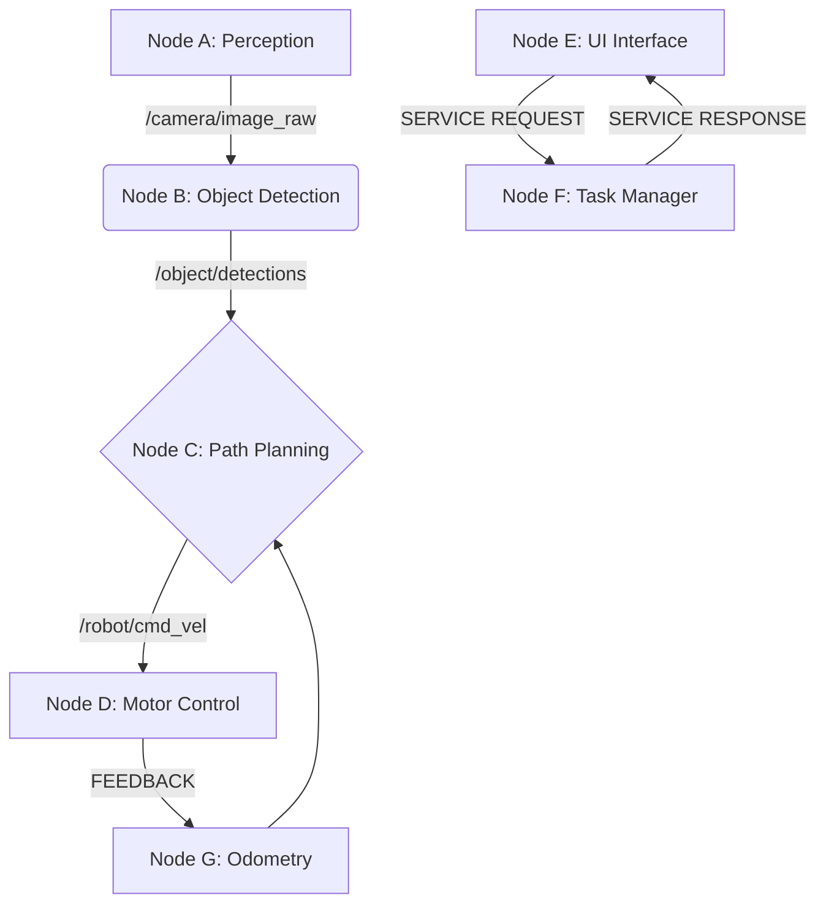
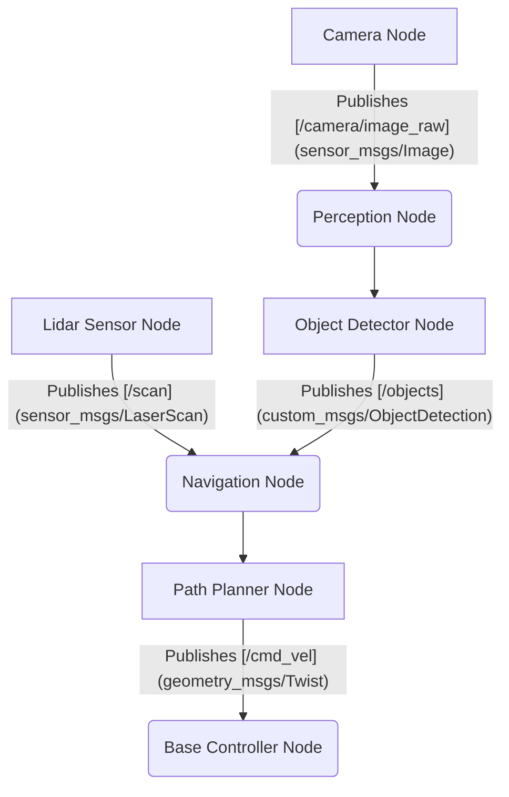
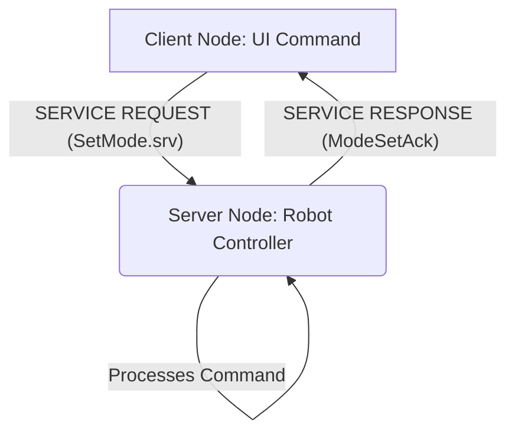
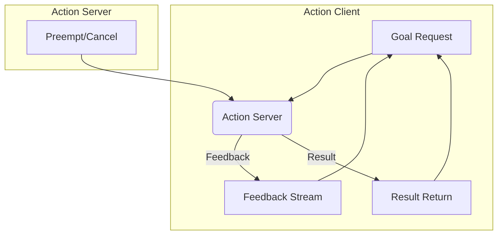

# ROS 2 Fundamentals: Nodes, Topics, and Services

## Introduction to the Robotic Nervous System

The Robotic Operating System 2 (ROS 2) provides a flexible framework for writing robot software, serving as the sophisticated "nervous system" for modern robotics. As an indispensable middleware in Physical AI, it enables modular design and efficient communication between components, crucial for achieving complex robotic behaviors. This chapter focuses on ROS 2's core communication primitives: Nodes, Topics, and Services, fundamental for developing any robotic system, especially humanoid robots requiring intricate coordination.

## The Architecture of ROS 2

ROS 2 is designed for distributed, loosely coupled systems, leveraging a DDS (Data Distribution Service) layer for direct peer-to-peer communication. This architecture enhances reliability, scalability, and supports real-time capabilities essential for critical applications like humanoid control, differentiating it from its predecessor, ROS 1, which used a central master.


*Figure 1.1: Simplified ROS 2 communication graph illustrating nodes, topics, and services.*

## Nodes: The Workers of ROS 2

A **node** in ROS 2 is an executable program performing a specific task, acting as a focused process within the robotic system. For a humanoid robot, nodes can be dedicated to perception, navigation, manipulation, motor control, or high-level AI tasks. This modularity facilitates easier development, debugging, and software reuse. Should one node fail, the system can often continue operating or fail gracefully.

### Creating Your First ROS 2 Node (Python/rclpy)

Let's start by creating a simple "talker" node that publishes a message and a "listener" node that subscribes to it.

**Lab 1.1: Setting Up Your ROS 2 Workspace and First Node**

**Goal**: Create a ROS 2 workspace and a basic Python node that prints "Hello, ROS 2!".

1.  **Open a Terminal**:
    *   Ensure your ROS 2 environment is sourced. For example, `source /opt/ros/humble/setup.bash` (replace `humble` with your ROS 2 distribution).
2.  **Create a Workspace**:
    ```bash
    mkdir -p ~/ros2_ws/src
    cd ~/ros2_ws/src
    ```
3.  **Create a ROS 2 Package**:
    ```bash
    ros2 pkg create --build-type ament_python my_robot_pkg --dependencies rclpy
    ```
    This creates a Python package named `my_robot_pkg` with `rclpy` (the Python client library for ROS 2) as a dependency.
4.  **Create the Python Node File**:
    ```bash
    touch ~/ros2_ws/src/my_robot_pkg/my_robot_pkg/simple_node.py
    ```
5.  **Edit `simple_node.py`**:
    Add the following Python code to `~/ros2_ws/src/my_robot_pkg/my_robot_pkg/simple_node.py`:
    ```python
    import rclpy
    from rclpy.node import Node

    class SimpleNode(Node):

        def __init__(self):
            super().__init__('simple_node')
            self.get_logger().info('Hello, ROS 2! From SimpleNode.')

    def main(args=None):
        rclpy.init(args=args)
        simple_node = SimpleNode()
        rclpy.spin(simple_node) # Keep node alive until Ctrl+C
        simple_node.destroy_node()
        rclpy.shutdown()

    if __name__ == '__main__':
        main()
    ```
6.  **Update `setup.py`**:
    Edit `~/ros2_ws/src/my_robot_pkg/setup.py` to add an entry point for your executable. Locate the `entry_points` dictionary and add the following:
    ```python
    entry_points={
        'console_scripts': [
            'simple_node = my_robot_pkg.simple_node:main',
        ],
    },
    ```
7.  **Build Your Workspace**:
    ```bash
    cd ~/ros2_ws
    colcon build
    ```
8.  **Source Your Workspace**:
    ```bash
    source install/setup.bash
    ```
9.  **Run Your Node**:
    ```bash
    ros2 run my_robot_pkg simple_node
    ```
    You should see `[INFO] [simple_node]: Hello, ROS 2! From SimpleNode.` in your terminal.

**Common Pitfall**: Forgetting to source your workspace (`source install/setup.bash`) after building.
**Fix**: Always source after building new packages or opening a new terminal.

## Topics: The Asynchronous Data Streams

**Topics** are the most common communication mechanism in ROS 2, utilizing a publish-subscribe model for continuous, asynchronous data streams. A node "publishes" messages to a named topic, and interested nodes "subscribe" to it. Each topic has a specific message type, ensuring data integrity. This model is ideal for sensor data, robot state, and low-level control commands.

*   **Publisher**: Sends messages to a topic.
*   **Subscriber**: Receives messages from a topic.
*   **Message Type**: Defines the structure of transmitted data (e.g., `std_msgs/msg/String`), ensuring type safety.


*Figure 1.2: Example of ROS 2 topics in a mobile robot system.*

### Lab 1.2: Implementing a Talker and Listener (Python/rclpy)

1.  **Navigate to your package**:
    ```bash
    cd ~/ros2_ws/src/my_robot_pkg/my_robot_pkg
    ```
2.  **Create `talker.py`**:
    ```python
    import rclpy
    from rclpy.node import Node
    from std_msgs.msg import String # Standard string message type

    class TalkerNode(Node):
        def __init__(self):
            super().__init__('talker_node')
            # Create a publisher on the 'chatter' topic with String messages
            # and a queue size of 10
            self.publisher_ = self.create_publisher(String, 'chatter', 10)
            self.i = 0
            # Create a timer to publish messages every 0.5 seconds
            timer_period = 0.5
            self.timer = self.create_timer(timer_period, self.timer_callback)
            self.get_logger().info('Talker node has started and is publishing...')

        def timer_callback(self):
            msg = String()
            msg.data = f'Hello, world! {self.i}'
            self.publisher_.publish(msg)
            self.get_logger().info(f'Publishing: "{msg.data}"')
            self.i += 1

    def main(args=None):
        rclpy.init(args=args)
        talker_node = TalkerNode()
        try:
            rclpy.spin(talker_node)
        except KeyboardInterrupt:
            pass
        talker_node.destroy_node()
        rclpy.shutdown()

    if __name__ == '__main__':
        main()
    ```
3.  **Create `listener.py`**:
    ```python
    import rclpy
    from rclpy.node import Node
    from std_msgs.msg import String

    class ListenerNode(Node):
        def __init__(self):
            super().__init__('listener_node')
            # Create a subscriber to the 'chatter' topic with String messages
            self.subscription = self.create_subscription(
                String,
                'chatter',
                self.listener_callback,
                10)
            self.subscription  # prevent unused variable warning
            self.get_logger().info('Listener node has started and is subscribing...')

        def listener_callback(self, msg):
            self.get_logger().info(f'I heard: "{msg.data}"')

    def main(args=None):
        rclpy.init(args=args)
        listener_node = ListenerNode()
        try:
            rclpy.spin(listener_node)
        except KeyboardInterrupt:
            pass
        listener_node.destroy_node()
        rclpy.shutdown()

    if __name__ == '__main__':
        main()
    ```
4.  **Update `setup.py`**:
    Add entry points for both `talker.py` and `listener.py` in `~/ros2_ws/src/my_robot_pkg/setup.py`:
    ```python
    entry_points={
        'console_scripts': [
            'simple_node = my_robot_pkg.simple_node:main', # Keep existing
            'talker = my_robot_pkg.talker:main',
            'listener = my_robot_pkg.listener:main',
        ],
    },
    ```
5.  **Build and Source**:
    ```bash
    cd ~/ros2_ws
    colcon build
    source install/setup.bash
    ```
6.  **Run in Separate Terminals**:
    *   Terminal 1: `ros2 run my_robot_pkg talker`
    *   Terminal 2: `ros2 run my_robot_pkg listener`
    You should see the listener printing the messages published by the talker.

**Common Pitfall**: Incorrect topic name or message type between publisher and subscriber.
**Fix**: Use `ros2 topic list -t` to inspect active topics and their types. Ensure they match.

### Inspecting Topics

ROS 2 provides command-line tools to interact with and debug topics:

*   `ros2 topic list`: Lists all active topics.
*   `ros2 topic info <topic_name>`: Shows publishers, subscribers, and message type for a topic.
*   `ros2 topic echo <topic_name>`: Displays messages being published on a topic in real-time.
*   `ros2 interface show <message_type>`: Shows the definition of a message type.

## Services: The Synchronous Request-Response

**Services** implement a synchronous request-response communication model, akin to a distributed function call. A client node sends a request to a server node and awaits an immediate response. This is suitable for single, immediate tasks that don't involve continuous data streams. Examples include configuring robot modes, querying status, or triggering discrete actions like "open gripper." Each service type specifies the structure for both its request and response messages.


*Figure 1.3: ROS 2 service communication flow.*

### Lab 1.3: Implementing a Simple Adder Service (Python/rclpy)

1.  **Define a Custom Service Type**:
    *   In `~/ros2_ws/src/my_robot_pkg`, create a `srv` directory:
        ```bash
        mkdir -p ~/ros2_ws/src/my_robot_pkg/srv
        ```
    *   Create `AddTwoInts.srv` inside the `srv` directory:
        ```
        # Request
        int64 a
        int64 b
        ---
        # Response
        int64 sum
        ```
    *   **Edit `setup.py`**:
        To make ROS 2 aware of your custom service, modify `~/ros2_ws/src/my_robot_pkg/setup.py`.
        First, ensure `setuptools` and `ament_cmake_auto` are in `install_requires` (they usually are by default, but double-check).
        Then, add `message_generation` to `package_data` and ensure `AddTwoInts.srv` is listed:
        ```python
        # ... other imports
        from setuptools import setup
        import os
        from glob import glob

        package_name = 'my_robot_pkg'

        setup(
            name=package_name,
            version='0.0.0',
            packages=[package_name],
            data_files=[
                ('share/ament_index/resource_index/packages',
                    ['resource/' + package_name]),
                ('share/' + package_name, ['package.xml']),
                (os.path.join('share', package_name, 'launch'), glob(os.path.join('launch', '*launch.[pxy][yem]'))),
                (os.path.join('share', package_name, 'srv'), glob('srv/*.srv')) # Add this line
            ],
            install_requires=['setuptools'],
            zip_safe=True,
            maintainer='your_name',
            maintainer_email='your_email@example.com',
            description='TODO: Package description',
            license='TODO: License declaration',
            tests_require=['pytest'],
            entry_points={
                'console_scripts': [
                    'simple_node = my_robot_pkg.simple_node:main',
                    'talker = my_robot_pkg.talker:main',
                    'listener = my_robot_pkg.listener:main',
                    'add_server = my_robot_pkg.add_two_ints_server:main', # New server entry point
                    'add_client = my_robot_pkg.add_two_ints_client:main', # New client entry point
                ],
            },
        )
        ```
    *   **Edit `package.xml`**:
        Add the following build and execution dependencies to `~/ros2_ws/src/my_robot_pkg/package.xml`:
        ```xml
        <build_depend>rosidl_default_generators</build_depend>
        <exec_depend>rosidl_default_runtime</exec_depend>
        <member_of_group>rosidl_interface_packages</member_of_group>
        ```

2.  **Create `add_two_ints_server.py`**:
    ```python
    import rclpy
    from rclpy.node import Node
    from my_robot_pkg.srv import AddTwoInts # Import your custom service type

    class AddTwoIntsService(Node):
        def __init__(self):
            super().__init__('add_two_ints_server')
            self.srv = self.create_service(AddTwoInts, 'add_two_ints', self.add_two_ints_callback)
            self.get_logger().info('Add two ints service ready.')

        def add_two_ints_callback(self, request, response):
            response.sum = request.a + request.b
            self.get_logger().info(f'Incoming request: a={request.a}, b={request.b}')
            self.get_logger().info(f'Sending response: sum={response.sum}')
            return response

    def main(args=None):
        rclpy.init(args=args)
        add_two_ints_service = AddTwoIntsService()
        try:
            rclpy.spin(add_two_ints_service)
        except KeyboardInterrupt:
            pass
        add_two_ints_service.destroy_node()
        rclpy.shutdown()

    if __name__ == '__main__':
        main()
    ```
3.  **Create `add_two_ints_client.py`**:
    ```python
    import sys
    import rclpy
    from rclpy.node import Node
    from rclpy.task import Future
    from my_robot_pkg.srv import AddTwoInts

    class AddTwoIntsClient(Node):
        def __init__(self):
            super().__init__('add_two_ints_client')
            self.cli = self.create_client(AddTwoInts, 'add_two_ints')
            # Wait for the service to be available
            while not self.cli.wait_for_service(timeout_sec=1.0):
                self.get_logger().info('service not available, waiting again...')
            self.req = AddTwoInts.Request()
            self.get_logger().info('Add two ints client ready.')

        def send_request(self, a, b):
            self.req.a = a
            self.req.b = b
            self.future = self.cli.call_async(self.req)
            self.get_logger().info(f'Requesting sum of {a} and {b}...')
            return self.future

    def main(args=None):
        rclpy.init(args=args)
        add_two_ints_client = AddTwoIntsClient()

        if len(sys.argv) != 3:
            add_two_ints_client.get_logger().info('Usage: ros2 run my_robot_pkg add_client <int> <int>')
            return

        a = int(sys.argv[1])
        b = int(sys.argv[2])

        future = add_two_ints_client.send_request(a, b)

        # Wait for the response
        rclpy.spin_until_future_complete(add_two_ints_client, future)

        if future.result() is not None:
            add_two_ints_client.get_logger().info(f'Result of add_two_ints: {future.result().sum}')
        else:
            add_two_ints_client.get_logger().error(f'Service call failed {future.exception()}')

        add_two_ints_client.destroy_node()
        rclpy.shutdown()

    if __name__ == '__main__':
        main()
    ```
4.  **Build and Source**:
    This is crucial after adding a custom service type!
    ```bash
    cd ~/ros2_ws
    colcon build
    source install/setup.bash
    ```
5.  **Run in Separate Terminals**:
    *   Terminal 1: `ros2 run my_robot_pkg add_server`
    *   Terminal 2: `ros2 run my_robot_pkg add_client 5 7`
    The client should print `Result of add_two_ints: 12`.

**Common Pitfall**: Not rebuilding after adding or modifying `.srv` files, or forgetting to add `rosidl_default_generators` dependencies to `package.xml` and `setup.py`.
**Fix**: Always `colcon build` and `source install/setup.bash` after any changes to interface definition files (messages, services, actions).

### Inspecting Services

Similar to topics, ROS 2 provides command-line tools for services:

*   `ros2 service list`: Lists all active services.
*   `ros2 service type <service_name>`: Shows the service type.
*   `ros2 service find <service_type>`: Finds services of a specific type.
*   `ros2 service call <service_name> <service_type> <arguments>`: Calls a service from the command line.

**Example using `ros2 service call`**:
```bash
ros2 service call /add_two_ints my_robot_pkg/srv/AddTwoInts "{a: 10, b: 20}"
```
This should return:
```
requester:
  qos_profile:
    depth: 10
    durability: 1
    history: 2
    reliability: 1
response:
  sum: 30
```

## Actions: The Long-Running Goal-Feedback-Result

**Actions** extend the request-response model for long-running, preemptable tasks. A client sends a goal, receives continuous feedback during execution, and eventually gets a final result. Critically, clients can cancel a goal mid-execution. This makes actions ideal for tasks like navigation or manipulation sequences that require ongoing execution and status updates. An action definition comprises a **Goal** (desired outcome), **Result** (final outcome), and **Feedback** (progress updates).


*Figure 1.4: ROS 2 action communication model.*

### Lab 1.4: Implementing a Fibonacci Action (Python/rclpy)

1.  **Define a Custom Action Type**:
    *   In `~/ros2_ws/src/my_robot_pkg`, create an `action` directory:
        ```bash
        mkdir -p ~/ros2_ws/src/my_robot_pkg/action
        ```
    *   Create `Fibonacci.action` inside the `action` directory:
        ```
        # Goal
        int32 order
        ---
        # Result
        int32[] sequence
        ---
        # Feedback
        int32[] partial_sequence
        ```
    *   **Edit `setup.py`**:
        Similar to services, add `action` directory to `package_data` and ensure `Fibonacci.action` is listed:
        ```python
        # ... existing setup.py
            data_files=[
                # ... existing data_files
                (os.path.join('share', package_name, 'action'), glob('action/*.action')) # Add this line
            ],
            install_requires=['setuptools', 'rclpy', 'action_msgs', 'builtin_interfaces'], # Add action_msgs, builtin_interfaces
            # ... other setup options
            entry_points={
                'console_scripts': [
                    # ... existing entry points
                    'fibonacci_server = my_robot_pkg.fibonacci_action_server:main', # New
                    'fibonacci_client = my_robot_pkg.fibonacci_action_client:main', # New
                ],
            },
        )
        ```
    *   **Edit `package.xml`**:
        Add dependencies for actions:
        ```xml
        <build_depend>rosidl_default_generators</build_depend>
        <exec_depend>rosidl_default_runtime</exec_depend>
        <build_depend>action_msgs</build_depend>
        <exec_depend>action_msgs</exec_depend>
        <member_of_group>rosidl_interface_packages</member_of_group>
        ```

2.  **Create `fibonacci_action_server.py`**:
    ```python
    import time
    import rclpy
    from rclpy.action import ActionServer, GoalStatus
    from rclpy.node import Node
    from my_robot_pkg.action import Fibonacci # Import your custom action type

    class FibonacciActionServer(Node):
        def __init__(self):
            super().__init__('fibonacci_action_server')
            self._action_server = ActionServer(
                self,
                Fibonacci,
                'fibonacci',
                self.execute_callback,
                goal_done_callback=self.goal_done_callback
            )
            self.get_logger().info('Fibonacci action server ready.')

        def goal_done_callback(self, goal_handle):
            self.get_logger().info(f'Goal was done: {goal_handle.get_status_as_result()}')

        def execute_callback(self, goal_handle):
            self.get_logger().info(f'Executing goal: {goal_handle.request.order}')

            feedback_msg = Fibonacci.Feedback()
            feedback_msg.partial_sequence = [0, 1]

            # Append the Fibonacci sequence to the feedback message
            for i in range(1, goal_handle.request.order):
                if goal_handle.is_cancel_requested:
                    goal_handle.canceled()
                    self.get_logger().info('Goal canceled')
                    return Fibonacci.Result()

                feedback_msg.partial_sequence.append(
                    feedback_msg.partial_sequence[i] + feedback_msg.partial_sequence[i-1]
                )
                self.get_logger().info(f'Feedback: {feedback_msg.partial_sequence}')
                goal_handle.publish_feedback(feedback_msg)
                time.sleep(0.5) # Simulate work

            goal_handle.succeed()
            result = Fibonacci.Result()
            result.sequence = feedback_msg.partial_sequence
            self.get_logger().info(f'Goal succeeded, result: {result.sequence}')
            return result

    def main(args=None):
        rclpy.init(args=args)
        fibonacci_action_server = FibonacciActionServer()
        try:
            rclpy.spin(fibonacci_action_server)
        except KeyboardInterrupt:
            pass
        fibonacci_action_server.destroy_node()
        rclpy.shutdown()

    if __name__ == '__main__':
        main()
    ```
3.  **Create `fibonacci_action_client.py`**:
    ```python
    import rclpy
    from rclpy.action import ActionClient
    from rclpy.node import Node
    from my_robot_pkg.action import Fibonacci

    class FibonacciActionClient(Node):
        def __init__(self):
            super().__init__('fibonacci_action_client')
            self._action_client = ActionClient(self, Fibonacci, 'fibonacci')
            self.get_logger().info('Fibonacci action client ready.')

        def send_goal(self, order):
            self.get_logger().info('Waiting for action server...')
            self._action_client.wait_for_server()

            goal_msg = Fibonacci.Goal()
            goal_msg.order = order

            self.get_logger().info(f'Sending goal request... order={order}')
            self._send_goal_future = self._action_client.send_goal_async(
                goal_msg,
                feedback_callback=self.feedback_callback
            )

            self._send_goal_future.add_done_callback(self.goal_response_callback)

        def goal_response_callback(self, future):
            goal_handle = future.result()
            if not goal_handle.accepted:
                self.get_logger().error('Goal rejected :(')
                return

            self.get_logger().info('Goal accepted :)')
            self._get_result_future = goal_handle.get_result_async()
            self._get_result_future.add_done_callback(self.get_result_callback)

        def get_result_callback(self, future):
            result = future.result().result
            status = future.result().status
            if status == GoalStatus.STATUS_SUCCEEDED:
                self.get_logger().info(f'Goal succeeded! Result: {list(result.sequence)}')
            else:
                self.get_logger().warn(f'Goal failed with status: {status}')
            rclpy.shutdown() # Shutdown client after receiving result

        def feedback_callback(self, feedback_msg):
            self.get_logger().info(f'Received feedback: {list(feedback_msg.partial_sequence)}')


    def main(args=None):
        rclpy.init(args=args)
        action_client = FibonacciActionClient()
        action_client.send_goal(10) # Request Fibonacci sequence up to order 10
        rclpy.spin(action_client) # Keep client alive to receive feedback and result
        # Note: rclpy.shutdown() is called in get_result_callback

    if __name__ == '__main__':
        main()
    ```
4.  **Build and Source**:
    Again, crucial after adding a custom action type!
    ```bash
    cd ~/ros2_ws
    colcon build
    source install/setup.bash
    ```
5.  **Run in Separate Terminals**:
    *   Terminal 1: `ros2 run my_robot_pkg fibonacci_server`
    *   Terminal 2: `ros2 run my_robot_pkg fibonacci_client`
    You should observe the client receiving feedback periodically and then the final result.

**Common Pitfall**: Not including `action_msgs` and `builtin_interfaces` in `install_requires` in `setup.py` and `package.xml`.
**Fix**: Always include these dependencies when working with ROS 2 actions.

## Inter-Process Communication (IPC) Summary

| Feature   | Communication Model | Use Case                                            | Synchronous/Asynchronous | Preemptable | Example Messages/Requests/Goals           |
| :-------- | :------------------ | :-------------------------------------------------- | :----------------------- | :---------- | :---------------------------------------- |
| **Nodes** | Executable unit     | Encapsulate specific robot functionality            | N/A                      | N/A         | N/A                                       |
| **Topics**| Publish-Subscribe   | Continuous data streams (sensors, odometry, cmd_vel)| Asynchronous             | No          | `sensor_msgs/Image`, `geometry_msgs/Twist`|
| **Services**| Request-Response    | Single, immediate requests for computation/action   | Synchronous              | No          | `std_srvs/Trigger`, `my_robot_pkg/AddTwoInts`|
| **Actions**| Goal-Feedback-Result| Long-running, preemptable tasks                     | Asynchronous (client side)| Yes         | `nav2_msgs/NavigateToPose`, `my_robot_pkg/Fibonacci`|

## Student Exercises

**Exercise 1.1: Topic Remapping**
Modify the `talker` and `listener` nodes. Remap the `chatter` topic of the `talker` node to `/robot/status_updates` using a ROS 2 launch file. Ensure the `listener` node still receives messages by subscribing to the remapped topic.

*Hint*: Explore `ros2 launch` XML or Python syntax for remapping.

<details>
  <summary>Solution (click to expand)</summary>

**`my_robot_pkg/launch/remap_talker.launch.py`**:
```python
from launch import LaunchDescription
from launch_ros.actions import Node

def generate_launch_description():
    return LaunchDescription([
        Node(
            package='my_robot_pkg',
            executable='talker',
            name='my_remapped_talker',
            remappings=[
                ('chatter', '/robot/status_updates')
            ]
        ),
        Node(
            package='my_robot_pkg',
            executable='listener',
            name='my_listener',
            # Listener will automatically subscribe to the remapped topic if it's the only one
            # or you can explicitly remap its subscription as well:
            # remappings=[
            #     ('chatter', '/robot/status_updates')
            # ]
        )
    ])
```
Run with: `ros2 launch my_robot_pkg remap_talker.launch.py`
The listener will hear messages on `/robot/status_updates` which the talker is publishing to.
</details>

**Exercise 1.2: Advanced Service Call**
Create a new service client that takes three integer arguments (`a`, `b`, `c`) and calls the `add_two_ints` service twice: first to add `a` and `b`, then to add the result to `c`. Print the final sum.

*Hint*: Remember that service calls are synchronous by default in `rclpy`'s client. You can make two consecutive calls.

<details>
  <summary>Solution (click to expand)</summary>

**`my_robot_pkg/my_robot_pkg/add_three_ints_client.py`**:
```python
import sys
import rclpy
from rclpy.node import Node
from my_robot_pkg.srv import AddTwoInts

class AddThreeIntsClient(Node):
    def __init__(self):
        super().__init__('add_three_ints_client')
        self.cli = self.create_client(AddTwoInts, 'add_two_ints')
        while not self.cli.wait_for_service(timeout_sec=1.0):
            self.get_logger().info('add_two_ints service not available, waiting again...')
        self.req = AddTwoInts.Request()
        self.get_logger().info('Add three ints client ready.')

    def send_request(self, a, b, c):
        # First call: a + b
        self.req.a = a
        self.req.b = b
        self.get_logger().info(f'Requesting sum of {a} and {b}...')
        future1 = self.cli.call(self.req) # Synchronous call

        if future1.sum is not None:
            intermediate_sum = future1.sum
            self.get_logger().info(f'Intermediate sum: {intermediate_sum}')

            # Second call: (a + b) + c
            self.req.a = intermediate_sum
            self.req.b = c
            self.get_logger().info(f'Requesting sum of {intermediate_sum} and {c}...')
            future2 = self.cli.call(self.req) # Synchronous call

            if future2.sum is not None:
                final_sum = future2.sum
                self.get_logger().info(f'Final sum of {a}, {b}, and {c}: {final_sum}')
            else:
                self.get_logger().error(f'Second service call failed!')
        else:
            self.get_logger().error(f'First service call failed!')

def main(args=None):
    rclpy.init(args=args)
    add_three_ints_client = AddThreeIntsClient()

    if len(sys.argv) != 4:
        add_three_ints_client.get_logger().info('Usage: ros2 run my_robot_pkg add_three_ints_client <int> <int> <int>')
        return

    a = int(sys.argv[1])
    b = int(sys.argv[2])
    c = int(sys.argv[3])

    add_three_ints_client.send_request(a, b, c)

    add_three_ints_client.destroy_node()
    rclpy.shutdown()

if __name__ == '__main__':
    main()
```
Add to `setup.py` `console_scripts`:
`'add_three_ints_client = my_robot_pkg.add_three_ints_client:main',`
Run with: `ros2 run my_robot_pkg add_server` (in one terminal) and `ros2 run my_robot_pkg add_three_ints_client 1 2 3` (in another)
</details>

**Exercise 1.3: Action Preemption**
Modify the Fibonacci action client to send a goal with order 20, but then cancel the goal after receiving 3-5 feedback messages. Observe the server's response.

*Hint*: Use `rclpy.timer.Timer` or `time.sleep` in the client to wait for some feedback, then call `goal_handle.cancel_goal_async()`.

<details>
  <summary>Solution (click to expand)</summary>

**Modified `fibonacci_action_client.py`**:
```python
import rclpy
from rclpy.action import ActionClient
from rclpy.node import Node
from my_robot_pkg.action import Fibonacci
from rclpy.task import Future
import threading
import time # For simulating a delay before cancellation

class FibonacciActionClient(Node):
    def __init__(self):
        super().__init__('fibonacci_action_client')
        self._action_client = ActionClient(self, Fibonacci, 'fibonacci')
        self.get_logger().info('Fibonacci action client ready.')
        self.goal_handle = None
        self.feedback_count = 0
        self.cancellation_timer = None

    def send_goal(self, order):
        self.get_logger().info('Waiting for action server...')
        self._action_client.wait_for_server()

        goal_msg = Fibonacci.Goal()
        goal_msg.order = order

        self.get_logger().info(f'Sending goal request... order={order}')
        self._send_goal_future = self._action_client.send_goal_async(
            goal_msg,
            feedback_callback=self.feedback_callback
        )

        self._send_goal_future.add_done_callback(self.goal_response_callback)

    def goal_response_callback(self, future):
        self.goal_handle = future.result()
        if not self.goal_handle.accepted:
            self.get_logger().error('Goal rejected :(')
            rclpy.shutdown()
            return

        self.get_logger().info('Goal accepted :)')
        # Start a timer to cancel the goal after some feedback
        self.cancellation_timer = self.create_timer(3.0, self.cancel_goal_timer_callback) # Cancel after 3 seconds

        self._get_result_future = self.goal_handle.get_result_async()
        self._get_result_future.add_done_callback(self.get_result_callback)

    def get_result_callback(self, future):
        status = future.result().status
        if status == GoalStatus.STATUS_SUCCEEDED:
            result = future.result().result
            self.get_logger().info(f'Goal succeeded! Result: {list(result.sequence)}')
        elif status == GoalStatus.STATUS_CANCELED:
            self.get_logger().info('Goal was successfully canceled.')
        else:
            self.get_logger().warn(f'Goal finished with status: {status}')

        if self.cancellation_timer:
            self.cancellation_timer.cancel()
        rclpy.shutdown()

    def feedback_callback(self, feedback_msg):
        self.get_logger().info(f'Received feedback: {list(feedback_msg.partial_sequence)}')
        self.feedback_count += 1
        # Optional: Cancel after N feedback messages
        # if self.feedback_count >= 3 and self.goal_handle and not self.goal_handle.is_status_done():
        #     self.get_logger().info('Cancelling goal after sufficient feedback.')
        #     cancel_future = self.goal_handle.cancel_goal_async()
        #     cancel_future.add_done_callback(
        #         lambda future: self.get_logger().info(f'Goal cancellation request sent: {future.result().return_code}')
        #     )

    def cancel_goal_timer_callback(self):
        if self.goal_handle and not self.goal_handle.is_status_done():
            self.get_logger().info('Timer triggered: Cancelling goal.')
            cancel_future = self.goal_handle.cancel_goal_async()
            cancel_future.add_done_callback(
                lambda future: self.get_logger().info(f'Goal cancellation request sent: {future.result().return_code}')
            )
        else:
            if self.cancellation_timer:
                self.cancellation_timer.cancel() # Stop the timer if goal is already done


def main(args=None):
    rclpy.init(args=args)
    action_client = FibonacciActionClient()
    action_client.send_goal(20) # Request Fibonacci sequence up to order 20
    rclpy.spin(action_client)

if __name__ == '__main__':
    main()
```
Run with: `ros2 run my_robot_pkg fibonacci_server` (in one terminal) and `ros2 run my_robot_pkg fibonacci_client` (in another).
Observe the client sending cancellation and the server responding to it.
</details>

## Further Reading and Official Resources

*   **ROS 2 Documentation**: The official source for all things ROS 2. Essential for in-depth understanding.
    *   [ROS 2 Concepts](https://docs.ros.org/en/humble/Concepts.html)
    *   [Understanding ROS 2 Nodes](https://docs.ros.org/en/humble/Tutorials/Beginner-CLI-Tools/Understanding-ROS2-Nodes/Understanding-ROS2-Nodes.html)
    *   [Understanding ROS 2 Topics](https://docs.ros.org/en/humble/Tutorials/Beginner-CLI-Tools/Understanding-ROS2-Topics/Understanding-ROS2-Topics.html)
    *   [Understanding ROS 2 Services](https://docs.ros.org/en/humble/Tutorials/Beginner-CLI-Tools/Understanding-ROS2-Services/Understanding-ROS2-Services.html)
    *   [Understanding ROS 2 Actions](https://docs.ros.org/en/humble/Tutorials/Beginner-CLI-Tools/Understanding-ROS2-Actions/Understanding-ROS2-Actions.html)
*   **`rclpy` Documentation**: Python client library specifics.
    *   [rclpy documentation](https://docs.ros.org/en/humble/p/rclpy/index.html)
*   **DDS (Data Distribution Service)**: The underlying communication standard.
    *   [OMG DDS Portal](https://www.omg.org/dds/)
*   **Message and Service Definitions**: How to define your own custom messages and services.
    *   [Creating Custom ROS 2 Msg and Srv (Python)](https://docs.ros.org/en/humble/Tutorials/Beginner-Client-Libraries/Custom-ROS2-Interfaces.html)

Mastering ROS 2 nodes, topics, services, and actions provides the foundational building blocks for complex, modular, and robust robotic applications. This understanding is critical for humanoid robotics, where intricate control and feedback loops are paramount for natural and intelligent behaviors in the physical world.