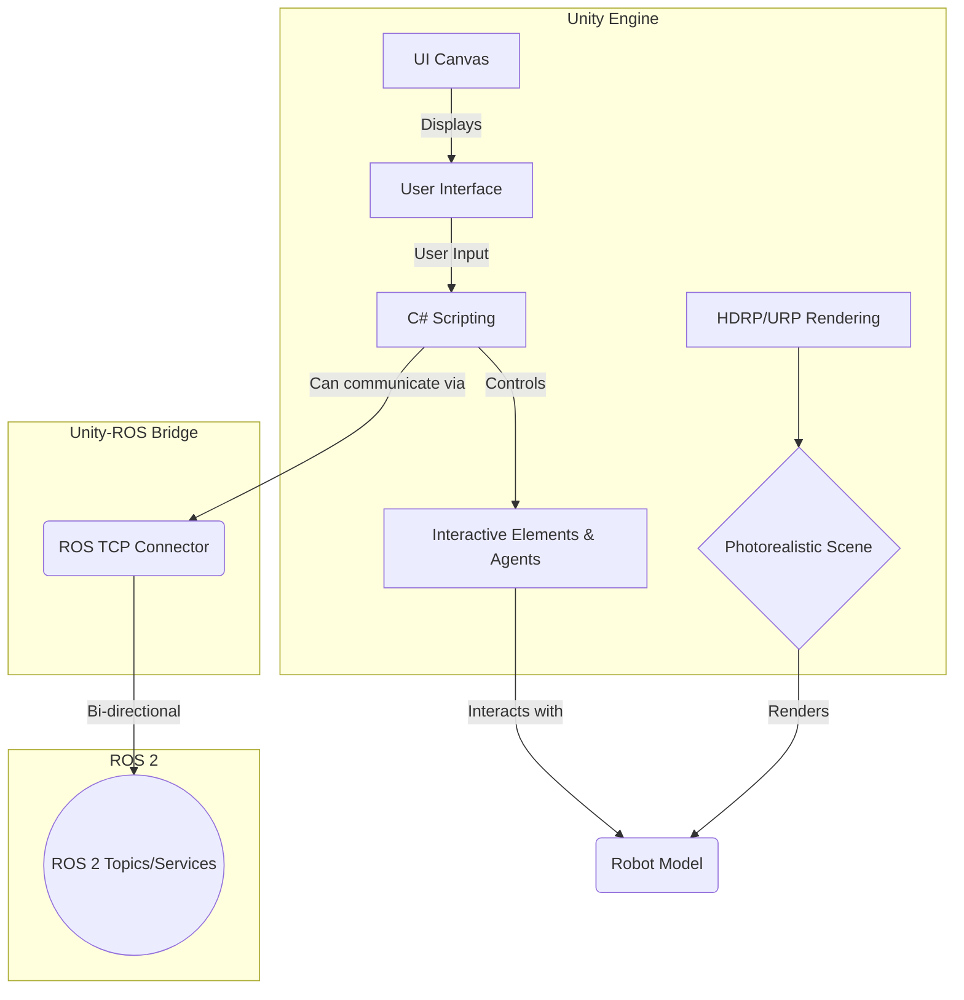

# High-Fidelity Rendering and Human-Robot Interaction in Unity

While Gazebo provides a robust physics simulation, **Unity** excels at creating photorealistic, visually immersive, and highly interactive environments. For Physical AI, especially in the domain of humanoid robotics, high-fidelity rendering is not just an aesthetic enhancement—it's a critical component for training and validating perception systems, generating realistic synthetic data, and designing intuitive Human-Robot Interaction (HRI) scenarios.

Unity's powerful rendering engine, rich asset ecosystem, and intuitive C# scripting environment make it an ideal platform for building the "digital twin" environments where our robots will learn and operate. This chapter explores how to leverage Unity for advanced rendering and to create dynamic scenarios for testing human-robot interactions.

## Why Unity for High-Fidelity Robotics?

-   **Advanced Rendering Pipelines**: Unity offers the Universal Render Pipeline (URP) for scalable graphics and the High Definition Render Pipeline (HDRP) for stunning, photorealistic visuals with advanced lighting, materials, and post-processing effects.
-   **Rich Asset Store**: The Unity Asset Store provides a vast library of pre-made environments, models, textures, and tools, dramatically accelerating the process of building complex virtual worlds.
-   **Intuitive C# Scripting**: Unity's C# API is powerful and easy to learn, making it simple to script complex events, character behaviors, and interactive scenarios.
-   **Seamless ROS 2 Integration**: Through the official **Unity Robotics Hub** package, Unity can communicate directly with ROS 2, allowing for the co-simulation of physics, AI, and visualization.


*A diagram illustrating the components of a Unity simulation connected to ROS 2 via the Unity Robotics Hub.*

## Unity's Render Pipelines: URP vs. HDRP

-   **Universal Render Pipeline (URP)**: A flexible and optimized pipeline that delivers high-quality graphics on a wide range of platforms, from mobile to high-end PCs. It's a great choice for most robotics applications where performance is a key consideration.
-   **High Definition Render Pipeline (HDRP)**: A state-of-the-art pipeline targeting powerful hardware (like NVIDIA RTX GPUs). It provides access to advanced features like ray tracing, volumetric lighting, and physically-based materials, making it ideal for generating synthetic data for training perception algorithms that need to be robust to real-world lighting and material variations.

For this course, we will focus on **HDRP** to emphasize the importance of photorealism in training and testing our humanoid robots.

## Setting Up the Unity-ROS 2 Environment

The key to connecting Unity and ROS 2 is the [Unity Robotics Hub](https://github.com/Unity-Technologies/Unity-Robotics-Hub). This collection of packages allows for seamless communication.

### Lab 1: Your First ROS-Integrated Unity Project

**Goal**: Set up a Unity project, import the Robotics Hub assets, and establish a connection to a running ROS 2 system.

1.  **Install Unity**: Download and install Unity Hub and a recent version of the Unity Editor (e.g., 2022.3 LTS). Make sure to include Linux Build Support if developing on Windows/Mac for a Linux target.

2.  **Create a New Unity Project**: In Unity Hub, create a new 3D (HDRP) project.

3.  **Install Unity Robotics Hub**:
    -   Open the Unity project. Go to `Window -> Package Manager`.
    -   Click the `+` icon in the top-left corner and select `Add package from git URL...`.
    -   Enter `https://github.com/Unity-Technologies/Unity-Robotics-Hub.git`. Unity will download and install the packages.

4.  **Configure ROS Settings**:
    -   A new menu item `Robotics` will appear. Go to `Robotics -> ROS Settings`.
    -   Here you can configure the connection to your ROS 2 master. If ROS 2 is running on the same machine, the default settings are often sufficient. If ROS 2 is in a VM or Docker container, you'll need to input the appropriate IP address.

5.  **Test the Connection**:
    -   Run a simple ROS 2 node in a terminal, like the `talker` from the previous chapter: `ros2 run demo_nodes_py talker`.
    -   In Unity, go to `Robotics -> ROS Connection`. Click the `Connect` button.
    -   You should see a "Successfully connected" message in the Unity console, and the connection status will turn green.

*A screenshot showing the Unity editor with the Package Manager window open, highlighting the installed Robotics Hub package.*

## Importing and Visualizing Your Robot

With the bridge in place, you can now import your robot's URDF into Unity. The Robotics Hub provides a URDF importer that automatically converts your robot model into a Unity prefab.

### Lab 2: Import Your Humanoid Leg URDF

**Goal**: Import the `leg.urdf.xacro` file from the previous chapter and visualize it in Unity.

1.  **Prepare the URDF**: The Unity importer works best with plain URDF files. First, convert your XACRO file to a URDF file.
    ```bash
    # In a terminal with your ROS 2 workspace sourced
    ros2 run xacro xacro ~/ros2_ws/src/humanoid_description/urdf/leg.urdf.xacro > ~/ros2_ws/src/humanoid_description/urdf/leg.urdf
    ```

2.  **Import the URDF**:
    -   In the Unity Editor, go to `Robotics -> URDF Importer`.
    -   Select the `leg.urdf` file you just generated.
    -   The importer will ask where to save the generated assets. Create a new folder `Robots/SimpleLeg`.
    -   Unity will process the file, create a robot prefab, and generate all the necessary meshes and materials.

3.  **Visualize the Robot**:
    -   Drag the newly created `simple_leg` prefab from your project assets into the scene view.
    -   You will see your robot model rendered in the Unity environment. You can now adjust materials, lighting, and camera angles to get a high-quality view.

*A screenshot showing the imported humanoid leg model rendered in a simple Unity HDRP scene, highlighting the quality of lighting and shadows.*

## Designing Human-Robot Interaction (HRI) Scenarios

Unity's real strength lies in creating interactive scenarios. Using C# scripts, you can:
-   **Simulate Human Agents**: Create simple AI for virtual humans that can walk around, point to objects, or give commands.
-   **Create Interactive Objects**: Make objects in the scene that the robot can interact with (e.g., buttons to press, levers to pull, objects to grasp).
-   **Build User Interfaces**: Use the Unity UI canvas to create on-screen displays that can send commands to the robot or show its status.
-   **VR/AR Integration**: Unity is a leading platform for VR/AR development, opening the door to immersive teleoperation or interaction with your robot.

### Lab 3: Creating a Simple HRI Scenario

**Goal**: Create a simple scene where a user can click a button in the UI to make the robot's leg joint move.

1.  **Create a UI Button**:
    -   In the Unity Hierarchy, right-click and go to `UI -> Button - TextMeshPro`. This will create a Canvas and a Button.
    -   Position the button on the screen and change its text to "Move Joint".

2.  **Create a C# Script**:
    -   In your Project assets, create a new C# script named `JointController`.
    -   Attach this script to an empty GameObject in your scene (e.g., create an empty object called "GameController").

3.  **Write the Joint Controller Script**:
    This script will expose a public function that can be called by the UI button. It will use the ROS TCP Connector to publish a message to a ROS 2 topic.

    **File**: `Assets/Scripts/JointController.cs`
    ```csharp
    using UnityEngine;
    using Unity.Robotics.ROSTCPConnector;
    using RosMessageTypes.Std; // To use the String message type

    public class JointController : MonoBehaviour
    {
        // ROS Connector
        ROSConnection ros;
        // ROS Topic Name
        public string topicName = "joint_command";

        void Start()
        {
            // Get the ROS connection instance
            ros = ROSConnection.GetOrCreateInstance();
            // Register the publisher
            ros.RegisterPublisher<StringMsg>(topicName);
            Debug.Log("JointController started and publisher registered.");
        }

        public void SendMoveCommand()
        {
            // This function will be called by the UI button's OnClick event
            Debug.Log("Button clicked! Sending move command...");
            
            StringMsg move_command = new StringMsg("move_hip_joint");
            
            ros.Publish(topicName, move_command);
            
            Debug.Log("Published message to " + topicName);
        }
    }
    ```

4.  **Connect the Button to the Script**:
    -   Select the Button in the Hierarchy.
    -   In the Inspector, find the `On Click ()` panel.
    -   Drag the "GameController" GameObject from the Hierarchy into the `None (Object)` field.
    -   From the `No Function` dropdown, select `JointController -> SendMoveCommand ()`.

5.  **Create a ROS 2 Listener Node**:
    -   In your ROS 2 workspace, create a simple Python listener node that subscribes to the `/joint_command` topic and logs the message it receives.

6.  **Run the Scenario**:
    -   Start your ROS 2 listener node.
    -   Enter Play mode in Unity.
    -   Ensure the ROS connection is active.
    -   Click the "Move Joint" button in the Game view.
    -   Observe your ROS 2 terminal. You should see the message "move_hip_joint" being logged by your listener node.

This simple example demonstrates a complete HRI loop: user input in the high-fidelity simulation environment triggers a ROS 2 message that a backend AI agent can act upon.

## Further Reading

- **Unity Robotics Hub GitHub**: [https://github.com/Unity-Technologies/Unity-Robotics-Hub](https://github.com/Unity-Technologies/Unity-Robotics-Hub)
- **Unity's High Definition Render Pipeline (HDRP)**: [https://unity.com/hdrp](https://unity.com/hdrp)
- **Unity Learn - Robotics**: [https://learn.unity.com/search?k=robotics](https://learn.unity.com/search?k=robotics)

---

[**← Previous: Simulating Physics in Gazebo**](./simulating-physics-in-gazebo.md) | [**Next: Simulating Sensors →**](./simulating-sensors-lidar-depth-imu.md)