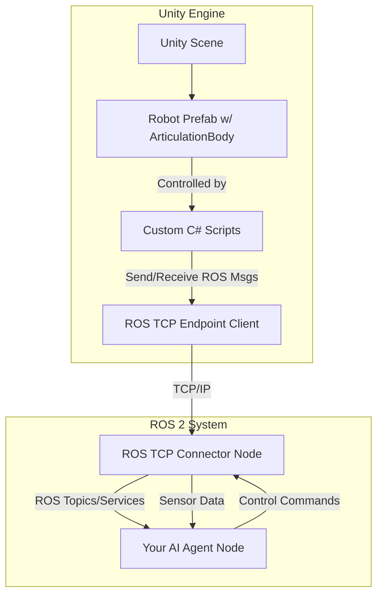

# The Digital Twin: High-Fidelity Rendering in Unity

While Gazebo is a workhorse for physics simulation, its visual rendering capabilities, while functional, are not state-of-the-art. For tasks that require photorealism—such as training vision-based AI, generating synthetic data, or creating compelling human-robot interaction (HRI) scenarios—we turn to a dedicated game engine. **Unity** has emerged as a powerful tool in the robotics community for creating high-fidelity digital twins.

This chapter explores how to use Unity to create visually stunning and realistic simulations. We will focus on the **Unity Robotics Hub**, a set of open-source packages that bridge the gap between Unity and the ROS 2 ecosystem, allowing your robot's AI to control a photorealistic model in a beautifully rendered world.

## Why Unity for Robotics?

Unity offers several advantages that make it an ideal choice for high-fidelity simulation:
-   **Photorealistic Graphics**: Leveraging technologies like the High Definition Render Pipeline (HDRP), Unity can produce stunningly realistic lighting, shadows, materials, and post-processing effects.
-   **Rich Asset Ecosystem**: The Unity Asset Store provides a massive library of 3D models, environments, textures, and tools that can be used to rapidly build complex and detailed worlds.
-   **Advanced Physics**: While we often use Gazebo for primary physics, Unity also has powerful physics engines (like NVIDIA's PhysX) that can be used for everything from rigid body dynamics to soft body and fluid simulations.
-   **C# Scripting**: Unity's scripting is done in C#, a modern, powerful, and widely-used language.
-   **Cross-Platform**: Unity can deploy to a vast range of platforms, which is useful for creating user interfaces or remote control applications that can run on desktops, mobile devices, or VR/AR headsets.

## The Unity Robotics Hub

Connecting a game engine to a robotics framework is a non-trivial task. The Unity Robotics Hub simplifies this process immensely. It consists of several key components:

1.  **ROS TCPEndpoint**: This is the core communication layer. It's a package that runs in Unity and acts as a TCP client that connects to a server on the ROS 2 side (the `ros_tcp_connector`). This allows for bidirectional communication of ROS messages.
2.  **URDF Importer**: A tool within the Unity editor that can parse a URDF file and automatically generate a corresponding 3D model (a "prefab") of the robot, complete with its kinematic tree and joint components.
3.  **ArticulationBody Components**: Unity's specialized components for robotics. Unlike standard `RigidBody` components, `ArticulationBody` components are designed to work in a tree structure, making them perfect for representing the kinematic chains of a robot and applying forces to joints.

The typical workflow looks like this:



---

## Lab 1: Setting Up a Unity Robotics Project

This lab will guide you through creating a new Unity project, installing the necessary robotics packages, and importing your humanoid leg URDF.

**Prerequisites**:
-   Unity Hub and a recent version of the Unity Editor (2021.3 LTS or newer is recommended).
-   A basic understanding of the Unity Editor interface.

### Step 1: Create a New Unity Project
1.  Open Unity Hub.
2.  Click **New Project**.
3.  Select the **3D (HDRP)** template. This gives us the High Definition Render Pipeline for the best graphics.
4.  Give your project a name (e.g., `HumanoidSimulation`) and click **Create Project**.

### Step 2: Install Unity Robotics Packages
1.  In the Unity Editor, go to `Window > Package Manager`.
2.  Click the `+` icon in the top-left and select **Add package from git URL...**.
3.  Add the following packages one by one:
    *   `com.unity.robotics.ros-tcp-connector`
    *   `com.unity.robotics.urdf-importer`
    *   `com.unity.robotics.visualizations` (Optional, but useful)

*A screenshot reference of the Unity Package Manager window showing the installed robotics packages would go here.*

### Step 3: Configure the ROS Connection
1.  In the Unity Editor menu, go to `Robotics > ROS Settings`.
2.  In the Inspector window that appears, you can configure the connection.
    *   **ROS IP Address**: Set this to the IP address of the machine running ROS 2. If it's the same machine, you can often use `127.0.0.1`.
    *   **ROS Port**: The default is `10000`.
    *   **Connect on Play**: Check this box to have Unity automatically attempt to connect to the ROS TCP Endpoint when you press the Play button.

### Step 4: Import Your URDF
1.  From the previous chapter, locate your `leg.urdf.xacro` file.
2.  Convert the xacro to a plain URDF file. In a terminal:
    ```bash
    ros2 run xacro xacro humanoid_description/urdf/leg.urdf.xacro > leg.urdf
    ```
3.  In your Unity Project's `Assets` pane, create a new folder named `URDF`.
4.  Drag and drop the `leg.urdf` file into this folder.
5.  The URDF Importer will pop up. Leave the settings as default and click **Import**.

Unity will now generate a "prefab" of your robot. This prefab is a reusable asset that contains all the links as GameObjects, connected by ArticulationBody components.

*A screenshot reference of the Unity editor showing the imported `simple_leg` prefab in the Project window and its hierarchy of links in the Hierarchy window would go here.*

---

## Lab 2: Controlling the Robot from ROS 2

Now, let's make the robot move in Unity by sending joint commands from ROS 2.

### Step 1: Add a Joint Control Script in Unity
The URDF Importer creates the robot's structure, but we need to tell it how to *receive* ROS messages and apply them to the joints.

1.  In Unity, create a new C# script named `JointController.cs`.
2.  Replace its contents with the following:

**File**: `Assets/Scripts/JointController.cs`
```csharp
using UnityEngine;
using Unity.Robotics.ROSTCPConnector;
using RosMessageTypes.Sensor; // To use JointState message type

public class JointController : MonoBehaviour
{
    // ROS Connector
    private ROSConnection ros;
    
    // The name of the ROS topic to subscribe to
    public string topicName = "joint_states";
    
    // The robot's articulation body components
    private ArticulationBody[] jointArticulationBodies;
    
    // Hardcoded joint names for our simple leg
    private readonly string[] jointNames = { "hip_joint", "knee_joint" };

    void Start()
    {
        // Get ROS connection instance
        ros = ROSConnection.GetOrCreateInstance();
        
        // Subscribe to the topic
        ros.Subscribe<JointStateMsg>(topicName, ReceiveJointCommand);
        
        // Find all articulation bodies in this GameObject and its children
        jointArticulationBodies = GetComponentsInChildren<ArticulationBody>();
    }

    // This function is called when a message is received
    void ReceiveJointCommand(JointStateMsg jointState)
    {
        for (int i = 0; i < jointState.name.Length; i++)
        {
            for (int j = 0; j < jointNames.Length; j++)
            {
                // If the message's joint name matches one of our robot's joints
                if (jointState.name[i] == jointNames[j])
                {
                    // Find the corresponding articulation body
                    var joint = jointArticulationBodies[j+1]; // +1 to skip the root body
                    
                    // Set the joint target position
                    var drive = joint.xDrive;
                    drive.target = (float)(jointState.position[i] * Mathf.Rad2Deg); // Convert radians to degrees
                    joint.xDrive = drive;
                }
            }
        }
    }
}
```
3.  Drag your `simple_leg` prefab from the Project window into your Scene Hierarchy.
4.  Select the root object of the leg in the Hierarchy.
5.  In the Inspector, click **Add Component** and add the `Joint Controller` script.

### Step 2: Set up the ROS Side
On the ROS 2 side, we need to run the `ros_tcp_connector` node and a node to send `JointState` messages.

1.  **Launch the TCP Connector**:
    ```bash
    ros2 launch ros_tcp_connector endpoint.launch.py
    ```
2.  **Use the `joint_state_publisher_gui`**: We can reuse the GUI from the last chapter to send commands.
    ```bash
    # You will need your URDF for this node to know the joint names and limits
    ros2 launch humanoid_description display.launch.py
    # This will fail to start rviz if you don't have a display, but it will start the publishers.
    # A cleaner way is to create a launch file that only starts robot_state_publisher and joint_state_publisher_gui
    ```

### Step 3: Connect and Play!
1.  Make sure the ROS 2 nodes from Step 2 are running.
2.  In Unity, press the **Play** button.
3.  The Unity console should show a `[INFO] Connected to ROS` message.
4.  In your ROS 2 machine, use the `joint_state_publisher_gui` sliders.

You should now see the high-fidelity model of the leg in Unity moving in real-time as you move the sliders in the ROS 2 GUI!

*A screenshot reference of the Unity Editor in Play mode. The photorealistic leg model is visible, and it is in a bent position corresponding to the state of the `joint_state_publisher_gui` from ROS 2 (which could be shown inset).*

## Common Errors

1.  **Error**: Unity doesn't connect to ROS.
    *   **Cause**: The IP address in the ROS Settings is incorrect, a firewall is blocking the port, or the `ros_tcp_connector` endpoint isn't running.
    *   **Fix**: Double-check the IP and port. Use `ping` to ensure the machines can see each other. Temporarily disable firewalls to check if they are the issue. Make sure you launched `endpoint.launch.py`.

2.  **Error**: The URDF fails to import.
    *   **Cause**: The URDF might have syntax errors, or it might be a XACRO file that hasn't been converted yet. The Unity URDF Importer does not understand XACRO.
    *   **Fix**: Always run `xacro` to convert your file to a plain URDF first. Validate your URDF using `check_urdf leg.urdf` in a ROS (1) terminal if you have access, or carefully review it for XML errors.

3.  **Error**: The robot model explodes or behaves erratically in Unity.
    *   **Cause**: Incorrect `ArticulationBody` settings or bad inertial values in the URDF. The importer sets stiffness and damping values, but for a complex humanoid, these often need manual tuning.
    *   **Fix**: Select a joint's `ArticulationBody` component in the inspector. Try increasing the `Joint Friction` and `Angular Damping` values. Ensure your `<inertial>` tags in the URDF are plausible.

## Student Exercises

<details>
<summary>Exercise 1: Pimp My Robot</summary>
<div>

**Task**: The default imported URDF is plain grey. Use Unity's material system to make your robot look cool.

**Solution Steps**:
1. In the Unity Project window, create a `Materials` folder.
2. Right-click inside it and go to `Create > Material`. Name it something like `RobotBlue`.
3. Select the new material. In the Inspector, change the `Base Color` to a nice metallic blue. Increase the `Metallic` and `Smoothness` sliders to make it look like painted metal.
4. In the Scene Hierarchy, expand your robot prefab. Select a link, like the `thigh`.
5. In the Inspector, find the `Mesh Renderer` component. Expand its `Materials` array.
6. Drag your new `RobotBlue` material from the Project window into the `Element 0` slot of the materials. The thigh link in your scene should now be blue.
7. Repeat for other links to create a custom color scheme.
</div>
</details>

<details>
<summary>Exercise 2: Add a Camera to the Robot in Unity</summary>
<div>

**Task**: Add a camera to your robot in Unity and stream the image back to ROS 2.

**Solution Steps**:
1. In the Unity Hierarchy, find the link where you want to attach the camera (e.g., the `pelvis`).
2. Right-click the link and select `Camera`. This creates a new camera as a child of the link, so it will move with the robot. Position the camera to look forward.
3. Select the new Camera GameObject. In the Inspector, add a new component: `ROS Camera Publisher`. This script comes from the `ros-tcp-connector` package.
4. Set the `Topic Name` on the script to `/unity_camera/image_raw`.
5. Run the ROS TCP endpoint and press Play in Unity.
6. In a ROS 2 terminal, run `ros2 topic echo /unity_camera/image_raw` to see the raw image data being streamed, or use `rviz2` to visualize the image feed.
</div>
</details>

## Further Reading
- **Unity Robotics Hub GitHub**: [https://github.com/Unity-Technologies/Unity-Robotics-Hub](https://github.com/Unity-Technologies/Unity-Robotics-Hub)
- **Unity HDRP Documentation**: [https://docs.unity3d.com/Packages/com.unity.render-pipelines.high-definition@latest/index.html](https://docs.unity3d.com/Packages/com.unity.render-pipelines.high-definition@latest/index.html)
- **ROS TCP Connector Package**: [https://github.com/Unity-Technologies/ROS-TCP-Connector](https://github.com/Unity-Technologies/ROS-TCP-Connector)
- **URDF Importer Package**: [https://github.com/Unity-Technologies/URDF-Importer](https://github.com/Unity-Technologies/URDF-Importer)
