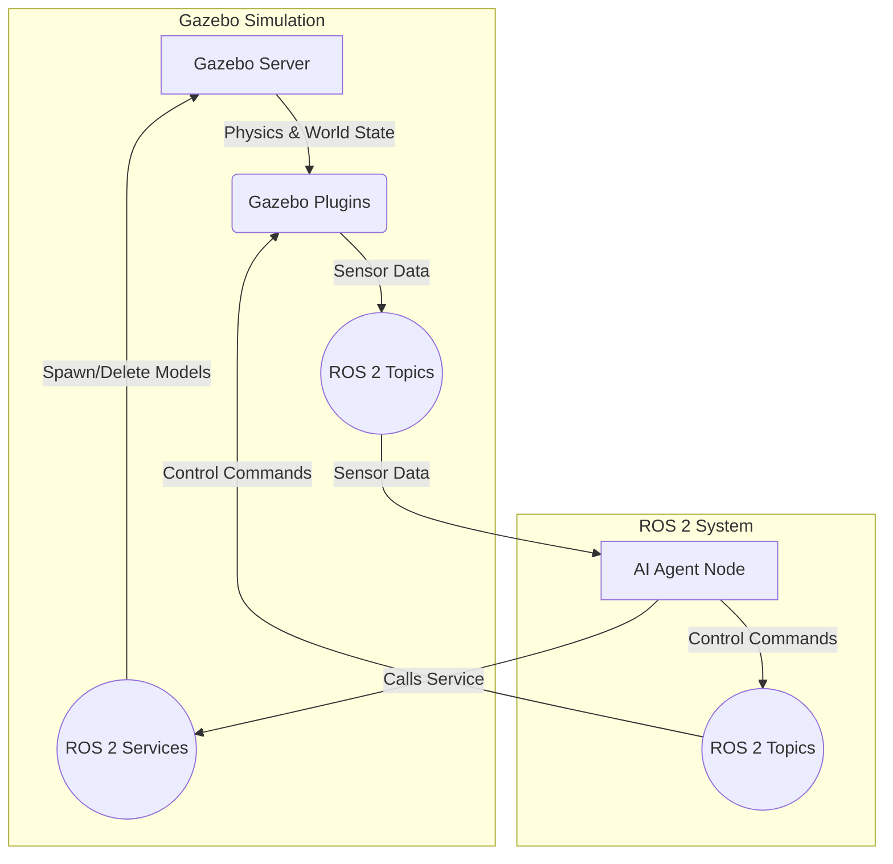

# The Digital Twin: Simulating Physics in Gazebo

Welcome to the world of the digital twin, where we forge a virtual copy of our robot to test, train, and iterate without risking physical hardware. Our primary tool for this is **Gazebo**, a powerful 3D robotics simulator that allows us to model not just the robot, but the world it lives in—complete with gravity, friction, and collisions.

Gazebo is more than just a visualizer; it's a physics engine. It understands how objects should interact, fall, and collide. By accurately simulating these physical laws, we can develop and validate our robot's control algorithms in a realistic, repeatable, and safe environment. This chapter will guide you through setting up a Gazebo world, importing your robot, and understanding the key physics properties that bring your simulation to life.

## Gazebo and ROS 2: A Symbiotic Relationship

Gazebo is a standalone application, but its true power is unlocked when used with ROS 2. The `gazebo_ros_pkgs` provide a bridge, allowing Gazebo to seamlessly integrate into the ROS 2 ecosystem.

-   **Gazebo as a collection of ROS 2 Nodes**: The Gazebo server can be seen as a ROS 2 node that provides services to spawn and delete robot models.
-   **Plugins as ROS 2 Nodes**: Gazebo plugins (for sensors, controllers, etc.) can also be ROS 2 nodes, publishing data to topics (like `/scan` or `/camera/image_raw`) and offering services.
-   **Simulation Time**: Gazebo publishes the simulation time to the `/clock` topic. ROS 2 nodes can be configured to use this simulation time, ensuring that all events are synchronized with the physics simulation, not the real world's clock.

This integration allows us to run the exact same AI agent code in both the simulation and on the real robot, a cornerstone of the "sim-to-real" paradigm.



## SDF: The Language of Simulation

While URDF is excellent for describing a robot's kinematics, Gazebo uses a more comprehensive format called the **Simulation Description Format (SDF)**. SDF is a superset of URDF and can describe not only robots, but entire worlds—including lighting, terrain, static objects, and physics properties.

**Key SDF Tags for Physics**:
-   **`<world>`**: The top-level element that contains everything in the simulation.
-   **`<physics>`**: Defines the global physics parameters.
    -   `type`: The physics engine to use (e.g., `ode`, `bullet`, `dart`).
    -   `max_step_size`: The time increment for each physics update.
    -   `real_time_factor`: A target for how fast the simulation should run relative to real time.
    -   `gravity`: The gravity vector (e.g., `0 0 -9.8`).
-   **`<collision>`**: (Inside a `<link>`) Defines the shape for physics interactions.
-   **`<surface>`**: (Inside a `<collision>`) Defines the properties of the link's surface.
    -   **`<friction>`**: Specifies static and dynamic friction coefficients.
    -   **`<restitution>`**: Specifies the "bounciness" of the surface.
    -   **`<contact>`**: Defines properties like stiffness and damping for when objects touch.

Fortunately, you don't have to throw away your URDF. Gazebo provides tools to automatically convert a URDF into an SDF file. However, to add Gazebo-specific tags (like materials, plugins, and detailed physics), we use `<gazebo>` extension tags directly within our URDF/XACRO files.

**Example: Adding Gazebo friction to a URDF link:**
```xml
<link name="wheel">
  <!-- ... visual, inertial, collision ... -->
</link>

<gazebo reference="wheel">
  <mu1>1.0</mu1> <!-- Static friction coefficient -->
  <mu2>0.9</mu2> <!-- Dynamic friction coefficient -->
  <material>Gazebo/Grey</material>
</gazebo>
```

---
## Lab 1: Creating a Basic Gazebo World

Let's build a simple world file with a ground plane and a few obstacles.

### Step 1: Create a World File

In your `humanoid_description` package, create a `worlds` directory. Inside, create `obstacle_course.world`.

**File**: `humanoid_description/worlds/obstacle_course.world`
```xml
<?xml version="1.0" ?>
<sdf version="1.7">
  <world name="default">
    <!-- A global light source -->
    <include>
      <uri>model://sun</uri>
    </include>

    <!-- A ground plane -->
    <include>
      <uri>model://ground_plane</uri>
    </include>

    <!-- Define the physics engine -->
    <physics type="ode">
      <max_step_size>0.001</max_step_size>
      <real_time_update_rate>1000</real_time_update_rate>
    </physics>

    <!-- A simple box obstacle -->
    <model name="box_obstacle_1">
      <pose>2.0 1.0 0.5 0 0 0</pose>
      <link name="link">
        <collision name="collision">
          <geometry>
            <box><size>1 1 1</size></box>
          </geometry>
        </collision>
        <visual name="visual">
          <geometry>
            <box><size>1 1 1</size></box>
          </geometry>
        </visual>
      </link>
    </model>

    <!-- A cylinder obstacle -->
    <model name="cylinder_obstacle_1">
      <pose>-1.5 -2.0 0.5 0 0 0</pose>
      <link name="link">
        <collision name="collision">
          <geometry>
            <cylinder><radius>0.5</radius><length>1.0</length></cylinder>
          </geometry>
        </collision>
        <visual name="visual">
          <geometry>
            <cylinder><radius>0.5</radius><length>1.0</length></cylinder>
          </geometry>
        </visual>
      </link>
    </model>

  </world>
</sdf>
```
<div align="center">

*Image: A simple Gazebo world with two obstacles.*
*A screenshot showing a ground plane with a box and a cylinder obstacle.*

</div>

### Step 2: Create a Launch File for the World

Now, create a launch file to start Gazebo with your custom world.

**File**: `humanoid_description/launch/gazebo_world.launch.py`
```python
import os
from ament_index_python.packages import get_package_share_directory
from launch import LaunchDescription
from launch.actions import IncludeLaunchDescription
from launch.launch_description_sources import PythonLaunchDescriptionSource

def generate_launch_description():
    pkg_gazebo_ros = get_package_share_directory('gazebo_ros')
    pkg_humanoid_description = get_package_share_directory('humanoid_description')

    # Start Gazebo server and client
    gazebo = IncludeLaunchDescription(
        PythonLaunchDescriptionSource(
            os.path.join(pkg_gazebo_ros, 'launch', 'gazebo.launch.py')
        ),
        launch_arguments={'world': os.path.join(
            pkg_humanoid_description, 'worlds', 'obstacle_course.world'
        )}.items()
    )

    return LaunchDescription([
        gazebo
    ])
```

### Step 3: Build and Launch

```bash
# In ros2_ws
colcon build --packages-select humanoid_description

# In a new terminal
source install/setup.bash
ros2 launch humanoid_description gazebo_world.launch.py
```
You should see Gazebo open, displaying your custom world with a box and a cylinder.

---
## Lab 2: Spawning Your Humanoid in Gazebo

Now let's add the leg robot we defined in the previous chapter into our world.

### Step 1: Add a Gazebo Plugin to your URDF
To control the joints in Gazebo, we need the `gazebo_ros2_control` plugin. This plugin reads joint commands from ROS 2 and applies forces in the simulation. Add this to your `leg.urdf.xacro` file.

**File**: `humanoid_description/urdf/leg.urdf.xacro`
```xml
<!-- ... at the end of the file, inside the <robot> tag ... -->
  <gazebo>
    <plugin name="gazebo_ros2_control" filename="libgazebo_ros2_control.so">
      <robot_param>robot_description</robot_param>
      <robot_param_node>robot_state_publisher</robot_param_node>
    </plugin>
  </gazebo>
```

### Step 2: Create a Launch File to Spawn the Robot

This launch file will start the world, process your URDF, and then call the `spawn_entity.py` script to add the robot to the simulation.

**File**: `humanoid_description/launch/spawn_leg.launch.py`
```python
import os
from ament_index_python.packages import get_package_share_directory
from launch import LaunchDescription
from launch.actions import IncludeLaunchDescription
from launch.launch_description_sources import PythonLaunchDescriptionSource
from launch_ros.actions import Node
import xacro

def generate_launch_description():
    pkg_humanoid_description = get_package_share_directory('humanoid_description')
    
    # Process the URDF file
    xacro_file = os.path.join(pkg_humanoid_description, 'urdf', 'leg.urdf.xacro')
    robot_description_raw = xacro.process_file(xacro_file).toxml()

    # Gazebo launch
    gazebo = IncludeLaunchDescription(
        PythonLaunchDescriptionSource([os.path.join(
            get_package_share_directory('gazebo_ros'), 'launch'), '/gazebo.launch.py']),
        launch_arguments={'world': os.path.join(
            pkg_humanoid_description, 'worlds', 'obstacle_course.world'
        )}.items()
    )

    # Robot state publisher
    node_robot_state_publisher = Node(
        package='robot_state_publisher',
        executable='robot_state_publisher',
        output='screen',
        parameters=[{'robot_description': robot_description_raw}]
    )

    # Spawn entity
    spawn_entity = Node(
        package='gazebo_ros',
        executable='spawn_entity.py',
        arguments=['-topic', 'robot_description', '-entity', 'simple_leg'],
        output='screen'
    )

    return LaunchDescription([
        gazebo,
        node_robot_state_publisher,
        spawn_entity
    ])
```

### Step 3: Build and Launch

```bash
# In ros2_ws
colcon build --packages-select humanoid_description

# In a new terminal
source install/setup.bash
ros2 launch humanoid_description spawn_leg.launch.py
```
<div align="center">

*Image: Our humanoid leg model spawned and interacting with the physics simulation in Gazebo.*
*A screenshot showing the simple leg robot spawned in the obstacle course world.*

</div>

You should now see your leg robot appear in the Gazebo world. Because it has mass and is subject to gravity, it will immediately fall to the ground plane. Congratulations, you have a working physics simulation!

## Common Errors and Debugging

1.  **Error**: Robot model appears in Gazebo but is completely transparent or "ghostly."
    *   **Cause**: The link has a `<visual>` tag but no `<collision>` tag. Gazebo's physics engine doesn't know its physical shape.
    *   **Fix**: Add a `<collision>` tag to every link that should interact with the world. It's good practice to always have both.

2.  **Error**: Robot falls through the ground plane.
    *   **Cause**: The ground plane or the robot's links are missing `<collision>` tags.
    *   **Fix**: Ensure every model that should be "solid" has collision geometry defined. Check the Gazebo GUI under the `View` menu and enable `Collisions` to visualize the collision shapes.

3.  **Error**: `spawn_entity` fails with a timeout.
    *   **Cause**: Gazebo is taking a long time to load, and the spawn script gives up waiting for the `/spawn_entity` service.
    *   **Fix**: This is common with complex worlds. You can increase the timeout in the `spawn_entity.py` script or, more simply, run the launch file a second time once Gazebo is already running.

## Student Exercises

<details>
<summary>Exercise 1: Make a Bouncy Ball</summary>
<div>

**Task**: Create a new world file. Add a single sphere model to it. Using SDF properties, make this sphere highly bouncy.

**Solution Steps**:
1. Create a new `.world` file.
2. Add a `<model name="bouncy_ball">` with a sphere geometry for visual and collision.
3. Inside the `<collision>` tag, add a `<surface>` block.
4. Inside the `<surface>` block, add `<restitution_coefficient>0.9</restitution_coefficient>` and `<bounce><threshold>0.01</threshold></bounce>`. A restitution coefficient close to 1.0 makes it very bouncy.
5. Launch Gazebo with your new world and watch the ball bounce when it hits the ground.
</div>
</details>

<details>
<summary>Exercise 2: Create a Domino Rally</summary>
<div>

**Task**: Create a world with a series of thin, tall boxes lined up like dominoes. Spawn a sphere and give it an initial velocity so that it rolls into the first domino and knocks the whole chain down.

**Solution Steps**:
1.  Create a world file with 5-10 tall, thin `<model>`s representing dominoes, positioned close to each other.
2.  Create another model for a sphere.
3.  To give the sphere an initial velocity, you can write a small ROS 2 node that waits for the simulation to start and then publishes a single message to the `/model/sphere/odometry` topic or uses a Gazebo plugin. A simpler way is to apply a force using the Gazebo GUI (Right-click the model -> Apply Force/Torque).
4.  Alternatively, you can set an initial velocity directly in the world SDF for the ball link: `<velocity>1 0 0 0 0 0</velocity>`.

</div>
</details>

## Further Reading

- **Gazebo Official Documentation**: [https://gazebosim.org/docs](https://gazebosim.org/docs)
- **SDF Specification**: [http://sdformat.org/spec](http://sdformat.org/spec)
- **`gazebo_ros_pkgs` Documentation**: [http://wiki.ros.org/gazebo_ros_pkgs](http://wiki.ros.org/gazebo_ros_pkgs)
- **Gazebo Tutorials**: [https://classic.gazebosim.org/tutorials](https://classic.gazebosim.org/tutorials)

---

[**← Previous: URDF for Humanoids**](../module-1/urdf-for-humanoids.md) | [**Next: High-Fidelity Rendering in Unity →**](./high-fidelity-rendering-in-unity.md)