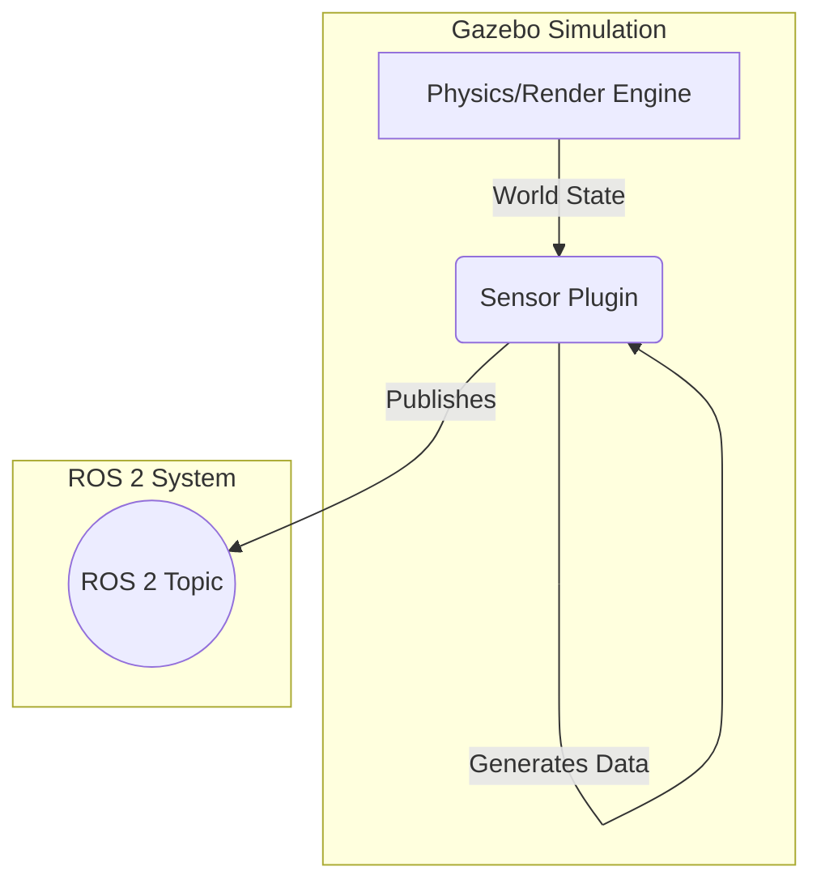

# The Digital Twin: Simulating Sensors (LiDAR, Depth, IMU)

A robot is blind and numb without its sensors. To develop an intelligent agent, we need to provide it with a stream of data that accurately represents what it would perceive in the real world. In simulation, this is achieved through **sensor plugins**. These are small, loadable modules that attach to a robot's model and generate realistic sensor data based on the state of the simulated world.

This chapter focuses on simulating the three most common and critical sensors for humanoid robotics using Gazebo:
1.  **LiDAR (Light Detection and Ranging)**: For 2D or 3D environmental mapping.
2.  **Depth Cameras**: For 3D perception and object recognition.
3.  **IMUs (Inertial Measurement Units)**: For measuring orientation and acceleration, crucial for balance.

We will learn how to add these sensor plugins to our robot's URDF, configure their parameters to mimic real-world hardware, and visualize their data output in ROS 2.

## How Sensor Plugins Work

In Gazebo, a sensor plugin is typically a shared library (`.so` file) that is loaded at runtime. It attaches to a link in your robot's URDF and leverages Gazebo's physics and rendering engines to generate data.

The general workflow is:
1.  **Define a "sensor" link** in your URDF. This is often a small, massless box that serves as the physical location and orientation of the sensor.
2.  **Attach it to the robot** with a `fixed` joint.
3.  **Use a `<gazebo>` tag** to specify the sensor plugin and its parameters. The plugin will then publish the simulated data to a ROS 2 topic.



## Lab 1: Simulating a 2D LiDAR Scanner

Let's add a 2D laser scanner to our humanoid leg model. This sensor will scan the horizontal plane and publish `sensor_msgs/LaserScan` messages, which are essential for 2D SLAM (Simultaneous Localization and Mapping) and obstacle avoidance.

### Step 1: Add the Sensor Link and Plugin to URDF

We'll use XACRO to make this clean. We need to add a new link for the sensor and a `fixed` joint to attach it to the `pelvis`. Then, we add the `<gazebo>` block to configure the plugin.

**File**: `humanoid_description/urdf/leg.urdf.xacro`
```xml
<?xml version="1.0"?>
<robot name="simple_leg_xacro" xmlns:xacro="http://www.ros.org/wiki/xacro">

  <!-- ... (previous properties and macros) ... -->

  <!-- Add a new link for the laser scanner -->
  <link name="laser_link">
    <visual>
      <geometry><box size="0.05 0.05 0.05"/></geometry>
      <material name="red"><color rgba="1 0 0 1"/></material>
    </visual>
    <collision><geometry><box size="0.05 0.05 0.05"/></geometry></collision>
    <inertial><mass value="0.1"/><inertia ixx="0.001" ixy="0" ixz="0" iyy="0.001" iyz="0" izz="0.001"/></inertial>
  </link>

  <!-- Attach the laser link to the pelvis -->
  <joint name="laser_joint" type="fixed">
    <parent link="pelvis"/>
    <child link="laser_link"/>
    <origin xyz="0.1 0 0.1" rpy="0 0 0"/>
  </joint>

  <!-- ... (rest of the robot definition) ... -->

  <!-- Gazebo Plugin for the 2D LiDAR -->
  <gazebo reference="laser_link">
    <sensor type="ray" name="head_hokuyo_sensor">
      <pose>0 0 0 0 0 0</pose>
      <visualize>true</visualize> <!-- Set to true to see the laser rays in Gazebo -->
      <update_rate>40</update_rate>
      <ray>
        <scan>
          <horizontal>
            <samples>720</samples>
            <resolution>1</resolution>
            <min_angle>-1.570796</min_angle>
            <max_angle>1.570796</max_angle>
          </horizontal>
        </scan>
        <range>
          <min>0.10</min>
          <max>30.0</max>
          <resolution>0.01</resolution>
        </range>
        <noise>
          <type>gaussian</type>
          <mean>0.0</mean>
          <stddev>0.01</stddev>
        </noise>
      </ray>
      <plugin name="gazebo_ros_head_hokuyo_controller" filename="libgazebo_ros_ray_sensor.so">
        <ros>
          <namespace>/</namespace>
          <argument>--ros-args -r /scan:=/leg_scan</argument>
        </ros>
        <output_type>sensor_msgs/LaserScan</output_type>
      </plugin>
    </sensor>
  </gazebo>

</robot>
```
**Plugin Breakdown**:
-   **`<sensor type="ray">`**: Specifies that this is a ray-casting based sensor (like LiDAR or Sonar).
-   **`<visualize>true`**: Shows the laser beams in the Gazebo GUI, which is incredibly useful for debugging.
-   **`<scan>`**: Defines the properties of the scan. Here, we're scanning a 180-degree arc in front of the robot with 720 points.
-   **`<range>`**: Defines the minimum and maximum detection distance.
-   **`<noise>`**: Adds Gaussian noise to the measurements to make the simulation more realistic.
-   **`<plugin filename="libgazebo_ros_ray_sensor.so">`**: This is the actual plugin library that does the work.
-   **`<argument>-r /scan:=/leg_scan</argument>`**: This is a crucial line. It remaps the default output topic from `/scan` to `/leg_scan`, preventing conflicts if other robots are in the simulation.

### Step 2: Visualize the Data in RViz2

1.  **Launch the simulation** with your robot as you did in the previous chapter.
    ```bash
    ros2 launch humanoid_description spawn_leg.launch.py
    ```
2.  **Open RViz2** in a new terminal: `rviz2`.
3.  Click the **Add** button in the bottom-left.
4.  Select the **By topic** tab and find the `/leg_scan` topic. Choose the `LaserScan` display and click OK.
5.  Set the **Fixed Frame** in the Global Options (top-left) to `pelvis`.

*A screenshot reference showing RViz2. The leg model is visible, and red dots (from the LaserScan display) are shown, accurately mapping the walls and obstacles from the Gazebo world. The caption would read: "Visualizing the simulated LiDAR data in RViz2."*

You should now see a plot of red dots in RViz2, corresponding to the distances measured by the simulated LiDAR in Gazebo. If you move an obstacle in front of the robot in Gazebo, you will see the red dots in RViz2 update in real-time.

---

## Lab 2: Simulating a Depth Camera

A depth camera is like a regular camera, but instead of color, each pixel represents the distance from the camera to that point in the scene. This provides a rich 3D "point cloud" of the environment.

### Step 1: Add the Depth Camera Plugin to URDF

We'll add another link and plugin to our XACRO file. The process is very similar to the LiDAR.

**File**: `humanoid_description/urdf/leg.urdf.xacro`
```xml
<!-- ... after the laser_joint ... -->
  <link name="camera_link">
    <visual><geometry><box size="0.03 0.05 0.05"/></geometry></visual>
    <collision><geometry><box size="0.03 0.05 0.05"/></geometry></collision>
    <inertial><mass value="0.05"/><inertia ixx="0.001" ixy="0" ixz="0" iyy="0.001" iyz="0" izz="0.001"/></inertial>
  </link>

  <joint name="camera_joint" type="fixed">
    <parent link="pelvis"/>
    <child link="camera_link"/>
    <origin xyz="0.15 0 0" rpy="0 0 0"/>
  </joint>

<!-- ... after the LiDAR gazebo block ... -->
  <gazebo reference="camera_link">
    <sensor type="depth" name="depth_camera">
      <update_rate>30.0</update_rate>
      <camera name="head">
        <horizontal_fov>1.047</horizontal_fov> <!-- 60 degrees -->
        <image>
          <width>640</width>
          <height>480</height>
          <format>R8G8B8</format>
        </image>
        <clip>
          <near>0.1</near>
          <far>10</far>
        </clip>
      </camera>
      <plugin name="camera_plugin" filename="libgazebo_ros_camera.so">
         <ros>
            <namespace>depth_cam</namespace>
         </ros>
         <camera_name>camera</camera_name>
         <image_topic_name>image_raw</image_topic_name>
         <camera_info_topic_name>camera_info</camera_info_topic_name>
         <depth_image_topic_name>depth/image_raw</depth_image_topic_name>
         <depth_camera_info_topic_name>depth/camera_info</depth_camera_info_topic_name>
         <point_cloud_topic_name>points</point_cloud_topic_name>
         <frame_name>camera_link</frame_name>
      </plugin>
    </sensor>
  </gazebo>
```
**Plugin Breakdown**:
-   **`<sensor type="depth">`**: Specifies a depth camera sensor.
-   **`<camera>`**: Defines the intrinsic parameters of the camera, like field of view (FOV) and image resolution.
-   **`<clip>`**: Sets the near and far clipping planes. Any points outside this range will not be measured.
-   **`libgazebo_ros_camera.so`**: This is a versatile plugin that can simulate a regular RGB camera, a depth camera, or both. It publishes multiple topics:
    *   `/depth_cam/image_raw` (The color image)
    *   `/depth_cam/depth/image_raw` (The depth image)
    *   `/depth_cam/points` (A `sensor_msgs/PointCloud2` message)

### Step 2: Visualize the Point Cloud in RViz2
1.  **Relaunch** your simulation to load the new URDF.
2.  In RViz2, **Add** a new display.
3.  Select the **By topic** tab and find the `/depth_cam/points` topic. Choose the `PointCloud2` display.
4.  You may need to increase the `Size (Pixels)` in the PointCloud2 display options to see the points clearly.

*A screenshot reference showing RViz2. In addition to the leg and LiDAR scan, a colorful cloud of points is visible, representing the 3D structure of the world as seen by the depth camera. The caption would read: "Visualizing the PointCloud2 data from the simulated depth camera."*

---
## Lab 3: Simulating an IMU

An IMU is vital for balance and orientation. It measures angular velocity and linear acceleration.

### Step 1: Add the IMU Plugin to URDF

The IMU doesn't need its own link as it measures the motion of the link it's attached to. We can attach the plugin directly to the `pelvis` link.

**File**: `humanoid_description/urdf/leg.urdf.xacro`
```xml
<!-- ... at the end of the file ... -->
  <gazebo reference="pelvis">
    <sensor name="imu_sensor" type="imu">
      <always_on>true</always_on>
      <update_rate>100</update_rate>
      <visualize>true</visualize>
      <imu>
        <noise type="gaussian">
            <rate><mean>0.0</mean><stddev>2e-4</stddev></rate>
            <accel><mean>0.0</mean><stddev>1.7e-2</stddev></accel>
        </noise>
      </imu>
      <plugin filename="libgazebo_ros_imu_sensor.so" name="imu_plugin">
        <ros>
            <namespace>/imu</namespace>
            <remapping>~/out:=data</remapping>
        </ros>
      </plugin>
    </sensor>
  </gazebo>
```
This plugin will publish `sensor_msgs/Imu` messages to the `/imu/data` topic.

### Step 2: View the IMU Data
1. Relaunch the simulation.
2. The simplest way to see the data is to `echo` the topic in a terminal:
   ```bash
   ros2 topic echo /imu/data
   ```
As the robot falls and hits the ground in Gazebo, you will see the `linear_acceleration` and `angular_velocity` values change.

## Common Errors

1.  **Error**: Sensor topics do not appear when running `ros2 topic list`.
    *   **Cause**: The plugin failed to load. This is often due to a typo in the plugin name (`filename="..."`) or a missing dependency in the `gazebo_ros_pkgs`.
    *   **Fix**: Check the Gazebo output in the terminal where you ran the launch file. There will usually be an error message indicating that a plugin could not be found or loaded. Double-check the spelling and make sure you have all the `gazebo_ros_pkgs` installed.

2.  **Error**: Point cloud or laser scan is offset or rotated incorrectly.
    *   **Cause**: The `<origin>` of the sensor's joint or the `<pose>` within the `<sensor>` tag is incorrect. The final pose of the sensor is the combination of its joint's origin and the pose tag inside the sensor block.
    *   **Fix**: For simplicity, keep the `<pose>` inside the `<sensor>` tag at `0 0 0 0 0 0` and define the sensor's position and orientation entirely with its attachment joint's `<origin>` tag. Use the `tf_echo` tool (`ros2 run tf2_ros tf2_echo <parent_link> <sensor_link>`) to verify the transform is what you expect.

## Student Exercises

<details>
<summary>Exercise 1: Add a Second Camera</summary>
<div>
**Task**: Add a second, regular RGB camera to the robot's "knee" (`shin` link). Make it look downwards. Publish its data on a different topic.

**Solution Steps**:
1. Add a new `fixed` joint to attach a `knee_camera_link` to the `shin`. Use the `<origin>` tag to position it on the shin and rotate it to point downwards (`rpy="0 1.5707 0"`).
2. Add a new `<gazebo reference="knee_camera_link">` block.
3. Use the same `libgazebo_ros_camera.so` plugin, but change the `<namespace>` inside the `<ros>` tag to something unique, like `/knee_cam`. This will prevent topic name collisions.
4. Relaunch and use `ros2 topic list` to find your new camera topics. Visualize the new `image_raw` topic in RViz2.
</div>
</details>

<details>
<summary>Exercise 2: Create a "Noisy" Sensor</summary>
<div>
**Task**: The real world is noisy. Take one of the sensors (e.g., the LiDAR) and significantly increase its noise parameters. Observe the effect in RViz2.

**Solution Steps**:
1. In the URDF, find the `<noise>` block for the LiDAR sensor plugin.
2. Increase the `<stddev>` (standard deviation) value from `0.01` to something much larger, like `0.5`.
3. Relaunch the simulation.
4. In RViz2, you will now see that the laser scan points are "fuzzier" and jump around randomly, more closely resembling the output of a low-cost real-world sensor.
</div>
</details>

## Further Reading
- **Gazebo Sensor Plugins Tutorials**: [https://classic.gazebosim.org/tutorials?cat=sensors](https://classic.gazebosim.org/tutorials?cat=sensors)
- **`gazebo_ros_pkgs` Sensor Plugins**: A list of available sensor plugins can often be found by looking at the source or documentation for packages like `gazebo_plugins`.
- **`sensor_msgs` documentation**: [http://docs.ros.org/en/humble/API/sensor_msgs/index.html](http://docs.ros.org/en/humble/API/sensor_msgs/index.html)
