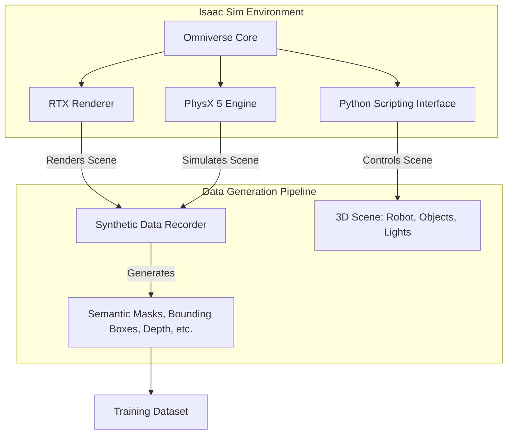

# The AI-Robot Brain: Isaac Sim for Synthetic Data

Welcome to the core of our AI-powered robotics curriculum: NVIDIA Isaac Sim. While Gazebo and Unity provide excellent physics and rendering, Isaac Sim is purpose-built for a critical task in modern AI: **generating high-quality, physically-accurate synthetic data at scale**. It combines the power of NVIDIA's Omniverse platform for photorealistic rendering with advanced physics simulation (PhysX 5) and tight integration with the ROS ecosystem.

In robotics, acquiring large, diverse, and accurately labeled real-world datasets is a major bottleneck. It's expensive, time-consuming, and often dangerous. Isaac Sim solves this problem by allowing us to create perfect, pixel-level annotated data in simulation. This chapter will introduce you to the Isaac Sim environment and guide you through the process of generating synthetic data for training a perception model.

## Why Isaac Sim? The Power of Omniverse

Isaac Sim is built on NVIDIA Omniverse, a platform designed for collaborative 3D content creation and simulation. This foundation provides several key advantages:

-   **Photorealism with RTX Rendering**: Isaac Sim leverages real-time ray tracing, producing stunningly realistic visuals that are crucial for training vision models that can transfer to the real world.
-   **Physics-Based Simulation**: Using NVIDIA's PhysX 5, it simulates rigid and soft body dynamics, enabling realistic interactions between a robot and its environment.
-   **Domain Randomization**: To ensure models trained on synthetic data generalize to the real world's unpredictability, Isaac Sim makes it easy to automatically randomize simulation parameters like lighting, textures, object positions, and camera angles.
-   **Python-First Scripting**: The primary way to interact with and control the simulation is through a comprehensive Python API. This allows for easy integration with AI frameworks like PyTorch and TensorFlow.
-   **ROS/ROS 2 Integration**: Isaac Sim comes with built-in extensions for connecting to ROS, allowing you to send control commands and receive sensor data just as you would with a physical robot.



---

## Lab 1: Your First Isaac Sim Application - Object Spawning

Let's get started by creating a simple Isaac Sim application that programmatically spawns a robot and a few objects in the scene.

**Prerequisites**:
-   An installed version of NVIDIA Isaac Sim (typically run from the Omniverse Launcher).
-   A powerful NVIDIA GPU (RTX 2070 or better is recommended).

### Step 1: Create a Standalone Python Script
Isaac Sim applications are Python scripts that use the `omni.isaac.kit.Kit` class to control the simulation.

Create a new file named `spawn_objects.py`.

**File**: `spawn_objects.py`
```python
import carb
from omni.isaac.kit import Kit

# Configuration for the application
config = {
    "renderer": "RayTracedLighting",
    "headless": False,
}

# Start the simulation environment
kit = Kit(config=config)

from omni.isaac.core import World
from omni.isaac.core.objects import cuboid, sphere
from omni.isaac.core.robots import Robot
import numpy as np

def main():
    # Create a new world
    world = World()
    
    # Add a ground plane
    world.scene.add_default_ground_plane()

    # Add a simple cuboid
    cuboid.DynamicCuboid(
        prim_path="/World/RandomCuboid",
        name="fancy_cube",
        position=np.array([0, 0, 1.0]),
        scale=np.array([0.5, 0.5, 0.5]),
        color=np.array([255, 0, 0]),
    )
    
    # Add a sphere
    sphere.VisualSphere(
        prim_path="/World/VisualSphere",
        name="visual_sphere",
        position=np.array([0, 2, 0.5]),
        radius=0.5,
        color=np.array([0, 0, 255]),
    )
    
    # Add a robot from a URDF
    # Note: Replace this with the actual path to your URDF file
    urdf_path = "/path/to/your/humanoid_description/urdf/leg.urdf"
    robot = Robot(
        prim_path="/World/Robot",
        name="simple_leg",
        position=np.array([0, -2, 0.5]),
        urdf_path=urdf_path,
    )
    world.scene.add(robot)

    # Reset the world to ensure all objects are loaded
    world.reset()

    # Simulate for a few frames
    for i in range(100):
        world.step(render=True)

    # Stop simulation
    kit.close()

if __name__ == "__main__":
    main()

```

### Step 2: Run the Script
To run this, you don't use a standard Python interpreter. You use the one bundled with Isaac Sim.

```bash
# From your Isaac Sim root directory
./python.sh /path/to/your/spawn_objects.py
```

You should see the Isaac Sim window appear, showing a ground plane, a red cube, a blue sphere, and your imported leg robot.

*A screenshot of the Isaac Sim viewport showing the spawned red cube, blue sphere, and the simple leg robot model on a ground plane.*

---

## Lab 2: Generating Synthetic Data for Object Detection

This is where Isaac Sim truly shines. We'll create a scene with a cluttered arrangement of objects and use Isaac Sim's synthetic data tools to generate perfectly labeled training data (bounding boxes) for an object detector.

### Step 1: Set up the Scene and Randomization
We will programmatically add objects to the scene and randomize their positions. Isaac Sim provides a `Replicator` tool for this.

Create a new script `generate_od_data.py`.

**File**: `generate_od_data.py`
```python
import omni.replicator.core as rep
import omni.isaac.core.utils.prims as prim_utils
from omni.isaac.kit import Kit

# --- Start Simulation ---
kit = Kit(headless=False) # Headless can be True for faster generation

# --- Define paths to assets ---
# Download some assets from the Omniverse Cloud or use your own
CUBE_URL = "/path/to/your/cube.usd"
SPHERE_URL = "/path/to/your/sphere.usd"
CYLINDER_URL = "/path/to/your/cylinder.usd"
OUTPUT_DIR = "/path/to/your/output_data"

# --- Create a camera and a render product ---
camera = rep.create.camera()
render_product = rep.create.render_product(camera, (1024, 1024))

# --- Define the randomizer for our objects ---
def object_placer():
    # Get references to the objects you want to randomize
    prims = rep.get.prims(semantics=[("class", "cube"), ("class", "sphere"), ("class", "cylinder")])
    
    with prims:
        rep.modify.pose(
            position=rep.distribution.uniform((-2, -2, 0), (2, 2, 0.5)),
            rotation=rep.distribution.uniform((0, -180, 0), (0, 180, 0)),
        )
    return prims.node

# --- Setup the scene ---
with rep.new_layer():
    # Add a default ground plane and a distant light
    rep.create.light(light_type="distant", intensity=3000, position=(0,0,1000))
    rep.create.plane(scale=10, visible=True)

    # Create the objects and assign semantic labels
    cube = rep.create.from_usd(CUBE_URL, semantics=[("class", "cube")])
    sphere = rep.create.from_usd(SPHERE_URL, semantics=[("class", "sphere")])
    cylinder = rep.create.from_usd(CYLINDER_URL, semantics=[("class", "cylinder")])
    
    # Register our randomizer function
    rep.randomizer.register(object_placer)

    # --- Setup the writer to save the data ---
    with rep.trigger.on_frame(num_frames=50): # Generate 50 images
        rep.randomizer.object_placer() # Call our randomizer
        
        # Define what data to save
        writer = rep.WriterRegistry.get("BasicWriter")
        writer.initialize(
            output_dir=OUTPUT_DIR,
            bounding_box_2d_tight=True, # We want tight 2D bounding boxes
            rgb=True
        )
        writer.attach([render_product])

# --- Run the simulation ---
rep.orchestrator.run()
kit.close()
```

### Step 2: Run the Data Generation
```bash
./python.sh /path/to/your/generate_od_data.py
```
Isaac Sim will run for 50 frames. On each frame, it will move the objects to a new random position and save an RGB image and a corresponding `bounding_box_2d_tight.json` file. This JSON file contains the pixel-perfect coordinates and semantic labels for the bounding boxes of each object in the image.

*A screenshot showing a folder of generated data. On one side, several rendered images of cubes, spheres, and cylinders in random positions. On the other side, a text editor showing the contents of a JSON file with bounding box coordinates and labels.*

## Common Pitfalls

1.  **Error**: "Could not find Isaac Sim assets."
    *   **Cause**: Isaac Sim has a library of pre-made assets (robots, environments, props). You need to have the correct paths to these assets, which are often referenced with URLs starting with `omniverse://`.
    *   **Fix**: Ensure you have the Isaac Sim Nucleus server running and that you are connected to it. Use the Content Browser within Isaac Sim to find the correct paths to assets.

2.  **Error**: Simulation runs much slower than real-time.
    *   **Cause**: Photorealistic rendering and complex physics are computationally expensive.
    *   **Fix**: Run in **headless mode** (`headless=True`) when generating data, as rendering to the screen takes significant resources. Simplify the physics scene where possible (e.g., use simpler collision meshes). Lower the rendering resolution. Use a more powerful GPU.

3.  **Error**: Python script fails with strange `carb` or `omni` errors.
    *   **Cause**: You are likely running the script with a standard Python interpreter, not the one provided with Isaac Sim.
    *   **Fix**: Always execute your scripts using the `./python.sh` or `python.bat` wrapper in the Isaac Sim root directory.

## Student Exercises

<details>
<summary>Exercise 1: Domain Randomization</summary>
<div>

**Task**: Modify the `generate_od_data.py` script to also randomize the color of the objects and the lighting direction on each frame.

**Solution Steps**:
1. Create a new randomizer function, e.g., `light_randomizer`.
2. Inside it, get a reference to your light using `rep.get.prims()`.
3. With the light prim, use `rep.modify.attribute("rotation", rep.distribution.uniform(...))` to change its orientation.
4. For colors, you can also use `rep.modify.attribute()` to change material properties, or create several materials and use `rep.modify.material()` to randomly assign one.
5. Register your new randomizer functions and add them to the `on_frame` trigger.
</div>
</details>

<details>
<summary>Exercise 2: Generate Semantic Segmentation Data</summary>
<div>
**Task**: Instead of bounding boxes, generate pixel-perfect semantic segmentation masks.

**Solution Steps**:
1. In your `BasicWriter` initialization, set `semantic_segmentation=True` and `bounding_box_2d_tight=False`.
2. The `semantic_segmentation` output will be an image where the color of each pixel corresponds to the class of the object at that pixel (e.g., all "cube" pixels might be red, all "sphere" pixels blue).
3. You will also get a JSON file that maps these colors back to the semantic labels ("cube", "sphere", etc.).
</div>
</details>

## Further Reading
- **NVIDIA Isaac Sim Documentation**: [https://docs.omniverse.nvidia.com/app_isaacsim/app_isaacsim/overview.html](https://docs.omniverse.nvidia.com/app_isaacsim/app_isaacsim/overview.html)
- **Omniverse Replicator (for Synthetic Data)**: [https://docs.omniverse.nvidia.com/prod_replicator/prod_replicator/overview.html](https://docs.omniverse.nvidia.com/prod_replicator/prod_replicator/overview.html)
- **Isaac Sim ROS/ROS 2 Bridge**: [https://docs.omniverse.nvidia.com/app_isaacsim/app_isaacsim/ext_omni_isaac_ros_bridge.html](https://docs.omniverse.nvidia.com/app_isaacsim/app_isaacsim/ext_omni_isaac_ros_bridge.html)
- **Domain Randomization Paper**: [https://arxiv.org/abs/1703.06907](https://arxiv.org/abs/1703.06907)
