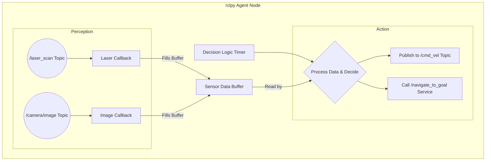

# Bridging Python Agents to ROS 2 with rclpy

In the previous chapter, we explored the fundamental "nervous system" of a robot: ROS 2 nodes, topics, and services. Now, we'll focus on the "brain." How do we implement intelligent, decision-making logic—an **AI agent**—and connect it to the robot's physical hardware? The answer lies in `rclpy`, the official ROS 2 client library for Python.

This chapter is about bridging the gap between high-level Python code and the low-level world of robotic sensors and actuators. We will learn how to structure a Python-based AI agent as a ROS 2 node, enabling it to perceive the world through subscriptions and act on it through publications and service calls.

## Why Python for Robotics AI?

Python has become the de facto language for AI and machine learning for several reasons:
-   **Rich Ecosystem**: Libraries like TensorFlow, PyTorch, scikit-learn, and OpenCV are industry standards.
-   **Simplicity and Speed of Development**: Python's clear syntax allows developers to prototype and iterate on complex algorithms quickly.
-   **Strong Community Support**: A vast community contributes to a wealth of open-source tools and tutorials.

`rclpy` empowers us to leverage this entire ecosystem directly within a ROS 2 environment, creating a powerful synergy between AI and robotics.

## The Anatomy of an `rclpy` Agent

An AI agent in ROS 2 is, at its core, a Python class that inherits from `rclpy.node.Node`. This class encapsulates the agent's logic and its interface with the rest of the ROS 2 system.

A typical agent structure includes:
1.  **Initialization (`__init__`)**:
    *   Initialize the parent `Node`.
    *   Create publishers to send commands (e.g., motor velocities).
    *   Create subscribers to receive sensor data (e.g., laser scans, camera images).
    *   Create clients to call services (e.g., path planning).
    *   Initialize internal state variables and AI models.
2.  **Sensor Callbacks**:
    *   Functions that are executed whenever new data arrives from a subscribed topic. This is where the agent "perceives" its environment.
3.  **Decision Loop**:
    *   A main loop, often driven by a `rclpy.timer.Timer`, where the agent processes its perceived data, updates its world model, and decides what action to take.
4.  **Action Execution**:
    *   The agent acts upon its decisions by publishing messages or calling services.

Here is a conceptual diagram of an agent node:



---

## Lab 1: A Reactive Obstacle-Avoiding Agent

Let's build a simple but practical agent. This agent will use data from a laser scanner (`sensor_msgs/LaserScan`) to avoid obstacles. If an obstacle is too close in front, the robot will turn; otherwise, it will move forward.

**Prerequisites**: A working ROS 2 installation with a simulator like Gazebo and TurtleBot3 is highly recommended.
-  `sudo apt-get install ros-humble-turtlebot3-gazebo`
-  `export TURTLEBOT3_MODEL=burger`
-  In one terminal, launch the simulation: `ros2 launch turtlebot3_gazebo empty_world.launch.py`

### Step 1: Create the Agent Package

```bash
cd ros2_ws/src
ros2 pkg create --build-type ament_python py_agent --dependencies rclpy sensor_msgs geometry_msgs
```

### Step 2: Write the Obstacle Avoider Node

Create the file `obstacle_avoider.py` in `py_agent/py_agent`.

**File**: `ros2_ws/src/py_agent/py_agent/obstacle_avoider.py`

```python
import rclpy
from rclpy.node import Node
from sensor_msgs.msg import LaserScan
from geometry_msgs.msg import Twist

class ObstacleAvoider(Node):
    def __init__(self):
        super().__init__('obstacle_avoider')
        # Publisher to send velocity commands
        self.publisher_ = self.create_publisher(Twist, '/cmd_vel', 10)
        # Subscriber to get laser scan data
        self.subscription = self.create_subscription(
            LaserScan,
            '/scan',
            self.scan_callback,
            10)
        # Timer for the main decision loop
        self.timer = self.create_timer(0.1, self.decision_loop)
        
        self.latest_scan = None
        self.get_logger().info('Obstacle Avoider node has been started.')

    def scan_callback(self, msg):
        """Callback function for the laser scan subscriber."""
        self.latest_scan = msg
        # self.get_logger().info('Received scan data.') # Too noisy for regular use

    def decision_loop(self):
        """Main loop for the agent's decision-making process."""
        if self.latest_scan is None:
            self.get_logger().info('No scan data yet, waiting...')
            return

        # The Twist message is used to send velocity commands
        twist_msg = Twist()
        
        # LaserScan 'ranges' field is an array of distances.
        # Index 0 is the direction straight ahead.
        # We check a small cone of +/- 10 degrees in front of the robot.
        front_min_dist = float('inf')
        for i in range(-10, 11):
            if len(self.latest_scan.ranges) > abs(i):
                 dist = self.latest_scan.ranges[i]
                 if dist < front_min_dist:
                     front_min_dist = dist
        
        self.get_logger().info(f'Minimum distance ahead: {front_min_dist:.2f} meters')

        # Decision logic
        if front_min_dist < 0.5:  # If obstacle is closer than 0.5 meters
            # Turn
            self.get_logger().info('Obstacle detected! Turning.')
            twist_msg.linear.x = 0.0
            twist_msg.angular.z = 0.5  # Positive value means turn left
        else:
            # Move forward
            self.get_logger().info('Path is clear. Moving forward.')
            twist_msg.linear.x = 0.2
            twist_msg.angular.z = 0.0

        # Publish the command
        self.publisher_.publish(twist_msg)

def main(args=None):
    rclpy.init(args=args)
    obstacle_avoider = ObstacleAvoider()
    rclpy.spin(obstacle_avoider)
    obstacle_avoider.destroy_node()
    rclpy.shutdown()

if __name__ == '__main__':
    main()
```

**Code Breakdown**:
1.  **Imports**: We import `LaserScan` for sensor data and `Twist` for velocity commands.
2.  **`__init__`**: We set up a publisher to `/cmd_vel` (the standard topic for robot velocity), a subscriber to `/scan` (the standard topic for laser data), and a timer that runs the `decision_loop` 10 times per second.
3.  **`scan_callback`**: This function simply stores the most recent laser scan data in `self.latest_scan`.
4.  **`decision_loop`**: This is the agent's "brain."
    *   It checks if any scan data has been received.
    *   It finds the minimum distance in a 20-degree cone directly in front of the robot.
    *   Based on this distance, it decides whether to move forward or turn.
    *   Finally, it constructs a `Twist` message and publishes it.

### Step 3: Add the Entry Point

Update `setup.py` in your `py_agent` package.

```python
# ... (in setup.py)
    entry_points={
        'console_scripts': [
            'avoider = py_agent.obstacle_avoider:main',
        ],
    },
)
```

### Step 4: Build and Run

```bash
# In ros2_ws
colcon build --packages-select py_agent

# In a new terminal, after launching the Gazebo simulation
source install/setup.bash
ros2 run py_agent avoider
```

You should now see the TurtleBot3 moving forward in Gazebo. If you place an object in front of it (or drive it near a wall), it will stop moving forward and start turning until its path is clear.

---

## Lab 2: A Service-Based Agent for "Go-to-Goal"

Let's create a more advanced agent that can call a service to perform a complex task. Imagine we have a powerful navigation service that can compute a path to a specific (x, y) coordinate. Our agent's job is to manage goals and command the robot to move to a sequence of waypoints.

### Step 1: Create a "Dummy" Navigation Service
For this lab, we'll create a mock navigation service that just pretends to navigate.

- **Package**: Create a new package `py_nav_service` with a dependency on `rclpy`.
- **Service Definition**: Create `custom_interfaces/srv/GoTo.srv`
  ```
  geometry_msgs/Point goal
  ---
  bool success
  ```
- **Build the interface**. Remember `CMakeLists.txt` and `package.xml`.
- **Service Server**: `py_nav_service/py_nav_service/mock_nav_server.py`

```python
# mock_nav_server.py
import rclpy
from rclpy.node import Node
from custom_interfaces.srv import GoTo
import time

class MockNavServer(Node):
    def __init__(self):
        super().__init__('mock_nav_server')
        self.srv = self.create_service(GoTo, 'navigate_to_goal', self.nav_callback)
        self.get_logger().info('Mock Navigation Server is ready.')

    def nav_callback(self, request, response):
        goal = request.goal
        self.get_logger().info(f'Received navigation goal: ({goal.x}, {goal.y})')
        self.get_logger().info('Simulating navigation...')
        time.sleep(5)  # Pretend it takes 5 seconds to navigate
        response.success = True
        self.get_logger().info('Navigation complete.')
        return response

def main(args=None):
    rclpy.init(args=args)
    server = MockNavServer()
    rclpy.spin(server)
    rclpy.shutdown()

if __name__ == '__main__':
    main()
```
- **Add entry point** and **build**.

### Step 2: Write the Waypoint Manager Agent

Now, create the agent that will use this service.

**File**: `py_agent/py_agent/waypoint_manager.py`

```python
import rclpy
from rclpy.node import Node
from custom_interfaces.srv import GoTo
from geometry_msgs.msg import Point

class WaypointManager(Node):
    def __init__(self):
        super().__init__('waypoint_manager')
        self.cli = self.create_client(GoTo, 'navigate_to_goal')
        while not self.cli.wait_for_service(timeout_sec=1.0):
            self.get_logger().info('Navigation service not available, waiting...')
        
        self.waypoints = [
            Point(x=1.0, y=1.0, z=0.0),
            Point(x=-1.0, y=1.0, z=0.0),
            Point(x=-1.0, y=-1.0, z=0.0),
            Point(x=1.0, y=-1.0, z=0.0),
        ]
        self.current_waypoint_index = 0
        
        self.timer = self.create_timer(1.0, self.run_mission)
        self.mission_running = False
        self.get_logger().info('Waypoint Manager is ready to start mission.')

    async def run_mission(self):
        if self.mission_running:
            return

        if self.current_waypoint_index >= len(self.waypoints):
            self.get_logger().info('All waypoints visited. Mission complete.')
            self.timer.cancel()
            return
            
        self.mission_running = True
        goal = self.waypoints[self.current_waypoint_index]
        self.get_logger().info(f'Requesting navigation to waypoint {self.current_waypoint_index+1}/{len(self.waypoints)}: ({goal.x}, {goal.y})')
        
        request = GoTo.Request()
        request.goal = goal
        
        future = self.cli.call_async(request)
        rclpy.spin_until_future_complete(self, future)
        
        if future.result() is not None and future.result().success:
            self.get_logger().info('Successfully navigated to waypoint.')
            self.current_waypoint_index += 1
        else:
            self.get_logger().error('Failed to navigate to waypoint.')
            # Here you could add retry logic
            
        self.mission_running = False

def main(args=None):
    rclpy.init(args=args)
    waypoint_manager = WaypointManager()
    rclpy.spin(waypoint_manager)
    waypoint_manager.destroy_node()
    rclpy.shutdown()

if __name__ == '__main__':
    main()
```
- **Add entry point** for `waypoint_manager` and **rebuild**.

### Step 3: Run the System

```bash
# Terminal 1: Mock Navigation Server
source install/setup.bash
ros2 run py_nav_service mock_server

# Terminal 2: Waypoint Manager Agent
source install/setup.bash
ros2 run py_agent waypoint_manager
```

You will see the Waypoint Manager log that it's sending a goal, the Mock Nav Server will log that it received it and is "simulating," and after 5 seconds, the manager will report success and move to the next waypoint.

## Common Pitfalls and Fixes

1.  **Pitfall**: Agent crashes on start-up trying to access sensor data.
    *   **Symptom**: `AttributeError: 'NoneType' object has no attribute 'ranges'`.
    *   **Cause**: The decision loop runs before the first sensor message has arrived.
    *   **Fix**: Always check if your sensor data variable is `None` at the beginning of your decision loop.

2.  **Pitfall**: Asynchronous service calls are confusing.
    *   **Symptom**: Code seems to execute out of order, or the agent gets stuck waiting for a service.
    *   **Cause**: Misunderstanding Python's `async/await` or the `rclpy` future mechanism. The line `rclpy.spin_until_future_complete(self, future)` is crucial; it pauses your node's execution at that point until the service response is received.
    *   **Fix**: For complex sequences of actions, consider structuring your agent as a state machine. Each state can perform an action (like calling a service) and then transition to a "waiting" state until the result is available.

3.  **Pitfall**: Forgetting to source the workspace.
    *   **Symptom**: `ros2 run` says `Package '...' not found`.
    *   **Cause**: You forgot to run `source install/setup.bash` in the terminal where you are trying to run your node. This command adds your newly built packages to the environment.
    *   **Fix**: Always source your workspace's `setup.bash` file in every new terminal you use for your project.

## Student Exercises

<details>
<summary>Exercise 1: Improve the Obstacle Avoider</summary>
<div>

**Task**: The current obstacle avoider is very simple. Modify it to be more intelligent. Instead of just turning left, make it check for the clearest path (left or right) and turn in that direction.

**Solution Steps**:
1. In the `decision_loop`, if an obstacle is detected, don't just turn left.
2. Scan a 90-degree arc on the left side of the robot (e.g., `ranges[15:105]`) and find the average distance.
3. Scan a 90-degree arc on the right side (e.g., `ranges[-105:-15]`) and find the average distance.
4. Set the `angular.z` velocity to turn towards the direction with the higher average distance. A positive value turns left, a negative value turns right.
</div>
</details>

<details>
<summary>Exercise 2: Add a "Patrol" Mode to the Waypoint Manager</summary>
<div>

**Task**: Modify the `WaypointManager` so that once it completes its list of waypoints, it starts over from the beginning, patrolling indefinitely. Add a service to stop the patrol.

**Solution Steps**:
1. In `run_mission`, when `self.current_waypoint_index >= len(self.waypoints)`, instead of canceling the timer, reset `self.current_waypoint_index` to `0`.
2. Create a new service, perhaps `std_srvs/srv/SetBool`, named `toggle_patrol`.
3. The service callback should set a flag, e.g., `self.patrol_enabled`.
4. In `run_mission`, only proceed if `self.patrol_enabled` is `True`.
5. Now you can use `ros2 service call /toggle_patrol std_srvs/srv/SetBool "{data: false}"` to stop the robot.
</div>
</details>

## Further Reading

- **rclpy Documentation**: [https://docs.ros2.org/latest/api/rclpy/index.html](https://docs.ros2.org/latest/api/rclpy/index.html)
- **ROS 2 Python Examples**: [https://github.com/ros2/examples/tree/humble/rclpy](https://github.com/ros2/examples/tree/humble/rclpy)
- **ROS 2 Action Client/Server (for long-running tasks)**: Actions are an even better mechanism for tasks like navigation. We will cover them in a future chapter! They provide feedback during execution (e.g., distance to goal) and are cancelable.
- **geometry_msgs/Twist**: [http://docs.ros.org/en/noetic/api/geometry_msgs/html/msg/Twist.html](http://docs.ros.org/en/noetic/api/geometry_msgs/html/msg/Twist.html)
- **sensor_msgs/LaserScan**: [http://docs.ros.org/en/noetic/api/sensor_msgs/html/msg/LaserScan.html](http://docs.ros.org/en/noetic/api/sensor_msgs/html/msg/LaserScan.html)
