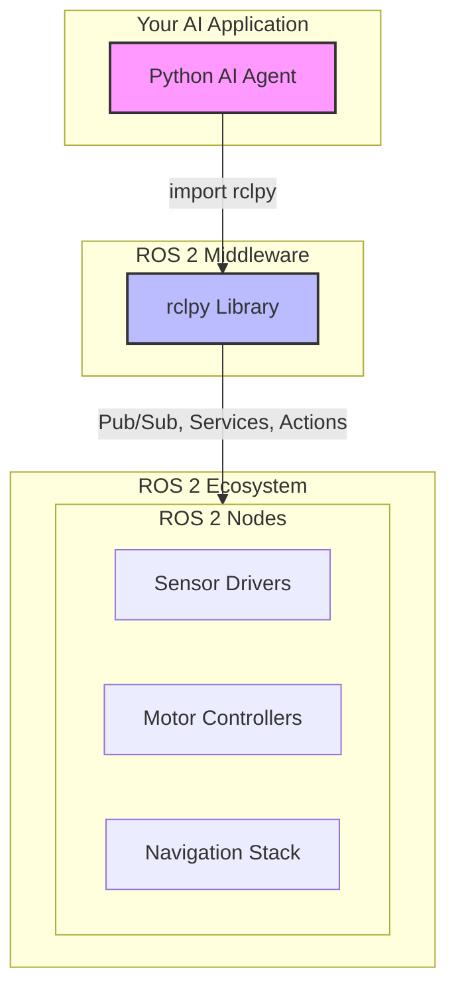

# Bridging Python Agents to ROS 2 with `rclpy`

Welcome to a pivotal moment in your journey into Physical AI. Until now, we have discussed the concepts of robotics and AI, but it is here that we build the first, most crucial bridge between the digital brain and the physical body. This chapter will empower you, the AI developer, to take your Python expertise and apply it directly to the world of robotics using the **ROS 2 Client Library for Python**, universally known as `rclpy`.

Think of `rclpy` as the nervous system connecting your AI agent’s logic to the robot’s sensors and actuators. It allows your Python code to send commands, receive data, and become the intelligent core of a sophisticated robotic system. Let's embark on this exciting integration, transforming your AI algorithms into embodied actions.

## The Core Architecture: Python, `rclpy`, and ROS 2

At a high level, your Python-based AI agent will not live in isolation. It will be a participant in a larger, distributed network of processes that is the ROS 2 ecosystem. `rclpy` is the software library that makes this participation possible.

Here is a conceptual diagram of the architecture we are building:



This diagram shows your Python agent using the `rclpy` library to communicate with other essential parts of the robot's software, like its motor controllers or navigation logic.

### Prerequisites
Before we dive in, ensure you have a working ROS 2 (Humble Hawksbill or newer) development environment and are comfortable with basic Python programming. You should have `colcon`, the standard ROS 2 build tool, installed and ready.

## Foundational Concepts of `rclpy`

To use `rclpy`, you must understand how ROS 2 structures communication.

1.  **Nodes**: A node is the fundamental unit of execution in ROS 2. Think of it as a single, self-contained program within your robotics application. Your AI agent will be encapsulated within a ROS 2 node.
2.  **Topics**: Topics are named buses over which nodes exchange messages. They use a publish/subscribe model. For example, a camera node might *publish* images to an `/image_raw` topic, and your AI node could *subscribe* to that topic to receive them.
3.  **Services**: Services are for request/response communication. A node can offer a service (acting as a server), and another node can call that service (acting as a client) to get a direct, blocking response. This is perfect for when your agent needs to trigger a specific action and wait for the result, like "move arm to position X."
4.  **Actions**: Actions are for long-running, feedback-driven tasks. For example, navigating to a goal is an action, as it takes time and the robot can provide feedback (e.g., distance to goal) along the way.

## Tutorial 1: Your First ROS 2 Publisher & Subscriber in Python

Let's write code. We'll create two nodes: one that publishes a simple "Hello, Robot" message and one that subscribes to it.

First, create a new ROS 2 package:
```bash
# Navigate to your ROS 2 workspace 'src' directory
cd ~/ros2_ws/src
ros2 pkg create --build-type ament_python py_agent_tutorial --dependencies rclpy std_msgs
```

This creates a new package named `py_agent_tutorial`. Now, let's add our Python nodes inside the `py_agent_tutorial/py_agent_tutorial` directory.

### Code Example 1: The Publisher Node

Create a file named `talker.py` with the following code. This node will publish a `String` message to the `chatter` topic every second.

```python
# py_agent_tutorial/talker.py
import rclpy
from rclpy.node import Node
from std_msgs.msg import String

class TalkerNode(Node):
    """A simple ROS 2 node that publishes a string message."""
    def __init__(self):
        super().__init__('talker_node')
        self.publisher_ = self.create_publisher(String, 'chatter', 10)
        self.timer = self.create_timer(1.0, self.timer_callback)
        self.i = 0
        self.get_logger().info('Talker node has been started and is publishing.')

    def timer_callback(self):
        msg = String()
        msg.data = f'Hello, Robot: {self.i}'
        self.publisher_.publish(msg)
        self.get_logger().info(f'Publishing: "{msg.data}"')
        self.i += 1

def main(args=None):
    rclpy.init(args=args)
    node = TalkerNode()
    rclpy.spin(node)
    node.destroy_node()
    rclpy.shutdown()

if __name__ == '__main__':
    main()
```

### Code Example 2: The Subscriber Node

Next, create a file named `listener.py`. This node will subscribe to the `chatter` topic and print any messages it receives.

```python
# py_agent_tutorial/listener.py
import rclpy
from rclpy.node import Node
from std_msgs.msg import String

class ListenerNode(Node):
    """A simple ROS 2 node that subscribes to a string message."""
    def __init__(self):
        super().__init__('listener_node')
        self.subscription = self.create_subscription(
            String,
            'chatter',
            self.listener_callback,
            10)
        self.get_logger().info('Listener node has been started and is listening.')

    def listener_callback(self, msg):
        self.get_logger().info(f'I heard: "{msg.data}"')

def main(args=None):
    rclpy.init(args=args)
    node = ListenerNode()
    rclpy.spin(node)
    node.destroy_node()
    rclpy.shutdown()

if __name__ == '__main__':
    main()
```

### Building and Running the Nodes

1.  **Update `setup.py`**: To make these nodes executable, add them to your `setup.py` file's `entry_points`.

    ```python
    # In setup.py
    'console_scripts': [
        'talker = py_agent_tutorial.talker:main',
        'listener = py_agent_tutorial.listener:main',
    ],
    ```

2.  **Build the Package**: Navigate to the root of your workspace (`~/ros2_ws`) and run `colcon build`.
    ```bash
    cd ~/ros2_ws
    colcon build
    ```

3.  **Run the Nodes**: Open two separate terminals and source your workspace in each.
    ```bash
    # In both terminals
    source ~/ros2_ws/install/setup.bash
    ```
    *   In Terminal 1, run the talker: `ros2 run py_agent_tutorial talker`
    *   In Terminal 2, run the listener: `ros2 run py_agent_tutorial listener`

You should see the talker publishing messages and the listener receiving them! You have successfully created a distributed communication system with just a few lines of Python.

## Tutorial 2: Creating an AI-Powered Service

Now, let's model how an AI agent might perform a task. We'll create a service where a client can send a natural language command (as a string) and a server node (our "AI") will process it and return a response.

```mermaid
graph TD
    subgraph AI Service Architecture
        Client[Client Node]
        Server[AI Service Node]
    end

    subgraph AI_Model [Conceptual AI Model]
        Model[process_command()]
    end

    Client -- "Request: 'clean the room'" --> Server
    Server -- "Invokes" --> Model
    Model -- "Returns: 'Command acknowledged'" --> Server
    Server -- "Response: 'Command acknowledged'" --> Client

    style Client fill:#cce,stroke:#333,stroke-width:2px
    style Server fill:#f9a,stroke:#333,stroke-width:2px
```

First, we need a custom service definition. Create a directory `srv` inside your package and add a file `Command.srv`:

```
# py_agent_tutorial/srv/Command.srv
string command
---
string response
```

Update your `CMakeLists.txt` to find and build this service, and `package.xml` to declare the dependency.

### Code Example 3: The AI Service Server

This node pretends to be an AI that can process commands.

```python
# py_agent_tutorial/ai_service.py
from .srv import Command  # Import our custom service
import rclpy
from rclpy.node import Node

class AIServiceNode(Node):
    """A node that provides an 'AI' service."""
    def __init__(self):
        super().__init__('ai_service_node')
        self.srv = self.create_service(Command, 'ai_command', self.command_callback)
        self.get_logger().info('AI Service is ready.')

    def command_callback(self, request, response):
        # In a real system, this is where you would call your AI model
        self.get_logger().info(f'Received command: "{request.command}"')
        
        # Mock AI processing
        if "clean" in request.command.lower():
            response.response = f"Acknowledged. I will now clean."
        else:
            response.response = "Sorry, I don't understand that command."
            
        return response

def main(args=None):
    rclpy.init(args=args)
    node = AIServiceNode()
    rclpy.spin(node)
    node.destroy_node()
    rclpy.shutdown()

if __name__ == '__main__':
    main()
```

### Code Example 4: The Service Client

This node calls the service to issue a command.

```python
# py_agent_tutorial/command_client.py
from .srv import Command
import rclpy
from rclpy.node import Node
import sys

class CommandClientNode(Node):
    """A client that calls the AI service."""
    def __init__(self):
        super().__init__('command_client_node')
        self.client = self.create_client(Command, 'ai_command')
        while not self.client.wait_for_service(timeout_sec=1.0):
            self.get_logger().info('Service not available, waiting again...')
        self.req = Command.Request()

    def send_request(self, command):
        self.req.command = command
        self.future = self.client.call_async(self.req)
        rclpy.spin_until_future_complete(self, self.future)
        return self.future.result()

def main(args=None):
    rclpy.init(args=args)
    client_node = CommandClientNode()
    command = " ".join(sys.argv[1:]) if len(sys.argv) > 1 else "do something"
    
    response = client_node.send_request(command)
    client_node.get_logger().info(f'Response from AI: "{response.response}"')
    
    client_node.destroy_node()
    rclpy.shutdown()

if __name__ == '__main__':
    main()
```
Add these to your `setup.py` and `colcon build` again. Now you can run the service and then call it from the client:
*   Terminal 1: `ros2 run py_agent_tutorial ai_service`
*   Terminal 2: `ros2 run py_agent_tutorial command_client "please clean the kitchen"`

## Common Pitfalls & Debugging Tips

*   **`colcon build` fails**: Always check dependencies in `package.xml` and `CMakeLists.txt` (for custom messages/services). Ensure your Python code is valid.
*   **Nodes can't communicate**: Use `ros2 topic list` and `ros2 service list` to verify that topics/services are available and correctly named. Use `ros2 topic echo <topic_name>` to inspect messages directly.
*   **Mismatched Message Types**: A classic error. Ensure your publisher and subscriber are using the exact same message type from the same package.
*   **Quality of Service (QoS)**: Sometimes, messages are dropped. This is often due to incompatible QoS settings between nodes. For beginners, sticking to the defaults is usually safe.

## Official Resources

*   **ROS 2 Documentation**: [docs.ros.org](https://docs.ros.org) - The source of truth.
*   **`rclpy` API Documentation**: [ROS 2 API Docs for rclpy](https://docs.ros2.org/latest/api/rclpy/index.html)
*   **NVIDIA Isaac ROS**: [Isaac ROS Documentation](https://developer.nvidia.com/isaac-ros) - For hardware-accelerated robotics.

## Student Exercises

Test your knowledge with these challenges.

<details>
  <summary><b>Exercise 1: New Message Type</b></summary>
  
  Modify the `talker.py` and `listener.py` nodes to use the `std_msgs/msg/Int32` message type instead of `String`. The talker should publish an incrementing integer.

  <details>
    <summary><i>Solution</i></summary>
    
    **Talker Changes:**
    ```python
    from std_msgs.msg import Int32
    # ...
    self.publisher_ = self.create_publisher(Int32, 'chatter_int', 10)
    # ...
    msg = Int32()
    msg.data = self.i
    ```
    **Listener Changes:**
    ```python
    from std_msgs.msg import Int32
    # ...
    self.subscription = self.create_subscription(Int32, 'chatter_int', ...)
    ```
  </details>
</details>

<details>
  <summary><b>Exercise 2: Calculator Service</b></summary>
  
  Create a new service that takes two integers (`a` and `b`) and returns their sum. Create a client to call this service.

  <details>
    <summary><i>Solution</i></summary>
    
    1.  Create `AddTwoInts.srv`:
        ```
        int64 a
        int64 b
        ---
        int64 sum
        ```
    2.  Create a service node that implements the addition logic in its callback.
    3.  Create a client node that sends two numbers and prints the `sum` from the response.
  </details>
</details>

<details>
  <summary><b>Exercise 3: The Echo Node</b></summary>
  
  Combine the publisher and subscriber into a single node. This node should subscribe to a topic named `/input`, and whatever message it receives, it should publish to a topic named `/output`.

  <details>
    <summary><i>Solution</i></summary>
    
    ```python
    import rclpy
    from rclpy.node import Node
    from std_msgs.msg import String

    class EchoNode(Node):
        def __init__(self):
            super().__init__('echo_node')
            self.publisher_ = self.create_publisher(String, 'output', 10)
            self.subscription = self.create_subscription(
                String, 'input', self.listener_callback, 10)

        def listener_callback(self, msg):
            self.get_logger().info(f'Echoing: "{msg.data}"')
            self.publisher_.publish(msg)

    def main(args=None):
        rclpy.init(args=args)
        node = EchoNode()
        rclpy.spin(node)
        node.destroy_node()
        rclpy.shutdown()

    if __name__ == '__main__':
        main()
    ```
    You can test this with the CLI: `ros2 topic pub /input std_msgs/msg/String "data: 'Hello world'"` and `ros2 topic echo /output`.
  </details>
</details>

### Conclusion

You have taken a monumental step, creating ROS 2 nodes in Python and enabling communication between them. You now possess the fundamental skills to integrate any Python-based AI model into a ROS 2 system. The patterns you learned here—publishing sensor data, subscribing to commands, and providing AI logic through services—are the building blocks for the advanced humanoid robots we will construct in the upcoming modules. Stay curious, and keep building!
