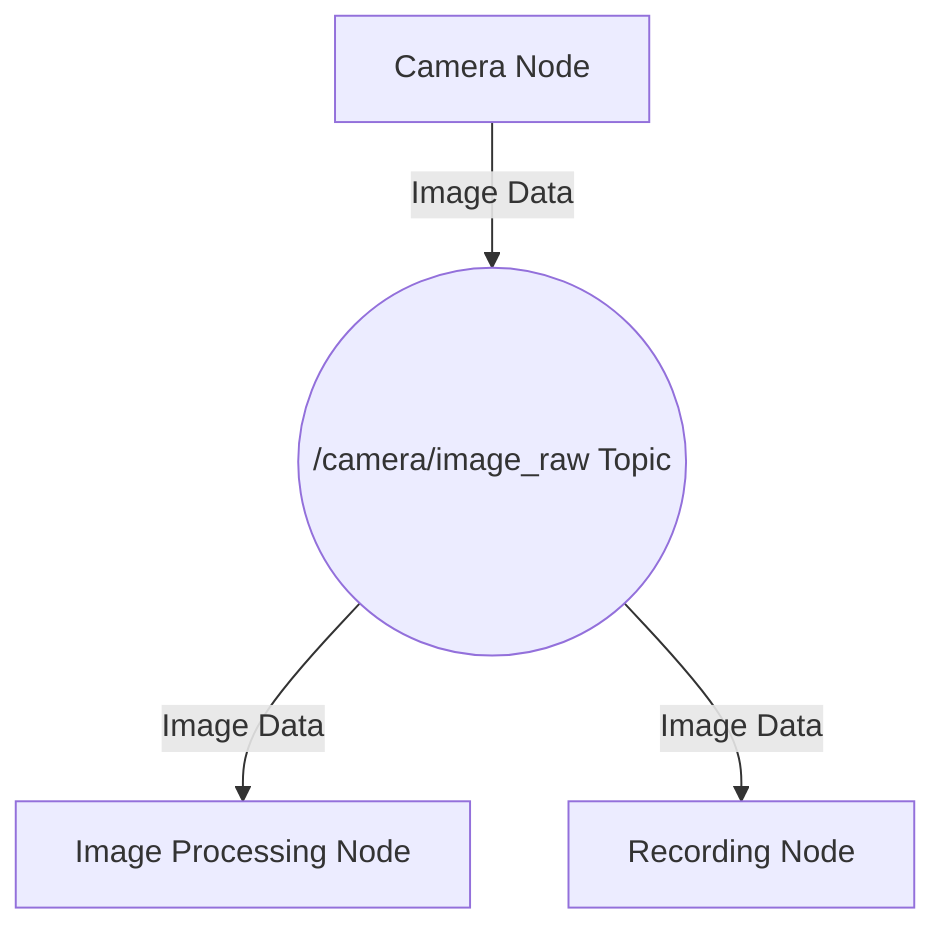

--- 
sidebar_position: 1
---

# The Robotic Nervous System: ROS 2 Nodes, Topics, & Services

Welcome to the foundational layer of modern robotics: the Robot Operating System (ROS 2). If a robot is like a body, ROS 2 is its nervous system. It’s the intricate network that allows different parts of the robot—sensors, actuators, and decision-making algorithms—to communicate and work together seamlessly. This chapter will demystify the three most critical components of this system: Nodes, Topics, and Services.

Mastering these concepts is the first step toward building complex, intelligent robotic behaviors. We’ll move from theory to hands-on practice, using Python and `rclpy` to bring a simulated robot to life.

## Core Concepts: The Building Blocks of ROS 2

At its heart, a ROS 2 system is a distributed network of processes. These processes, called **Nodes**, are the fundamental units of execution. Each node is responsible for a specific task, such as reading a sensor, controlling a motor, or planning a path. This modularity is a cornerstone of ROS 2's power, allowing for reusability and fault isolation.

But how do these nodes talk to each other? They use two primary communication mechanisms: **Topics** and **Services**.

| Component | Analogy | Communication Style | Use Case |
| :--- | :--- | :--- | :--- |
| **Node** | A worker in a factory | A single-purpose program | Reading a laser scanner, controlling a wheel motor. |
| **Topic** | A public announcement board | Asynchronous, one-to-many | Streaming sensor data, broadcasting robot state. |
| **Service** | A direct question-and-answer | Synchronous, one-to-one | Requesting a specific action, like "take a picture." |

### Nodes: The Workers
A ROS 2 Node is an executable that performs a computation. You might have a node for the camera, a node for the wheels, and a node for navigation. By keeping responsibilities separate, you can develop and debug different parts of your robot independently. A node is created using the `rclpy` (ROS Client Library for Python) library.

### Topics: The Announcement Board
Topics are the primary mechanism for continuous data streams. A node can **publish** messages to a topic, and any number of other nodes can **subscribe** to that topic to receive those messages. This is an asynchronous, decoupled, one-to-many communication model.

**Key Features of Topics:**
- **Anonymous**: The publisher doesn't know who is subscribing.
- **Asynchronous**: Publishers and subscribers don't need to be active at the same time.
- **Strongly Typed**: Every topic has a specific message type (e.g., `String`, `Int64`, `sensor_msgs/LaserScan`).

Here is a diagram illustrating the flow:



### Services: The Direct Request
Services are for request-response interactions. A **Service Client** sends a request to a **Service Server**, which processes the request and sends back a response. Unlike topics, this is a synchronous, one-to-one communication model. The client waits (blocks) until it receives a response from the server.

**Key Features of Services:**
- **Synchronous**: The client sends a request and waits for a response.
- **One-to-One**: A single client communicates with a single server.
- **Strongly Typed**: Services are defined by a type that specifies the request and response message formats.

Here’s how a service interaction looks:

```mermaid
graph TD
    subgraph Service Communication
        A[Navigation Node] -- Request: "Compute Path" --> B[Pathfinder Service Server];
        B -- Processes Request --> B;
        B -- Response: "Path Computed" --> A;
    end
```

--- 

## Lab 1: Your First ROS 2 Publisher and Subscriber

Let's get our hands dirty. In this lab, we'll create two Python nodes: one to publish "Hello World" messages with a counter and another to subscribe to them.

**Prerequisites**: Make sure you have ROS 2 installed and your environment sourced.
```bash
source /opt/ros/humble/setup.bash
```

### Step 1: Create a ROS 2 Package
First, let's create a workspace and a package to hold our code.

```bash
mkdir -p ros2_ws/src
cd ros2_ws/src
ros2 pkg create --build-type ament_python py_pubsub --dependencies rclpy
```

### Step 2: Write the Publisher Node
Inside your new package, create a file named `publisher_member_function.py` in a new subdirectory `py_pubsub/py_pubsub`.

**File:** `ros2_ws/src/py_pubsub/py_pubsub/publisher_member_function.py`
```python
# Copyright 2016 Open Source Robotics Foundation, Inc.
#
# Licensed under the Apache License, Version 2.0 (the "License");
# you may not use this file except in compliance with the License.
# You may obtain a copy of the License at
#
#     http://www.apache.org/licenses/LICENSE-2.0
#
# Unless required by applicable law or agreed to in writing, software
# distributed under the License is distributed on an "AS IS" BASIS,
# WITHOUT WARRANTIES OR CONDITIONS OF ANY KIND, either express or implied.
# See the License for the specific language governing permissions and
# limitations under the License.

import rclpy
from rclpy.node import Node
from std_msgs.msg import String

class MinimalPublisher(Node):

    def __init__(self):
        super().__init__('minimal_publisher')
        self.publisher_ = self.create_publisher(String, 'topic', 10)
        timer_period = 0.5  # seconds
        self.timer = self.create_timer(timer_period, self.timer_callback)
        self.i = 0

    def timer_callback(self):
        msg = String()
        msg.data = 'Hello World: %d' % self.i
        self.publisher_.publish(msg)
        self.get_logger().info('Publishing: "%s"' % msg.data)
        self.i += 1

def main(args=None):
    rclpy.init(args=args)
    minimal_publisher = MinimalPublisher()
    rclpy.spin(minimal_publisher)
    minimal_publisher.destroy_node()
    rclpy.shutdown()

if __name__ == '__main__':
    main()
```
**Code Breakdown:**
1.  **`import rclpy`**: Imports the necessary Python library for ROS 2.
2.  **`from std_msgs.msg import String`**: Imports the standard message type for strings.
3.  **`class MinimalPublisher(Node)`**: We create a class that inherits from `rclpy.node.Node`.
4.  **`self.create_publisher(String, 'topic', 10)`**: Creates a publisher.
    *   `String`: The message type.
    *   `'topic'`: The topic name.
    *   `10`: The queue size, a quality-of-service (QoS) setting that limits the amount of buffered messages.
5.  **`self.create_timer(0.5, self.timer_callback)`**: Creates a timer that calls `timer_callback` every 0.5 seconds.
6.  **`self.publisher_.publish(msg)`**: Publishes the message to the topic.
7.  **`rclpy.spin(minimal_publisher)`**: Keeps the node alive to continue publishing.

### Step 3: Write the Subscriber Node
Now, create the subscriber file `subscriber_member_function.py` in the same directory.

**File:** `ros2_ws/src/py_pubsub/py_pubsub/subscriber_member_function.py`
```python
# Copyright 2016 Open Source Robotics Foundation, Inc.
#
# Licensed under the Apache License, Version 2.0 (the "License");
# you may not use this file except in compliance with the License.
# You may obtain a copy of the License at
#
#     http://www.apache.org/licenses/LICENSE-2.0
#
# Unless required by applicable law or agreed to in writing, software
# distributed under the License is distributed on an "AS IS" BASIS,
# WITHOUT WARRANTIES OR CONDITIONS OF ANY KIND, either express or implied.
# See the License for the specific language governing permissions and
# limitations under the License.

import rclpy
from rclpy.node import Node
from std_msgs.msg import String

class MinimalSubscriber(Node):

    def __init__(self):
        super().__init__('minimal_subscriber')
        self.subscription = self.create_subscription(
            String,
            'topic',
            self.listener_callback,
            10)
        self.subscription  # prevent unused variable warning

    def listener_callback(self, msg):
        self.get_logger().info('I heard: "%s"' % msg.data)

def main(args=None):
    rclpy.init(args=args)
    minimal_subscriber = MinimalSubscriber()
    rclpy.spin(minimal_subscriber)
    minimal_subscriber.destroy_node()
    rclpy.shutdown()

if __name__ == '__main__':
    main()
```
**Code Breakdown:**
1.  **`self.create_subscription(String, 'topic', self.listener_callback, 10)`**: Creates a subscriber.
    *   `String`: The message type (must match the publisher).
    *   `'topic'`: The topic name (must match the publisher).
    *   `self.listener_callback`: The function to call when a message is received.
    *   `10`: The QoS queue size.
2.  **`listener_callback(self, msg)`**: This function is executed every time a message is received on the `'topic'`. The message content is in `msg.data`.

### Step 4: Add Entry Points
Modify `setup.py` to let ROS 2 know about your new nodes.

**File:** `ros2_ws/src/py_pubsub/setup.py`
```python
# ... (other setup configuration)
    entry_points={
        'console_scripts': [
            'talker = py_pubsub.publisher_member_function:main',
            'listener = py_pubsub.subscriber_member_function:main',
        ],
    },
)
```

### Step 5: Build and Run
Now, go to the root of your workspace, build the package, source the new setup file, and run the nodes.

```bash
# In your workspace root (ros2_ws)
colcon build --packages-select py_pubsub

# In Terminal 1
source install/setup.bash
ros2 run py_pubsub talker

# In Terminal 2
source install/setup.bash
ros2 run py_pubsub listener
```

You should see the "talker" publishing messages and the "listener" receiving them!

**Publisher Output:**
```
[INFO] [minimal_publisher]: Publishing: "Hello World: 0"
[INFO] [minimal_publisher]: Publishing: "Hello World: 1"
...
```

**Subscriber Output:**
```
[INFO] [minimal_subscriber]: I heard: "Hello World: 0"
[INFO] [minimal_subscriber]: I heard: "Hello World: 1"
...
```

---

## Lab 2: A Simple Service for Calculations

Let's build a service that adds two integers. This will demonstrate the request-response pattern.

### Step 1: Define a Custom Service Type
ROS 2 requires you to define the service request and response structure in a `.srv` file. Create a new package for our service definitions.

```bash
cd ros2_ws/src
ros2 pkg create --build-type ament_cmake custom_interfaces
mkdir -p custom_interfaces/srv
```
Now, create the file `AddTwoInts.srv` inside `custom_interfaces/srv`.

**File:** `ros2_ws/src/custom_interfaces/srv/AddTwoInts.srv`
```
int64 a
int64 b
---
int64 sum
```
- The part above the `---` is the **request**.
- The part below the `---` is the **response**.

Now modify `custom_interfaces/CMakeLists.txt` and `package.xml` to build this interface.

**`CMakeLists.txt`**
```cmake
# ...
find_package(rosidl_default_generators REQUIRED)

rosidl_generate_interfaces(${PROJECT_NAME}
  "srv/AddTwoInts.srv"
)
# ...
```

**`package.xml`**
```xml
<!-- ... -->
  <build_depend>rosidl_default_generators</build_depend>
  <exec_depend>rosidl_default_runtime</exec_depend>
  <member_of_group>rosidl_interface_packages</member_of_group>
<!-- ... -->
```

### Step 2: Write the Service Server Node
Create a new Python package for the service client and server.

```bash
cd ros2_ws/src
ros2 pkg create --build-type ament_python py_srvcli --dependencies rclpy custom_interfaces
```

Now, create the service server file.

**File:** `ros2_ws/src/py_srvcli/py_srvcli/service_member_function.py`
```python
from custom_interfaces.srv import AddTwoInts
import rclpy
from rclpy.node import Node

class MinimalService(Node):

    def __init__(self):
        super().__init__('minimal_service')
        self.srv = self.create_service(AddTwoInts, 'add_two_ints', self.add_two_ints_callback)

    def add_two_ints_callback(self, request, response):
        response.sum = request.a + request.b
        self.get_logger().info('Incoming request\na: %d b: %d' % (request.a, request.b))
        self.get_logger().info('Sending back response: [%d]' % response.sum)
        return response

def main(args=None):
    rclpy.init(args=args)
    minimal_service = MinimalService()
    rclpy.spin(minimal_service)
    minimal_service.destroy_node()
    rclpy.shutdown()

if __name__ == '__main__':
    main()
```

### Step 3: Write the Service Client Node
Now create the client that will send requests.

**File:** `ros2_ws/src/py_srvcli/py_srvcli/client_member_function.py`
```python
import sys
from custom_interfaces.srv import AddTwoInts
import rclpy
from rclpy.node import Node

class MinimalClientAsync(Node):

    def __init__(self):
        super().__init__('minimal_client_async')
        self.cli = self.create_client(AddTwoInts, 'add_two_ints')
        while not self.cli.wait_for_service(timeout_sec=1.0):
            self.get_logger().info('service not available, waiting again...')
        self.req = AddTwoInts.Request()

    def send_request(self, a, b):
        self.req.a = a
        self.req.b = b
        self.future = self.cli.call_async(self.req)
        rclpy.spin_until_future_complete(self, self.future)
        return self.future.result()

def main(args=None):
    rclpy.init(args=args)

    if len(sys.argv) != 3:
        print("Usage: ros2 run py_srvcli client <int> <int>")
        return

    minimal_client = MinimalClientAsync()
    response = minimal_client.send_request(int(sys.argv[1]), int(sys.argv[2]))
    minimal_client.get_logger().info(
        'Result of add_two_ints: for %d + %d = %d' %
        (int(sys.argv[1]), int(sys.argv[2]), response.sum))

    minimal_client.destroy_node()
    rclpy.shutdown()

if __name__ == '__main__':
    main()
```

### Step 4: Update Entry Points and Build
Update `setup.py` in `py_srvcli` package.

**File:** `ros2_ws/src/py_srvcli/setup.py`
```python
# ...
    entry_points={
        'console_scripts': [
            'service = py_srvcli.service_member_function:main',
            'client = py_srvcli.client_member_function:main',
        ],
    },
)
```

Now build and run.

```bash
# In ros2_ws
colcon build --packages-select custom_interfaces py_srvcli

# In Terminal 1
source install/setup.bash
ros2 run py_srvcli service

# In Terminal 2
source install/setup.bash
ros2 run py_srvcli client 5 10
```

**Server Output:**
```
[INFO] [minimal_service]: Incoming request
a: 5 b: 10
[INFO] [minimal_service]: Sending back response: [15]
```

**Client Output:**
```
[INFO] [minimal_client_async]: Result of add_two_ints: for 5 + 10 = 15
```

---

## Common Pitfalls and Fixes

1.  **Pitfall**: Nodes can't find each other.
    *   **Symptom**: Publisher runs, but subscriber never receives messages.
    *   **Cause**: Usually a networking issue or misconfiguration. ROS 2 relies on a middleware called DDS. Ensure all your terminals are sourced with the same `ROS_DOMAIN_ID`.
    *   **Fix**: Run `ros2 topic list` and `ros2 node list` to debug. If you see the nodes and topics, the issue might be QoS compatibility.

2.  **Pitfall**: Mismatched QoS settings.
    *   **Symptom**: Communication is unreliable or doesn't work at all.
    *   **Cause**: A publisher and subscriber must have compatible Quality of Service (QoS) profiles. For example, if a publisher uses a "reliable" profile, the subscriber must also be "reliable".
    *   **Fix**: Explicitly set QoS profiles when creating publishers and subscribers. For beginners, stick to the defaults or use `qos_profile_sensor_data`.

3.  **Pitfall**: `colcon build` fails on custom interfaces.
    *   **Symptom**: Build errors mentioning `rosidl_generate_interfaces`.
    *   **Cause**: You forgot to add the necessary dependencies and build steps in `CMakeLists.txt` and `package.xml` for your custom interface package.
    *   **Fix**: Double-check that `rosidl_default_generators` is in `CMakeLists.txt` and that the `<build_depend>`, `<exec_depend>`, and `<member_of_group>` tags are correct in `package.xml`.

## Student Exercises

Here are a few exercises to test your understanding.

<details>
<summary>Exercise 1: Modify the publisher to send a custom message.</summary>
<div>

**Task**: Create a new message type called `Person` with `string name` and `int32 age`. Modify the publisher to send this message with your name and a continuously increasing age. Modify the subscriber to print it.

**Solution Steps**:
1. Create a `custom_interfaces` package (if you haven't already).
2. Create a `msg/Person.msg` file with `string name` and `int32 age`.
3. Update `CMakeLists.txt` and `package.xml` to build the new message.
4. Build the interface package: `colcon build --packages-select custom_interfaces`.
5. In your `py_pubsub` package, change the publisher to import and use `custom_interfaces.msg.Person`.
6. Update the subscriber similarly.
7. Re-build and run.
</div>
</details>

<details>
<summary>Exercise 2: Create a service that reverses a string.</summary>
<div>

**Task**: Create a service named `StringReverser`. It should take a string as a request and return the reversed string as the response.

**Solution Steps**:
1. Create a `srv/ReverseString.srv` file with `string original` in the request and `string reversed` in the response.
2. Build the interface.
3. Create a service server node that implements the logic: `response.reversed = request.original[::-1]`.
4. Create a service client node to test it.
5. Build and run.
</div>
</details>

---

## Further Reading and Official Links

- **ROS 2 Docs: Understanding Nodes**: [https://docs.ros.org/en/humble/Tutorials/Beginner-CLI-Tools/Understanding-ROS2-Nodes/Understanding-ROS2-Nodes.html](https://docs.ros.org/en/humble/Tutorials/Beginner-CLI-Tools/Understanding-ROS2-Nodes/Understanding-ROS2-Nodes.html)
- **ROS 2 Docs: Understanding Topics**: [https://docs.ros.org/en/humble/Tutorials/Beginner-CLI-Tools/Understanding-ROS2-Topics/Understanding-ROS2-Topics.html](https://docs.ros.org/en/humble/Tutorials/Beginner-CLI-Tools/Understanding-ROS2-Topics/Understanding-ROS2-Topics.html)
- **ROS 2 Docs: Understanding Services**: [https://docs.ros.org/en/humble/Tutorials/Beginner-CLI-Tools/Understanding-ROS2-Services/Understanding-ROS2-Services.html](https://docs.ros.org/en/humble/Tutorials/Beginner-CLI-Tools/Understanding-ROS2-Services/Understanding-ROS2-Services.html)
- **rclpy API Documentation**: [https://docs.ros2.org/latest/api/rclpy/api.html](https://docs.ros2.org/latest/api/rclpy/api.html)
- **Common ROS 2 Message Types**: [https://github.com/ros2/common_interfaces](https://github.com/ros2/common_interfaces)
