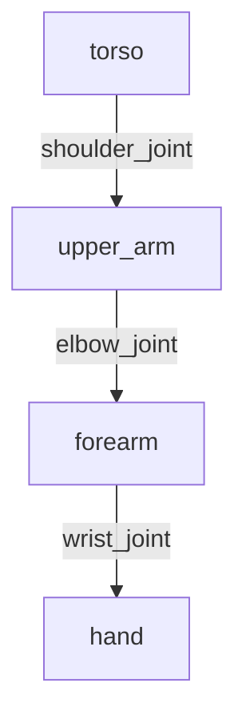

# Describing Humanoids: URDF for Digital Robots

Every robot, whether real or simulated, needs a blueprint. In ROS, this blueprint is the **Unified Robot Description Format (URDF)**. It’s an XML-based format used to describe every physical aspect of a robot: its links (the rigid parts), its joints (which connect the links), its visual appearance, and its physical properties for simulation.

While URDF can describe any robot, it is particularly crucial for humanoids. A humanoid robot's complexity—with its many limbs, joints, and closed kinematic chains—demands a precise and structured description. This chapter will teach you how to read, understand, and write URDF files, focusing on the specific challenges and conventions for humanoid robots.

## The Core Components of URDF

A URDF file is structured around two fundamental components: `<link>` and `<joint>`.

| Tag | Description | Analogy for a Human Body |
| :--- | :--- | :--- |
| **`<link>`** | A rigid part of the robot. It has inertial, visual, and collision properties. | A bone, like the femur or the skull. |
| **`<joint>`** | Connects two links together. It defines the motion between them. | A joint, like the knee or the elbow. |

These components form a **kinematic tree**. The tree starts at a single root link (e.g., `base_link` or `pelvis`) and branches out through joints to all other links.

### The `<link>` Tag in Detail

A link is more than just a shape. It has three key sub-tags:
1.  **`<visual>`**: What the link looks like. This is used for visualization in tools like RViz or Gazebo. It can be a simple geometric shape (box, cylinder, sphere) or a complex 3D mesh (e.g., a `.dae` or `.stl` file).
2.  **`<collision>`**: What the link's physical boundary is for collision detection. This is often a simpler version of the visual geometry to speed up physics calculations.
3.  **`<inertial>`**: The link's physical properties: its mass, center of mass, and moment of inertia. This is essential for accurate physics simulation in Gazebo.

**Example of a simple link:**
```xml
<link name="left_shin">
  <visual>
    <geometry>
      <cylinder length="0.4" radius="0.05" />
    </geometry>
    <origin xyz="0 0 0.2" rpy="0 0 0" />
    <material name="light_grey" />
  </visual>
  <collision>
    <geometry>
      <cylinder length="0.4" radius="0.05" />
    </geometry>
    <origin xyz="0 0 0.2" rpy="0 0 0" />
  </collision>
  <inertial>
    <mass value="1.5" />
    <inertia ixx="0.01" ixy="0" ixz="0" iyy="0.01" iyz="0" izz="0.005" />
    <origin xyz="0 0 0.2" />
  </inertial>
</link>
```

### The `<joint>` Tag in Detail

A joint defines the relationship between a `parent` link and a `child` link.
-   **`<parent link="..."/>`**: The link this joint is attached to, moving up the tree.
-   **`<child link="..."/>`**: The link this joint controls, moving down the tree.
-   **`<origin xyz="..." rpy="..." />`**: The pose of the child link's origin relative to the parent link's origin. This defines the joint's position and orientation.
-   **`<axis xyz="..." />`**: The axis of rotation or translation for `revolute` and `prismatic` joints.
-   **`<limit lower="..." upper="..." velocity="..." effort="..." />`**: Defines the joint's motion range and limits.

**Types of Joints**:
| Type | Description | Degrees of Freedom | Humanoid Example |
| :--- | :--- | :--- | :--- |
| `revolute` | Rotates around an axis. | 1 | Elbow joint, knee joint. |
| `continuous`| Rotates infinitely around an axis. | 1 | A spinning sensor on the head. |
| `prismatic` | Slides along an axis. | 1 | A gripper that opens and closes linearly. |
| `fixed` | A rigid connection with no motion. | 0 | A sensor rigidly mounted to the chest. |
| `floating` | Allows motion in all 6 DoF. | 6 | Connects the robot's base to the world. |
| `planar` | Allows motion in a 2D plane. | 3 | A robot that slides on a table. |

Here is a diagram of a simple arm chain:



---

## Lab 1: Building a Simple Humanoid Leg URDF

Let's create a URDF for a basic three-link leg: `pelvis`, `thigh`, and `shin`.

### Step 1: Create a URDF Package

It's good practice to keep your robot description in its own package.

```bash
cd ros2_ws/src
ros2 pkg create --build-type ament_python humanoid_description
mkdir -p humanoid_description/urdf
mkdir -p humanoid_description/launch
```

### Step 2: Write the Leg URDF File

Create the file `leg.urdf` inside `humanoid_description/urdf`.

**File**: `humanoid_description/urdf/leg.urdf`
```xml
<?xml version="1.0"?>
<robot name="simple_leg">

  <!-- Define materials for visualization -->
  <material name="blue">
    <color rgba="0.0 0.0 0.8 1.0"/>
  </material>
  <material name="grey">
    <color rgba="0.5 0.5 0.5 1.0"/>
  </material>

  <!-- Base Link: The Pelvis -->
  <link name="pelvis">
    <visual>
      <geometry>
        <box size="0.3 0.2 0.1" />
      </geometry>
      <material name="blue"/>
    </visual>
    <collision>
        <box size="0.3 0.2 0.1" />
    </collision>
    <inertial>
      <mass value="5"/>
      <inertia ixx="0.1" ixy="0" ixz="0" iyy="0.1" iyz="0" izz="0.1"/>
    </inertial>
  </link>

  <!-- Thigh Link -->
  <link name="thigh">
    <visual>
      <geometry>
        <cylinder length="0.4" radius="0.06"/>
      </geometry>
      <origin xyz="0 0 -0.2" rpy="0 0 0"/>
      <material name="grey"/>
    </visual>
     <collision>
      <geometry>
        <cylinder length="0.4" radius="0.06"/>
      </geometry>
      <origin xyz="0 0 -0.2" rpy="0 0 0"/>
    </collision>
    <inertial>
      <mass value="2"/>
      <origin xyz="0 0 -0.2" rpy="0 0 0"/>
      <inertia ixx="0.01" ixy="0" ixz="0" iyy="0.01" iyz="0" izz="0.005"/>
    </inertial>
  </link>

  <!-- Shin Link -->
  <link name="shin">
    <visual>
      <geometry>
        <cylinder length="0.4" radius="0.05"/>
      </geometry>
      <origin xyz="0 0 -0.2" rpy="0 0 0"/>
      <material name="grey"/>
    </visual>
    <collision>
      <geometry>
        <cylinder length="0.4" radius="0.05"/>
      </geometry>
      <origin xyz="0 0 -0.2" rpy="0 0 0"/>
    </collision>
    <inertial>
      <mass value="1.5"/>
      <origin xyz="0 0 -0.2" rpy="0 0 0"/>
      <inertia ixx="0.01" ixy="0" ixz="0" iyy="0.01" iyz="0" izz="0.005"/>
    </inertial>
  </link>

  <!-- Hip Joint (Connects Pelvis to Thigh) -->
  <joint name="hip_joint" type="revolute">
    <parent link="pelvis"/>
    <child link="thigh"/>
    <origin xyz="0 -0.1 0" rpy="0 1.5707 0"/>
    <axis xyz="0 1 0"/>
    <limit lower="-1.57" upper="1.57" effort="100" velocity="1.0"/>
  </joint>

  <!-- Knee Joint (Connects Thigh to Shin) -->
  <joint name="knee_joint" type="revolute">
    <parent link="thigh"/>
    <child link="shin"/>
    <origin xyz="0 0 -0.4" rpy="0 0 0"/>
    <axis xyz="0 1 0"/>
    <limit lower="0" upper="2.0" effort="100" velocity="1.0"/>
  </joint>

</robot>
```
**Code Breakdown**:
1.  **`<robot name="...">`**: The root element of any URDF.
2.  **`<material>`**: Reusable color definitions.
3.  **Links**: We define three links: `pelvis`, `thigh`, and `shin`. Notice the `<origin>` tag within the `visual`/`collision`/`inertial` blocks. It positions the geometry/mass center *relative to the link's own origin*. Here, we place the cylinder's center at `z=-0.2` so the top of the cylinder is at the link's origin.
4.  **Joints**:
    *   `hip_joint`: Connects the `pelvis` to the `thigh`. Its origin places it at the bottom corner of the pelvis box. We use `rpy` to rotate the thigh so it hangs downwards. The `<axis>` specifies rotation around the Y-axis (for forward/backward swing).
    *   `knee_joint`: Connects the `thigh` to the `shin`. Its origin is at the bottom of the thigh link.

### Step 3: Create a Launch File to Visualize the URDF

To see our creation, we need to use `robot_state_publisher` (which reads the URDF and publishes the transform tree) and `joint_state_publisher_gui` (a GUI to move the joints) and `rviz2`.

Create `display.launch.py` in `humanoid_description/launch`.

**File**: `humanoid_description/launch/display.launch.py`
```python
import os
from ament_index_python.packages import get_package_share_directory
from launch import LaunchDescription
from launch_ros.actions import Node
import xacro

def generate_launch_description():
    # Get the path to the URDF file
    urdf_path = os.path.join(
        get_package_share_directory('humanoid_description'),
        'urdf',
        'leg.urdf'
    )
    
    # Read the URDF file
    with open(urdf_path, 'r') as infp:
        robot_desc = infp.read()

    return LaunchDescription([
        # Publishes the robot description
        Node(
            package='robot_state_publisher',
            executable='robot_state_publisher',
            name='robot_state_publisher',
            output='screen',
            parameters=[{'robot_description': robot_desc}],
        ),
        # Provides a GUI to control the joints
        Node(
            package='joint_state_publisher_gui',
            executable='joint_state_publisher_gui',
            name='joint_state_publisher_gui',
            output='screen',
        ),
        # Starts RViz2 with a default configuration
        Node(
            package='rviz2',
            executable='rviz2',
            name='rviz2',
            output='screen',
            arguments=['-d', os.path.join(get_package_share_directory('humanoid_description'), 'rviz', 'display.rviz')]
        ),
    ])
```
*Note: You will need to create a simple `display.rviz` configuration file and save it in a new `rviz` directory. The easiest way is to run RViz2, add a `RobotModel` display, set the `Fixed Frame` to `pelvis`, and save the configuration.*

### Step 4: Build and Launch

```bash
# In ros2_ws
colcon build --packages-select humanoid_description

# In a new terminal
source install/setup.bash
ros2 launch humanoid_description display.launch.py
```
You should see RViz open with your robot leg model. The `joint_state_publisher_gui` window will have sliders for the `hip_joint` and `knee_joint`. Moving the sliders will move the leg in RViz!

---
## XACRO: The Better Way to Write URDF

URDF is verbose. For a full humanoid with 30+ joints, it becomes unmanageable. **XACRO (XML Macros)** is a scripting layer on top of URDF that adds variables, macros, and expressions.

**Key XACRO Features**:
-   **`<xacro:property name="var_name" value="..."/>`**: Defines constants.
-   **`<xacro:macro name="macro_name" params="param1 param2"> ... </xacro:macro>`**: Defines reusable blocks of code.
-   **`${var_name}`**: Inserts the value of a property.
-   **`*` and `**`**: For inserting macro blocks.

### Lab 2: Converting the Leg to XACRO

Let's refactor our leg URDF into a more modular XACRO file.

Create `leg.urdf.xacro` in `humanoid_description/urdf`.

**File**: `humanoid_description/urdf/leg.urdf.xacro`
```xml
<?xml version="1.0"?>
<robot name="simple_leg_xacro" xmlns:xacro="http://www.ros.org/wiki/xacro">

  <!-- Define constants -->
  <xacro:property name="thigh_len" value="0.4" />
  <xacro:property name="thigh_rad" value="0.06" />
  <xacro:property name="shin_len" value="0.4" />
  <xacro:property name="shin_rad" value="0.05" />

  <!-- A macro for a simple cylinder link -->
  <xacro:macro name="cylinder_link" params="name length radius mass">
    <link name="${name}">
      <visual>
        <geometry><cylinder length="${length}" radius="${radius}"/></geometry>
        <origin xyz="0 0 -${length/2}" rpy="0 0 0"/>
      </visual>
      <collision>
        <geometry><cylinder length="${length}" radius="${radius}"/></geometry>
        <origin xyz="0 0 -${length/2}" rpy="0 0 0"/>
      </collision>
      <inertial>
        <mass value="${mass}"/>
        <origin xyz="0 0 -${length/2}" rpy="0 0 0"/>
        <inertia ixx="0.01" ixy="0" ixz="0" iyy="0.01" iyz="0" izz="0.005"/>
      </inertial>
    </link>
  </xacro:macro>

  <!-- Instantiate the links using the macro -->
  <xacro:cylinder_link name="thigh" length="${thigh_len}" radius="${thigh_rad}" mass="2"/>
  <xacro:cylinder_link name="shin" length="${shin_len}" radius="${shin_rad}" mass="1.5"/>

  <!-- Base Link: The Pelvis -->
  <link name="pelvis">
    <visual><geometry><box size="0.3 0.2 0.1"/></geometry></visual>
    <collision><box size="0.3 0.2 0.1"/></collision>
    <inertial><mass value="5"/><inertia ixx="0.1" ixy="0" ixz="0" iyy="0.1" iyz="0" izz="0.1"/></inertial>
  </link>

  <!-- Joints -->
  <joint name="hip_joint" type="revolute">
    <parent link="pelvis"/><child link="thigh"/>
    <origin xyz="0 -0.1 0" rpy="0 1.5707 0"/>
    <axis xyz="0 1 0"/><limit lower="-1.57" upper="1.57" effort="100" velocity="1.0"/>
  </joint>

  <joint name="knee_joint" type="revolute">
    <parent link="thigh"/><child link="shin"/>
    <origin xyz="0 0 -${thigh_len}" rpy="0 0 0"/>
    <axis xyz="0 1 0"/><limit lower="0" upper="2.0" effort="100" velocity="1.0"/>
  </joint>
</robot>
```
To use this, you must modify your launch file to process the XACRO file into a URDF string first.

**Updated `display.launch.py`**:
```python
# ... (imports)
import xacro

def generate_launch_description():
    # Use xacro to process the file
    xacro_file = os.path.join(get_package_share_directory('humanoid_description'), 'urdf', 'leg.urdf.xacro')
    robot_desc = xacro.process_file(xacro_file).toxml()
    
    # ... (the rest of the launch file is the same)
```
Now when you launch, `xacro` will generate the full URDF on the fly. This is how all modern, complex ROS robots are described.

## Common Pitfalls for Humanoid URDFs

1.  **Pitfall**: The robot model "explodes" in simulation.
    *   **Symptom**: In Gazebo, the robot parts fly apart violently on startup.
    *   **Cause**: Self-collisions. The initial pose of the robot has links that are overlapping.
    *   **Fix**: Carefully check your `<collision>` geometries. Make them slightly smaller than the `<visual>` geometries. Ensure the initial joint angles don't cause parts to intersect.

2.  **Pitfall**: Kinematic loops.
    *   **Symptom**: URDF parser fails, or `robot_state_publisher` gives errors.
    *   **Cause**: URDF must be a tree structure. You cannot have a link that is a child of two different joints (e.g., describing both legs connecting back to a single foot plate).
    *   **Fix**: Break the loop. Designate one chain as the primary one (e.g., right leg) and leave the other one unattached in the URDF. The "closed loop" constraint is then handled by the physics simulator or a specialized kinematic solver, not by the URDF itself.

3.  **Pitfall**: Incorrect Inertia.
    *   **Symptom**: The robot is unstable, falls over easily, or moves unnaturally in simulation.
    *   **Cause**: The `<inertial>` properties are inaccurate. Estimating inertia tensors is difficult.
    *   **Fix**: Use CAD software to automatically calculate the inertial properties of your robot's links. If you don't have CAD models, there are tools that can estimate inertia from simple geometric shapes. As a starting point, use a simple formula for a box or cylinder.

## Student Exercises

<details>
<summary>Exercise 1: Add a Foot to the Leg</summary>
<div>

**Task**: Using the XACRO file, add a `foot` link to the bottom of the `shin`. The foot should be a simple box. The joint between the shin and foot should be a `revolute` joint for ankle pitch.

**Solution Steps**:
1. Add a new `<link name="foot">` with a `<box>` geometry for its visual and collision properties. Don't forget an `<inertial>` tag.
2. Add a new `<joint name="ankle_joint" type="revolute">` that connects `shin` (parent) to `foot` (child).
3. The origin of the joint should be at the bottom of the shin link: `<origin xyz="0 0 -${shin_len}"/>`.
4. Set the joint axis and limits for ankle motion.
5. Relaunch the display file to see your leg with a foot.
</div>
</details>

<details>
<summary>Exercise 2: Create a Full Biped</summary>
<div>

**Task**: This is a bigger challenge. Create a new macro called `<xacro:leg params="prefix reflect">`. This macro should generate a complete leg. Use the `prefix` parameter for joint and link names (e.g., `r_` or `l_`). Use the `reflect` parameter (1 or -1) to mirror the joint origins and axes for the other side of the body. Instantiate this macro twice to create a full biped with two legs attached to the `pelvis`.

**Solution Idea**:
Inside your new `leg` macro:
- Prefix all link names: `<link name="${prefix}_thigh">`
- Use the `reflect` parameter in the `xyz` of the joint origins: `<origin xyz="0 ${-0.1 * reflect} 0" ... />` for the hip joint. This will place one hip at `y=-0.1` and the other at `y=0.1`.
- Instantiate it:
  `<xacro:leg prefix="r" reflect="1" />`
  `<xacro:leg prefix="l" reflect="-1" />`

</div>
</details>

## Further Reading

- **URDF Official Documentation**: [http://wiki.ros.org/urdf/XML](http://wiki.ros.org/urdf/XML)
- **XACRO Official Documentation**: [http://wiki.ros.org/xacro](http://wiki.ros.org/xacro)
- **SDF (Simulation Description Format)**: For more advanced simulation needs, especially in Gazebo, SDF is often used. It's a superset of URDF, adding support for worlds, lights, sensors, and kinematic loops. [http://sdformat.org/](http://sdformat.org/)
- **PyKDL**: A library for doing forward and inverse kinematics calculations directly from a URDF file.
- **Gazebo Tutorials on URDFs**: [https://classic.gazebosim.org/tutorials?tut=ros_urdf](https://classic.gazebosim.org/tutorials?tut=ros_urdf)
