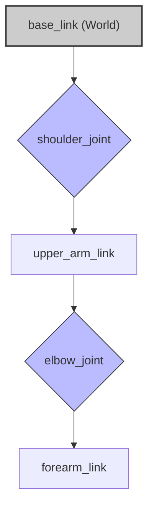

# Modeling Humanoids: The Unified Robot Description Format (URDF)

Before a humanoid robot can walk, wave, or perform a task, its digital twin must first exist. This digital blueprint, the very anatomy of the robot in simulation, is defined using the Unified Robot Description Format (URDF). This chapter introduces you to URDF, the foundational XML-based language used across the ROS ecosystem to describe a robot's physical structure. Mastering URDF is essential for visualization, simulation, and control.

Think of a URDF file as the robot's skeleton. It describes each body part, how they are connected, and their physical properties. For a humanoid, this means defining everything from the torso and head to the individual joints in each finger.

## The Anatomy of a URDF: Links and Joints

A robot model in URDF is fundamentally a tree of **links** connected by **joints**.

*   **Link**: A rigid body part with defined physical properties. For a humanoid, a link could be the forearm, a thigh, or the head. Each link has:
    *   `<visual>`: Specifies how the link looks. This is often a 3D mesh file (like `.stl` or `.dae`).
    *   `<collision>`: Defines the geometry used by the physics engine to detect collisions. It can be simpler than the visual mesh for performance.
    *   `<inertial>`: Describes the link's mass, center of mass, and moment of inertia. This is critical for realistic physics simulation.
*   **Joint**: Connects one link (the *parent*) to another (the *child*), defining the kinematics. Key properties of a joint include:
    *   `type`: The kind of motion allowed (e.g., `revolute` for a rotating elbow joint, `prismatic` for a sliding joint, or `fixed` for a rigid connection).
    *   `<parent>` & `<child>`: The two links the joint connects.
    *   `<origin>`: The pose (position and orientation) of the child link relative to the parent link.
    *   `<axis>`: The axis of rotation or translation for `revolute` and `prismatic` joints.

Here is how this hierarchy looks for a simple arm:



## Tutorial 1: Building a Simple Humanoid Arm in URDF

Let's create a URDF for a simple two-link arm and visualize it in RViz, the ROS 2 visualizer.

### Code Example 1: The Arm URDF (`simple_arm.urdf`)

Create a `urdf` directory in your ROS 2 package and save this file.

```xml
<?xml version="1.0"?>
<robot name="simple_humanoid_arm">

  <link name="base_link">
    <visual>
      <geometry>
        <cylinder length="0.2" radius="0.1"/>
      </geometry>
      <material name="grey">
        <color rgba="0.5 0.5 0.5 1"/>
      </material>
    </visual>
  </link>

  <link name="upper_arm_link">
    <visual>
      <geometry>
        <box size="0.5 0.1 0.1"/>
      </geometry>
      <origin xyz="0.25 0 0" rpy="0 0 0"/>
      <material name="blue">
        <color rgba="0.1 0.1 0.8 1"/>
      </material>
    </visual>
  </link>

  <joint name="shoulder_joint" type="revolute">
    <parent link="base_link"/>
    <child link="upper_arm_link"/>
    <origin xyz="0 0 0.1" rpy="0 0 0"/>
    <axis xyz="0 1 0"/>
    <limit lower="-1.57" upper="1.57" effort="10" velocity="1"/>
  </joint>

  <link name="forearm_link">
    <visual>
      <geometry>
        <box size="0.4 0.08 0.08"/>
      </geometry>
      <origin xyz="0.2 0 0" rpy="0 0 0"/>
      <material name="green">
        <color rgba="0.1 0.8 0.1 1"/>
      </material>
    </visual>
  </link>

  <joint name="elbow_joint" type="revolute">
    <parent link="upper_arm_link"/>
    <child link="forearm_link"/>
    <origin xyz="0.5 0 0" rpy="0 0 0"/>
    <axis xyz="0 1 0"/>
    <limit lower="-1.57" upper="1.57" effort="10" velocity="1"/>
  </joint>

</robot>
```

### Code Example 2: The Launch File (`view_arm.launch.py`)

Create a `launch` directory and save this file. This launch file starts the `robot_state_publisher` (to broadcast the robot's state) and RViz.

```python
from launch import LaunchDescription
from launch_ros.actions import Node
from launch.substitutions import LaunchConfiguration
from launch.actions import DeclareLaunchArgument
import os
from ament_index_python.packages import get_package_share_directory

def generate_launch_description():
    pkg_share = get_package_share_directory('your_package_name') # Replace with your package name
    urdf_file = os.path.join(pkg_share, 'urdf', 'simple_arm.urdf')

    with open(urdf_file, 'r') as infp:
        robot_desc = infp.read()

    return LaunchDescription([
        DeclareLaunchArgument(
            'use_sim_time',
            default_value='false',
            description='Use simulation (Gazebo) clock if true'),

        Node(
            package='robot_state_publisher',
            executable='robot_state_publisher',
            name='robot_state_publisher',
            output='screen',
            parameters=[{'use_sim_time': LaunchConfiguration('use_sim_time'), 'robot_description': robot_desc}]
        ),
        Node(
            package='rviz2',
            executable='rviz2',
            name='rviz2',
            output='screen',
            arguments=['-d', os.path.join(pkg_share, 'rviz', 'urdf.rviz')] # Optional RViz config
        ),
    ])
```

**To run this:**
1.  Replace `'your_package_name'` in the launch file.
2.  `colcon build` your package.
3.  `source install/setup.bash`
4.  `ros2 launch your_package_name view_arm.launch.py`

In RViz, set the "Fixed Frame" to `base_link` and add a "RobotModel" display to see your arm!

## Making URDFs Manageable with XACRO

Real humanoid URDFs are thousands of lines long. Writing them by hand is unfeasible. We use **XACRO** (XML Macros), a macro language that adds programming-like features to URDF.

With XACRO, you can:
*   Define constants (`<xacro:property name="wheel_radius" value="0.1"/>`)
*   Perform math (`<xacro:property name="circumference" value="${2 * pi * wheel_radius}"/>`)
*   Create reusable macros (`<xacro:macro name="leg" params="prefix reflect">...`)

### Code Example 3: A Leg Macro in XACRO

Let's define a macro for a single leg segment.

```xml
<!-- leg_segment.xacro -->
<robot xmlns:xacro="http://www.ros.org/wiki/xacro">
  <xacro:macro name="leg_segment" params="prefix parent">
    <link name="${prefix}_link">
      <visual>
        <geometry><box size="0.1 0.1 0.4"/></geometry>
        <origin xyz="0 0 -0.2" rpy="0 0 0"/>
      </visual>
    </link>
    <joint name="${prefix}_joint" type="revolute">
      <parent link="${parent}"/>
      <child link="${prefix}_link"/>
      <axis xyz="1 0 0"/>
      <limit lower="-1.57" upper="1.57"/>
    </joint>
  </xacro:macro>
</robot>
```

### Code Example 4: Instantiating the Macro

Now, a top-level XACRO file can use this macro to build a full robot.

```xml
<!-- full_robot.urdf.xacro -->
<?xml version="1.0"?>
<robot name="humanoid" xmlns:xacro="http://www.ros.org/wiki/xacro">
  <xacro:include filename="$(find your_package_name)/urdf/leg_segment.xacro" />

  <link name="base_link"/>

  <xacro:leg_segment prefix="left_upper_leg" parent="base_link" />
  <xacro:leg_segment prefix="left_lower_leg" parent="left_upper_leg_link" />
  
  <xacro:leg_segment prefix="right_upper_leg" parent="base_link" />
  <xacro:leg_segment prefix="right_lower_leg" parent="right_upper_leg_link" />
</robot>
```
To use this, you must first convert the XACRO to a URDF, which can be done inside a launch file.

## Debugging and Tools

*   **`check_urdf <filename.urdf>`**: This command parses a URDF file and reports any XML errors or structural problems. It's your first line of defense.
*   **RViz is your best friend**: If something looks wrong (links flying off, joints in weird places), it's almost always an issue with an `<origin>` tag's `xyz` or `rpy` values.
*   **Naming is critical**: Ensure all link and joint names are unique.

## Student Exercises

<details>
  <summary><b>Exercise 1: Add a Hand</b></summary>
  
  Modify the `simple_arm.urdf` to add a third link, `hand_link`, connected to the `forearm_link` by a `fixed` joint. Make the hand a small sphere.
  
  <details>
    <summary><i>Solution</i></summary>
    
    ```xml
    <link name="hand_link">
      <visual>
        <geometry><sphere radius="0.05"/></geometry>
        <material name="red"><color rgba="1 0 0 1"/></material>
      </visual>
    </link>

    <joint name="wrist_joint" type="fixed">
      <parent link="forearm_link"/>
      <child link="hand_link"/>
      <origin xyz="0.4 0 0"/>
    </joint>
    ```
  </details>
</details>

<details>
  <summary><b>Exercise 2: Use a XACRO Property</b></summary>
  
  In the `full_robot.urdf.xacro`, create a `<xacro:property>` for the leg length and use it in the `leg_segment` macro to define the box geometry.

  <details>
    <summary><i>Solution</i></summary>
    
    In `full_robot.urdf.xacro`:
    `<xacro:property name="leg_length" value="0.5"/>`
    
    In `leg_segment.xacro`, change the box size:
    `<box size="0.1 0.1 ${leg_length}"/>`
    And the origin:
    `<origin xyz="0 0 -${leg_length/2}" rpy="0 0 0"/>`
  </details>
</details>

<details>
  <summary><b>Exercise 3: Create a Prismatic Joint</b></summary>
  
  Change the `shoulder_joint` in `simple_arm.urdf` from `revolute` to `prismatic`. What happens in RViz when you move the joint state publisher GUI?
  
  <details>
    <summary><i>Solution</i></summary>
    
    Changing the joint type to `prismatic` will cause the `upper_arm_link` to slide along the joint's Y-axis instead of rotating around it.
  </details>
</details>

## Conclusion

You now understand how to define the very bones of a robot. URDF and XACRO are the tools you will use to create the digital twin of any robot, from a simple arm to a full-scale humanoid. This structural model is the canvas upon which we will paint the robot's senses and intelligence in the chapters to come.