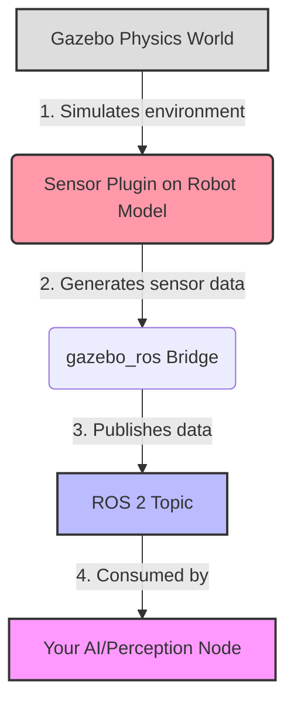

# The Robot's Senses: Simulating Sensors in Gazebo

An intelligent robot is a perceptive robot. For our AI agents to learn, act, and react, they need a constant stream of data about their environment. In the physical world, this comes from cameras, LiDARs, and IMUs. In simulation, we must create these senses digitally. This chapter will guide you through simulating the most common robotic sensors using Gazebo, the powerful physics simulator for ROS.

Gazebo doesn't just simulate how a robot moves; it simulates how it *perceives*. By attaching virtual sensors to our URDF models, we can generate the exact same data streams our AI will receive from a physical robot, allowing us to develop and test our perception and control algorithms entirely in simulation.

## How Gazebo Simulates Sensors: The Role of Plugins

Gazebo simulates sensors using **plugins**, which are self-contained libraries that can be attached to a robot model. These plugins interface with the Gazebo physics engine, generate sensor data, and then publish that data over the ROS 2 network for our nodes to consume.

The overall data flow is as follows:



To add a sensor, we use a special `<gazebo>` tag within our URDF file, referencing the link we want to attach the sensor to.

## Tutorial 1: Simulating a 2D LiDAR Scanner

A LiDAR (Light Detection and Ranging) sensor is the workhorse of robot navigation, providing precise distance measurements. Let's add a 2D LiDAR to a robot.

A LiDAR plugin in Gazebo works by raycasting—shooting out virtual laser beams and measuring the distance to the first object they hit. This data is published as a `sensor_msgs/LaserScan` message.

### Code Example 1: LiDAR Sensor URDF/SDF Snippet

To add a LiDAR, you extend your URDF with a `<gazebo>` tag. Note that sensor definitions often use SDF (Simulation Description Format) syntax within this block.

```xml
<!-- In your robot's URDF file, attached to a link e.g., 'base_link' -->
<gazebo reference="base_link">
  <sensor type="ray" name="lidar_sensor">
    <pose>0 0 0.1 0 0 0</pose>
    <visualize>true</visualize>
    <update_rate>10</update_rate>
    <ray>
      <scan>
        <horizontal>
          <samples>720</samples>
          <resolution>1</resolution>
          <min_angle>-1.5708</min_angle>
          <max_angle>1.5708</max_angle>
        </horizontal>
      </scan>
      <range>
        <min>0.1</min>
        <max>12.0</max>
        <resolution>0.01</resolution>
      </range>
    </ray>
    <plugin name="gazebo_ros_head_hokuyo_controller" filename="libgazebo_ros_ray_sensor.so">
      <ros>
        <namespace>/demo</namespace>
        <output_type>sensor_msgs/LaserScan</output_type>
        <topic>lidar_scan</topic>
        <frame_name>base_link</frame_name>
      </ros>
    </plugin>
  </sensor>
</gazebo>
```

### Lab 1: Visualizing LiDAR Data

**Goal:** Launch a robot with the LiDAR sensor and see the data in RViz.

1.  **Add the Code:** Add the snippet above to your robot's URDF file.
2.  **Launch Gazebo:** Create a launch file that starts Gazebo and spawns your robot model. Make sure to include some other objects (like simple boxes or spheres) in the world for the LiDAR to detect.
3.  **Launch RViz:** In a separate terminal, launch `rviz2`.
4.  **Configure RViz:**
    *   Set the "Fixed Frame" to `base_link` (or whatever frame you attached the sensor to).
    *   Add a "LaserScan" display.
    *   Set the "Topic" of the LaserScan display to `/demo/lidar_scan`.

You should now see points appearing in RViz corresponding to the objects in your Gazebo world!

### Code Example 2: Inspecting with ROS 2 CLI

You can also inspect the raw data directly from the command line.

```bash
# See detailed information about the topic
ros2 topic info /demo/lidar_scan

# Echo the raw data being published
ros2 topic echo /demo/lidar_scan
```

## Tutorial 2: Simulating a Depth Camera

Depth cameras are crucial for 3D perception. They provide an image where each pixel's value corresponds to its distance from the camera, enabling 3D reconstruction and object detection.

A depth camera plugin in Gazebo generates several topics: a standard color image (`sensor_msgs/Image`), a depth image (`sensor_msgs/Image`), and often a point cloud (`sensor_msgs/PointCloud2`).

```ascii
Diagram: Depth Camera Data Flow

      [Gazebo World]
            |
     +-----------------+
     | DepthCam Plugin |
     +-----------------+
            |
  /---------------------
  |
/camera/image_raw   /camera/depth/image_raw
(Color Image)       (Depth Image)
```

### Code Example 3: Depth Camera URDF/SDF Snippet

This snippet defines a depth camera and tells the plugin what topics to publish on.

```xml
<gazebo reference="head_link">
  <sensor type="depth" name="depth_camera">
    <update_rate>30.0</update_rate>
    <camera name="head">
      <horizontal_fov>1.39626</horizontal_fov>
      <image>
        <width>800</width>
        <height>800</height>
        <format>R8G8B8</format>
      </image>
      <clip>
        <near>0.05</near>
        <far>10</far>
      </clip>
    </camera>
    <plugin name="camera_plugin" filename="libgazebo_ros_camera.so">
      <ros>
        <namespace>demo</namespace>
        <topic>rgb_camera</topic>
        <depth_image_topic>depth_image</depth_image_topic>
        <camera_info_topic>camera_info</camera_info_topic>
        <frame_name>camera_link_optical</frame_name>
        <point_cloud_topic>point_cloud</point_cloud_topic>
        <hack_baseline>0.07</hack_baseline>
      </ros>
    </plugin>
  </sensor>
</gazebo>
```

### Lab 2: Viewing Camera Feeds

**Goal:** View the color and depth images from the simulated camera.

1.  **Add the Code:** Add the depth camera snippet to your robot's URDF, attached to a suitable link like `head_link`.
2.  **Launch Simulation:** Relaunch your Gazebo simulation.
3.  **Use `rqt_image_view`:** This is a great tool for visualizing image topics.
    ```bash
    rqt_image_view /demo/rgb_camera
    ```
    In a separate terminal:
    ```bash
    rqt_image_view /demo/depth_image
    ```
You will see the world from the robot's perspective in the first window, and a grayscale representation of depth in the second.

### Code Example 4: Adding Noise for Realism

Simulations are too perfect. To train robust models, we must add noise to better mimic reality.

```xml
<!-- Inside the <sensor> tag -->
<noise>
  <type>gaussian</type>
  <!-- Noise is sampled independently per pixel on each frame.
       That means, for a given image, each pixel's noise value is
       formally drawn from a normal distribution. -->
  <mean>0.0</mean>
  <stddev>0.007</stddev>
</noise>
```

## Debugging Common Sensor Issues

*   **Topic Not Found:** Double-check the `<namespace>` and `<topic>` tags in your URDF. Ensure the `gazebo_ros_pkgs` are installed and working.
*   **Bad Visuals/Data:** The sensor's pose (`<pose>`) inside the `<sensor>` tag is critical. If it's oriented incorrectly, your data will be wrong. Use `<visualize>true</visualize>` to see the sensor's rays in Gazebo.
*   **Performance Lag:** High-resolution cameras and LiDARs with many samples are very resource-intensive. If your simulation is slow, try reducing the `<update_rate>`, image `<width>`/`<height>`, or the number of LiDAR `<samples>`.

## Student Exercises

<details>
  <summary><b>Exercise 1: Modify LiDAR Range</b></summary>
  
  Change the LiDAR sensor's `max_angle` to `3.14159` (a full 360-degree scanner). Also, decrease its `max` range to `5.0` meters. How does the visualization in RViz change? 
  
  <details>
    <summary><i>Solution</i></summary>
    The laser scan will now form a full circle around the robot, but the points will disappear when objects are more than 5 meters away. This is useful for modeling different types of LiDAR hardware.
  </details>
</details>

<details>
  <summary><b>Exercise 2: Add a Second Camera</b></summary>
  
  Add a second camera to your robot model. Make it a regular RGB camera (not a depth camera) by using the `libgazebo_ros_camera.so` plugin but without the depth-specific tags. Ensure it publishes to a different topic, like `/demo/side_camera`. 
  
  <details>
    <summary><i>Solution</i></summary>
    You would copy the `<sensor>` block, change its `name`, set the `type` to `camera`, and adjust the `<topic>` in the plugin definition. You can then view this new feed with `rqt_image_view`.
  </details>
</details>

<details>
  <summary><b>Exercise 3: Simulate an IMU</b></summary>
  
  Research the `gazebo_ros_imu_sensor` plugin. Add an IMU sensor to your robot's `base_link`. Use `ros2 topic echo` to view the `sensor_msgs/Imu` data. What information does it provide?
  
  <details>
    <summary><i>Solution</i></summary>
    The IMU plugin publishes orientation (as a quaternion), angular velocity, and linear acceleration. This data is fundamental for balance and navigation algorithms.
  </details>
</details>

## Conclusion

You can now bestow your digital robot with the senses it needs to perceive its world. By mastering the simulation of LiDARs, cameras, and IMUs in Gazebo, you have unlocked the ability to develop and rigorously test sophisticated AI perception systems before ever touching a piece of hardware. This "sim-first" approach is the cornerstone of modern robotics development.