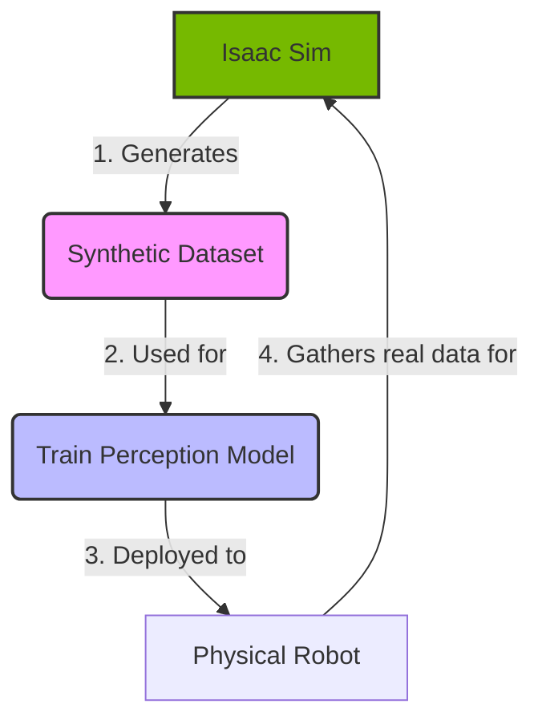

# Digital Reality: Synthetic Data with NVIDIA Isaac Sim

Welcome to the cutting edge of AI training for robotics. While Gazebo provides excellent physics simulation, modern deep learning models for perception have an insatiable appetite for data—vast, diverse, and perfectly labeled datasets. This is often impractical to collect in the real world. The solution is **synthetic data**, and the ultimate tool for generating it is **NVIDIA Isaac Sim**.

This chapter introduces Isaac Sim as a photorealistic, physics-based virtual environment built on the NVIDIA Omniverse™ platform. Its primary purpose in our curriculum is to act as a data factory. We will use it to generate massive, high-quality, automatically labeled datasets for training the vision models that will power our humanoid robot's brain.

## The Power of Synthetic Data

Training a state-of-the-art object detector requires hundreds of thousands of labeled images. Doing this by hand is slow, expensive, and prone to error. Synthetic data solves this by rendering realistic scenes where every single pixel is already understood by the simulator.

**Key Advantages:**
*   **Scale:** Generate millions of images, far more than you could ever collect manually.
*   **Perfect Labels:** Get pixel-perfect ground truth for bounding boxes, segmentation masks, depth, and more—for free.
*   **Edge Cases:** Easily create rare and dangerous scenarios (e.g., an object appearing suddenly) that are difficult to capture in the real world.
*   **Domain Randomization:** Systematically vary textures, lighting, and object placement to train models that are robust and generalize well to reality.

This workflow is a virtuous cycle:



## Core Isaac Sim Concepts

*   **NVIDIA Omniverse:** Isaac Sim is an application built on Omniverse, a platform designed for collaborative 3D workflows. It uses Pixar's **Universal Scene Description (USD)** format to compose complex scenes.
*   **Python-Based:** The entire simulator is controllable via Python scripts. You can build worlds, spawn robots, and run simulations entirely through code.
*   **Replicator:** This is the synthetic data generation engine within Isaac Sim. It provides a framework for randomizing scenes and generating corresponding labels.

## Tutorial 1: Your First Isaac Sim Python Script

Let's create a simple scene with a cube and a camera directly from a Python script.

**Prerequisites:** You must have Isaac Sim installed on a workstation with a compatible NVIDIA RTX GPU.

### Lab 1: Running a Script in Isaac Sim

1.  Launch Isaac Sim.
2.  From the top menu, go to `Window` > `Script Editor`.
3.  Paste the code below into the editor window.
4.  Click the "Run" button.

### Code Example 1: Creating a Simple Scene

```python
import asyncio
from omni.isaac.core import World
from omni.isaac.core.objects import cuboid

async def create_scene():
    # This must be awaited, and will create a new world stage
    await world.initialize_simulation_async()
    
    # Add a ground plane
    world.scene.add_default_ground_plane()

    # Create a simple red cube
    cuboid.VisualCuboid(
        prim_path="/World/MyCube",
        position=(0, 0, 1.0),
        scale=(0.5, 0.5, 0.5),
        color=(1.0, 0, 0)
    )
    
    # You can keep the simulation running to view the scene
    # or add more logic here.
    
# Get the core World object
world = World()

# Run the async function
asyncio.ensure_future(create_scene())
```
After running the script, you will see a red cube appear on a ground plane in the simulation viewport. This demonstrates the power of scripting to procedurally define a world.

## The Replicator Framework for Synthetic Data

Replicator is the heart of Isaac Sim's data generation capabilities. It allows you to define a graph of operations that randomize a scene and attach "annotators" to collect ground truth data.

**Key Concepts:**
*   **Randomization:** The core principle is to vary everything you can: object poses, textures, colors, lighting, and camera positions. This is called **Domain Randomization**.
*   **Triggers:** You decide when to capture data—every frame, every N frames, or on a custom event.
*   **Annotators:** These are the data collectors. Common annotators include:
    *   RGB images
    *   Bounding Boxes (2D and 3D)
    *   Semantic and Instance Segmentation
    *   Depth and Normals

## Tutorial 2: Generating an Object Detection Dataset

Let's create a script to randomize the position of a torus on a surface and save RGB images and bounding box data.

### Code Example 2: Basic Replicator Setup

This script sets up Replicator and defines a camera.

```python
import omni.replicator.core as rep

# Assume Isaac Sim is running and we have a camera
with rep.new_layer():
    camera = rep.get.prims(path_pattern="/World/Camera")
```

### Code Example 3: Randomizing an Object's Pose

Here, we define a function to place a torus at a random position on each trigger.

```python
# Define the object to be randomized
torus = rep.get.prims(path_pattern="/World/Torus")

# Define a randomization function
def randomize_torus_pose():
    with torus:
        rep.modify.pose(
            position=rep.distribution.uniform((-0.5, -0.5, 1.0), (0.5, 0.5, 1.0)),
            rotation=rep.distribution.uniform((-180, -180, -180), (180, 180, 180))
        )
    return torus.node

# Register the randomization
rep.randomizer.register(randomize_torus_pose)
```

### Code Example 4: Running the Replicator Graph

This code sets up a trigger, attaches the randomizer and an annotator, and runs the process.

```python
# Create a writer to save the data
writer = rep.WriterRegistry.get("BasicWriter")
writer.initialize(output_dir="~/replicator_output", rgb=True, bounding_box_2d_tight=True)

# Set up the render product (what the camera sees)
render_product = rep.create.render_product(camera, (1024, 1024))

# The main Replicator logic
with rep.trigger.on_frame(num_frames=100):
    rep.randomizer.randomize_torus_pose()

# Attach the writer to the render product
writer.attach([render_product])

# To run this, you would typically use the `orchestrator.run()` command
# rep.orchestrator.run() # This is a simplified representation
```
After running a full script like this, the `~/replicator_output` directory would contain 100 images and their corresponding bounding box labels, ready for training.

## ROS 2 Integration

Isaac Sim has a built-in ROS 2 bridge, making it seamless to:
*   **Publish Sensor Data:** Stream camera, LiDAR, and IMU data directly from Isaac Sim to ROS 2 topics.
*   **Subscribe to Control Commands:** Control a robot's joints in Isaac Sim by subscribing to a `JointState` or `Twist` topic from your ROS 2 navigation stack.

This allows for a powerful "hardware-in-the-loop" style of development where your ROS 2-based AI agent controls a robot in a photorealistic simulation as if it were real hardware.

## Debugging and Best Practices
*   **The Sim-to-Real Gap:** Even with randomization, models trained purely on synthetic data may not perform perfectly in the real world. Fine-tuning on a small amount of real data is often necessary.
*   **Performance:** Isaac Sim is extremely GPU-intensive. Keep scenes simple where possible, and use lower-resolution previews while developing.
*   **Check the Console:** Isaac Sim's console window (`Window` > `Console`) is your best friend for debugging Python script errors.

## Student Exercises

<details>
  <summary><b>Exercise 1: Change Object and Color</b></summary>
  
  Modify the first script (`create_scene`) to create a green sphere instead of a red cube.
  
  <details>
    <summary><i>Solution</i></summary>
    You would replace `cuboid.VisualCuboid` with `sphere.VisualSphere` and change the `color` tuple to `(0, 1.0, 0)`.
  </details>
</details>

<details>
  <summary><b>Exercise 2: Add More Randomization</b></summary>
  
  In the Replicator script, add randomization for the color of the torus. Hint: Use `rep.modify.attribute`.
  
  <details>
    <summary><i>Solution</i></summary>
    ```python
    def randomize_torus_color():
        with torus:
            rep.modify.attribute("color", rep.distribution.uniform((0,0,0), (1,1,1)))
        return torus.node
    # Register and call this new randomizer along with the pose one.
    ```
  </details>
</details>

<details>
  <summary><b>Exercise 3: Output Segmentation Data</b></summary>
  
  Modify the `rep.WriterRegistry` call to output semantic segmentation masks instead of 2D bounding boxes.
  
  <details>
    <summary><i>Solution</i></summary>
    You would change the writer initialization to:
    `writer.initialize(output_dir="...", rgb=True, semantic_segmentation=True)`
    This requires that objects in your scene have semantic labels assigned to them.
  </details>
</details>

## Conclusion
NVIDIA Isaac Sim and the Replicator framework represent a paradigm shift in how we train robots. By moving the bulk of data collection from the physical world to a photorealistic simulator, we can develop more robust, capable, and safer AI systems faster than ever before. You now have the foundational knowledge to use this powerful tool to create the datasets that will bring your humanoid robot to life.