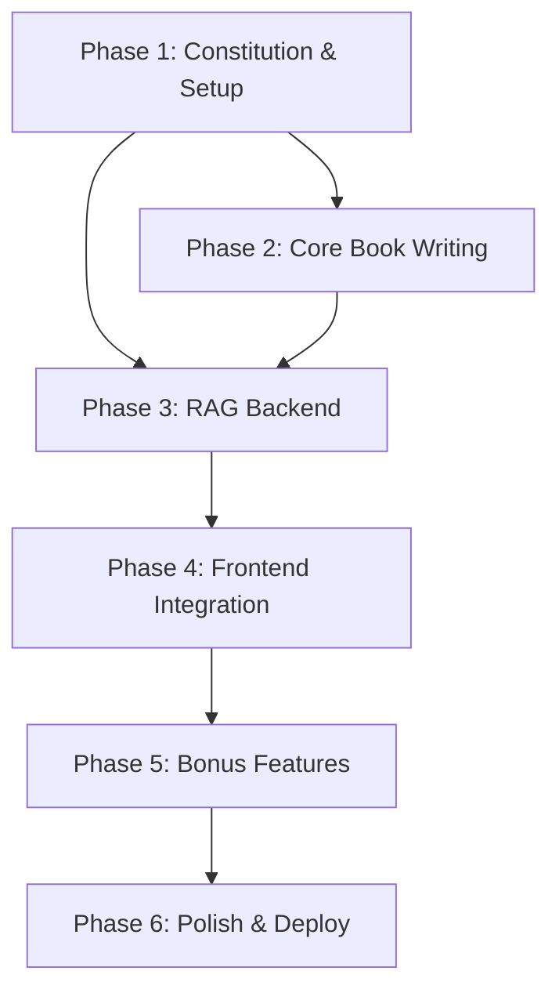

# Plan: AI-Native Textbook on Physical AI & Humanoid Robotics

This document outlines the architectural and implementation plan for creating a comprehensive, AI-native textbook on "Physical AI & Humanoid Robotics." This project is undertaken as part of the Panaversity Hackathon I and strictly follows the Spec-Kit Plus methodology.

## 1. Architecture Overview

The system is designed with a clear separation of concerns, ensuring modularity and scalability. It separates content authoring, frontend presentation, and backend intelligence into distinct, interoperable layers.

*High-Level Component Diagram Description:*

The architecture is composed of five primary, decoupled components:

1.  **Book Content (`/docs`)**: The single source of truth for all educational material, written in standards-compliant Markdown. This allows for content to be managed, versioned, and updated independently of the presentation or backend logic.
2.  **Docusaurus Site (Frontend)**: A static site generated by Docusaurus, responsible for rendering the book content. It will be themed with TailwindCSS and will host custom React components for all interactive features, including the RAG chatbot UI and personalization controls.
3.  **Backend Services (FastAPI)**: A robust backend built with Python and FastAPI, serving as the application's intelligent core. It will expose RESTful APIs for all dynamic features, including the RAG pipeline, user authentication, content personalization, and on-demand translation.
4.  **RAG Chatbot (AI Core)**: An integrated service that powers the conversational AI.
    *   **Orchestration**: Manages the retrieval-generation process, including "selected text only" mode.
    *   **Vector DB**: **Qdrant Cloud (Free Tier)** stores and indexes embeddings of the book content for efficient semantic search.
    *   **LLM**: **OpenAI** models will generate context-aware answers.
    *   **Data Store**: **Neon Serverless Postgres (Free Tier)** stores user data, background questionnaire responses, and conversation history.
    *   **UI**: A **ChatKit**-based component embedded within the Docusaurus site provides the user interface.
5.  **Auth & Personalization**: A dedicated module for user management and tailored experiences.
    *   **Authentication**: **Better-Auth** will handle user signup/login and manage profiles based on the background questionnaire.
    *   **Personalization**: A service that dynamically injects contextual notes into chapters based on a user's profile.
    *   **Translation**: A service that provides on-demand Urdu translation using a local open-source model.

---

## 2. Major Implementation Phases

The project will follow a structured, phased approach. Each phase has clear entry and exit criteria to ensure steady progress and quality control.

| Phase | Name                     | Entry Criteria                                    | Exit Criteria                                                                                                     |
|:------|:-------------------------|:--------------------------------------------------|:------------------------------------------------------------------------------------------------------------------|
| 1     | **Constitution & Setup** | Project kickoff                                   | `constitution.md` and `spec.md` are finalized. Docusaurus project is initialized with GitHub repository.        |
| 2     | **Core Book Writing**    | Phase 1 complete                                  | At least 75% of the 13+ core textbook chapters are drafted in Markdown and structured correctly in Docusaurus.   |
| 3     | **RAG Backend**          | Phase 2 complete                                  | FastAPI backend is deployed. Qdrant is populated with book embeddings. RAG pipeline successfully answers queries. |
| 4     | **Frontend Integration** | Phase 3 complete                                  | RAG chatbot (ChatKit UI) is embedded in the Docusaurus site. "Selected text only" mode is fully functional.      |
| 5     | **Bonus Features**       | Phase 4 complete                                  | Better-Auth login, per-chapter personalization, and per-chapter Urdu translation features are fully implemented and functional. |
| 6     | **Polish & Deploy**      | Phase 5 complete                                  | All features are validated end-to-end. The site is fully mobile-responsive. Project is deployed to GitHub Pages/Vercel. |

---

## 3. Component Breakdown & Ownership

This breakdown lists every major component, its purpose, and whether its development can be parallelized.

| Component / Folder              | Purpose                                                                                             | Parallelizable? |
|:--------------------------------|:----------------------------------------------------------------------------------------------------|:----------------|
| `docs/`                         | Contains all Markdown files for the textbook chapters.                                                | **Yes**         |
| `src/` (Docusaurus)             | Docusaurus frontend code, including custom React components, styling, and pages.                  | **Yes**         |
| `src/components/Chatbot`        | The ChatKit-based React component for the RAG chatbot UI.                                             | No              |
| `src/theme/`                    | Custom Docusaurus theme components, styled with TailwindCSS for a consistent look and feel.           | **Yes**         |
| `backend/`                      | Main directory for the FastAPI application, containing all backend logic.                           | **Yes**         |
| `backend/app/api/rag.py`        | FastAPI endpoint and logic for handling RAG queries, including selected text mode.                  | No              |
| `backend/app/api/auth.py`       | Endpoints for user authentication, profile, and questionnaire, integrating with Better-Auth.          | **Yes**         |
| `backend/app/services/`         | Business logic for embedding (Qdrant), translation (local model), and personalization.            | **Yes**         |
| `backend/app/core/`             | Configuration, DB connections (Neon, Qdrant), and core application settings.                        | No              |
| `specs/`                        | All Spec-Kit Plus artifacts: specifications, plans, and tasks.                                      | **Yes**         |
| `history/`                      | Contains all `adr/` and `prompts/` records for project governance.                                 | **Yes**         |
| `scripts/`                      | Automation scripts for data ingestion, deployment, and testing.                                     | **Yes**         |

---

## 4. Dependency Graph

This graph illustrates the development sequence and dependencies between major phases.

- **Core Book Writing (B)** can start after setup, and its content is a dependency for the **RAG Backend (C)**.
- The **RAG Backend (C)** can be developed in parallel with content, but ingestion requires content.
- **Frontend Integration (D)** depends on a functional backend.
- **Bonus Features (E)** can be integrated once the core frontend and backend are stable.

---

## 5. Research & Reusable Intelligence Strategy

We will research advanced topics to ensure cutting-edge content and create reusable AI "Skills" or "Subagents" to accelerate development and aim for bonus points.

**Research Topics:**
- **Robotics Simulators:** Best practices for `ROS 2` (Jazzy) and `Isaac Sim` for creating reproducible examples.
- **VLA Models:** Investigate state-of-the-art Vision-Language-Action models for chapters on advanced robot interaction.
- **Urdu Translation Models:** Benchmark local open-source models (e.g., NLLB from Hugging Face) for quality and performance within free-tier hardware limits.
- **Embedding & Chunking:** Analyze different strategies for Markdown chunking (semantic vs. fixed-size) to optimize RAG retrieval accuracy.

**Reusable Intelligence (Skills/Subagents) Candidates:**
- **`Skill:MarkdownChapterGenerator`:** A subagent to draft chapters from an outline, ensuring consistent structure and tone.
- **`Skill:RoboticsCodeGenerator`:** A subagent to generate Python code examples for `ROS 2` and `Isaac Sim`.
- **`Skill:QdrantIndexer`:** A reusable skill for chunking, embedding, and indexing Markdown content into Qdrant.
- **`Skill:UrduTranslator`:** A skill that encapsulates the logic for running the local translation model.
- **`Subagent:ADRGenerator`:** An agent to automate the creation of draft ADR files from a given decision context.
- **`Subagent:SpecScanner`:** A subagent that reads the `spec.md` and generates a test plan or checklist.

---

## 6. Design Decisions That Require ADRs

The following architectural decisions are significant and require formal ADRs to document their rationale and tradeoffs.

1.  **Frontend Framework Choice:** Docusaurus vs. Next.js with MDX.
2.  **Vector Database Host:** Local Qdrant vs. Qdrant Cloud.
3.  **Relational Database Provider:** Neon Serverless Postgres vs. Supabase.
4.  **Authentication Service:** Better-Auth vs. Clerk vs. custom FastAPI implementation.
5.  **RAG Content Chunking Strategy:** Fixed-size vs. recursive vs. semantic chunking of Markdown.
6.  **Text Embedding Model:** OpenAI `text-embedding-ada-002` vs. a newer/open-source alternative.
7.  **Urdu Translation Implementation:** A local Hugging Face model vs. a paid cloud API (e.g., Google Translate).
8.  **Deployment Platform:** GitHub Pages (for static content) vs. Vercel (for integrated backend/frontend).
9.  **Frontend Styling:** TailwindCSS vs. Emotion vs. plain CSS Modules.
10. **Chat UI Library:** Using a pre-built library like ChatKit vs. building a custom React component.
11. **Backend Caching:** Implementing a caching layer (e.g., Redis) for translation or personalization results.
12. **"Selected Text Only" RAG Logic:** Prompt engineering vs. a separate, filtered retrieval mechanism in the backend.

---

## 7. Testing & Validation Strategy

A multi-layered testing strategy will be employed to ensure quality across all components.

| Area                      | Validation Method                                                                                                   |
|:--------------------------|:--------------------------------------------------------------------------------------------------------------------|
| **Book Completeness**     | Peer review of each chapter against the `spec.md`. Automated checks for broken links, images, and formatting errors. |
| **RAG Accuracy**          | A "golden dataset" of 50+ question-answer pairs will be created. An automated script will run these questions and validate that the chatbot's answers are semantically correct and derived only from the book. |
| **"Selected Text Only"**  | Unit and integration tests will confirm that when text is selected, the RAG context is strictly limited to that selection. |
| **Bonus Features**        | End-to-end tests using Playwright will simulate the full user journey: signup, questionnaire, login, personalization, and translation. |
| **Mobile Responsiveness** | Manual testing on Chrome DevTools and real devices. Automated visual regression testing with a tool like Percy (optional). |
| **GitHub Pages Deployment**| A full CI/CD pipeline using GitHub Actions will build and deploy the site. Smoke tests will run against the live URL after each deployment. |

---

## 8. Success Criteria per Phase

Each phase concludes with measurable outcomes to verify completion.

| Phase                      | Measurable Exit Criteria                                                                                               |
|:---------------------------|:-----------------------------------------------------------------------------------------------------------------------|
| **1. Constitution & Setup**  | `constitution.md` is ratified. The Docusaurus site runs locally (`npm run start`). The `spec.md` is finalized.            |
| **2. Core Book Writing**     | At least 10 of the 13+ chapters are written, reviewed, and merged into the `main` branch.                              |
| **3. RAG Backend**           | The `/rag` API endpoint successfully returns a structured answer from a test query. The Qdrant collection contains over 1,000 vectors from the book content. |
| **4. Frontend Integration**  | The chatbot UI is functional on the website. A user can receive answers from both full-book and "selected text" queries. |
| **5. Bonus Features**        | A test user can sign up, log in, and see personalized content. Per-chapter Urdu translation is confirmed functional. |
| **6. Polish & Deploy**       | All critical bugs are resolved. The site is live at its public URL and achieves a Lighthouse performance score over 90. |